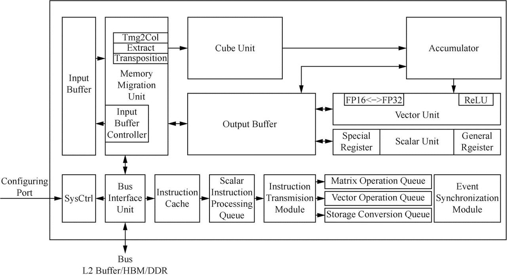

# Components of Hardware Accelerators

A hardware accelerator typically comprises multiple on-chip caches and
various types of arithmetic units. In this section, we'll examine the
fundamental components of hardware accelerators, using the Nvidia Volta
GPU architecture as a representative example.

## Architecture of Accelerators

Contemporary graphics processing units (GPUs) offer remarkable computing
speed, ample memory storage, and impressive I/O bandwidth. A top-tier
GPU frequently surpasses a conventional CPU by housing double the number
of transistors, boasting a memory capacity of 16 GB or greater, and
operating at frequencies reaching up to 1 GHz. The architecture of a GPU
comprises streaming processors and a memory system, interconnected
through an on-chip network. These components can be expanded
independently, allowing for customized configurations tailored to the
target market of the GPU.

Figure :numref:`ch06/ch06-gv100` illustrates the architecture of the
Volta GV100 . This architecture has:

:label:`ch06/ch06-gv100`

1.  6 GPU processing clusters (GPCs), each containing:

    1.  7 texture processing clusters (TPCs), each containing two
        streaming multiprocessors (SMs).

    2.  14 SMs.

2.  84 SMs, each containing:

    1.  64 32-bit floating-point arithmetic units

    2.  64 32-bit integer arithmetic units

    3.  32 64-bit floating-point arithmetic units

    4.  8 Tensor Cores

    5.  4 texture units

3.  8 512-bit memory controllers.

As shown in Figure :numref:`ch06/ch06-gv100`, a GV100 GPU contains 84 SMs (Streaming
Multiprocessors), 5376 32-bit floating-point arithmetic units, 5376
32-bit integer arithmetic units, 2688 64-bit floating-point arithmetic
units, 672 Tensor Cores, and 336 texture units. A pair of memory
controllers controls an HBM2 DRAM stack. Different vendors may use
different configurations (e.g., Tesla V100 has 80 SMs).

## Memory Units

The memory units of a hardware accelerator resemble a CPU's memory
controller. However, they encounter a bottleneck when retrieving data
from the computer system's DRAM, as it is slower compared to the
processor's computational speed. Without a cache for quick access, the
DRAM bandwidth becomes inadequate to handle all transactions of the
accelerator. Consequently, if program instructions or data cannot be
swiftly retrieved from the DRAM, the accelerator's efficiency diminishes
due to prolonged idle time. To tackle this DRAM bandwidth issue, GPUs
employ a hierarchical design of memory units. Each type of memory unit
offers its own maximum bandwidth and latency. To fully exploit the
computing power and enhance processing speed, programmers must select
from the available memory units and optimize memory utilization based on
varying access speeds.

1.  **Register file**: Registers serve as the swiftest on-chip memories.
    In contrast to CPUs, each SM in a GPU possesses tens of thousands of
    registers. Nevertheless, excessively utilizing registers for every
    thread can result in a reduced number of thread blocks that can be
    scheduled within the SM, leading to fewer executable threads. This
    underutilization of hardware capabilities hampers performance
    considerably. Consequently, programmers must judiciously determine
    the appropriate number of registers to employ, taking into account
    the algorithm's demands.

2.  **Shared memory**: The shared memory is a level-1 cache that is
    user-controllable. Each SM features a 128 KB level-1 cache, with the
    ability for programmers to manage up to 96 KB as shared memory. The
    shared memory offers a low access latency, requiring only a few
    dozen clock cycles, and boasts an impressive bandwidth of up to 1.5
    TB/s. This bandwidth is significantly higher than the peak bandwidth
    of the global memory, which stands at 900 GB/s. In high-performance
    computing (HPC) scenarios, engineers must possess a thorough
    understanding of how to leverage shared memory effectively.

3.  **Global memory**: Both GPUs and CPUs are capable of reading from
    and writing to global memory. Global memory is visible and
    accessible by all threads on a GPU, whereas other devices like CPUs
    need to traverse buses like PCIe and NV-Link to access the global
    memory. The global memory represents the largest memory space
    available in a GPU, with capacities reaching over 80 GB. However, it
    also exhibits the longest memory latency, with a load/store latency
    that can extend to hundreds of clock cycles.

4.  **Constant memory**: The constant memory is a virtual address space
    in the global memory and does not occupy a physical memory block. It
    serves as a high-speed memory, specifically designed for rapid
    caching and efficient broadcasting of a single value to all threads
    within a warp.

5.  **Texture memory**: Texture memory is a specialized form of global
    memory that is accessed through a dedicated texture cache to enhance
    performance. In earlier GPUs without caches, the texture memory on
    each SM served as the sole cache for data. However, the introduction
    of level-1 and level-2 caches in modern GPUs has rendered the
    texture memory's role as a cache obsolete. The texture memory proves
    most beneficial in enabling GPUs to execute hardware-accelerated
    operations while accessing memory units. For instance, it allows
    arrays to be accessed using normalized addresses, and the retrieved
    data can be automatically interpolated by the hardware.
    Additionally, the texture memory supports both hardware-accelerated
    bilinear and trilinear interpolation for 2D and 3D arrays,
    respectively. Moreover, the texture memory facilitates automatic
    handling of boundary conditions based on array indices. This means
    that operations on array elements can be carried out without
    explicit consideration of boundary situations, thus avoiding the
    need for extra conditional branches in a thread.

## Compute Units {#Compute Units}

Hardware accelerators offer a variety of compute units to efficiently
handle various neural networks.
Figure :numref:`ch06/ch06-compute-unit` demonstrates how different
layers of neural networks select appropriate compute units.

:label:`ch06/ch06-compute-unit`

1.  **Scalar Unit**: calculates one scalar element at a time, similar to
    the standard reduced instruction set computer (RISC).

2.  **1D Vector Unit**: computes multiple elements at a time, similar to
    the SIMD used in traditional CPU and GPU architectures. It has been
    widely used in HPC and signal processing.

3.  **2D Matrix Unit**: computes the inner product of a matrix and a
    vector or the outer product of a vector within one operation. It
    reuses data to reduce communication costs and memory footprint,
    which achieves the performance of matrix multiplication.

4.  **3D Cube Unit**: completes matrix multiplication within one
    operation. Specially designed for neural network applications, it
    can reuse data to compensate for the gap between the data
    communication bandwidth and computing.

The compute units on a GPU mostly include Scalar Units and 3D Cube
Units. As shown in Figure :numref:`ch06/ch06-SM`, each SM has 64 32-bit floating-point
arithmetic units, 64 32-bit integer arithmetic units, 32 64-bit
floating-point arithmetic units, which are Scalar Units, and 8 Tensor
Cores, which are 3D Cube Units specially designed for neural network
applications.

:label:`ch06/ch06-SM`

A Tensor Core is capable of performing one $4\times4$ matrix
multiply-accumulate operation per clock cycle, as shown in
Figure :numref:`ch06/ch06-tensorcore`.

    D = A * B + C

:label:`ch06/ch06-tensorcore`

$\bf{A}$, $\bf{B}$, $\bf{C}$, and $\bf{D}$ are $4\times4$ matrices.
Input matrices $\bf{A}$ and $\bf{B}$ are FP16 matrices, and accumulation
matrices $\bf{C}$ and $\bf{D}$ can be either FP16 or FP32 matrices.
Tesla V100's Tensor Cores are programmable matrix multiply-accumulate
units that can deliver up to 125 Tensor Tera Floating-point Operations
Per Second (TFLOPS) for training and inference applications, resulting
in a ten-fold increase in computing speed when compared with common FP32
compute units.

## Domain Specific Architecture

:label:`ch06/ch06-davinci_architecture`

Domain Specific Architecture (DSA) has been an area of interest in
meeting the fast-growing demand for computing power by deep neural
networks. As a typical DSA design targeting image, video, voice, and
text processing, neural network processing units (or namely deep
learning hardware accelerators) are system-on-chips (SoCs) containing
special compute units, large memory units, and the corresponding control
units. A neural processing unit, for example, Ascend chip, typically
consists of a control CPU, a number of AI computing engines, multi-level
on-chip caches or buffers, and the digital vision pre-processing (DVPP)
module.

The computing core of AI chips is composed of AI Core, which is
responsible for executing scalar- and tensor-based arithmetic-intensive
computing. Consider the Ascend chip as an example. Its AI Core adopts
the Da Vinci   architecture.
Figure :numref:`ch06/ch06-davinci_architecture` shows the architecture
of an AI Core, which can be regarded as a simplified version of modern
microprocessor architecture from the control perspective. It includes
three types of basic computing units: Cube Unit, Vector Unit, and Scalar
Unit. These units are used to compute on tensors, vectors, and scalars,
respectively, in three independent pipelines centrally scheduled through
the system software to coordinate with each other for higher efficiency.
Similar to GPU designs, the Cube Unit functions as the computational
core of the AI Core and delivers parallel acceleration for matrix
multiply-accumulate operations. Specifically, it can multiply two
$16\times16$ matrices in a single instruction --- equivalent to
completing 4096 (=$16\times16\times16$) multiply-accumulate operations
within an extremely short time --- with precision comparable to FP16
operations.
