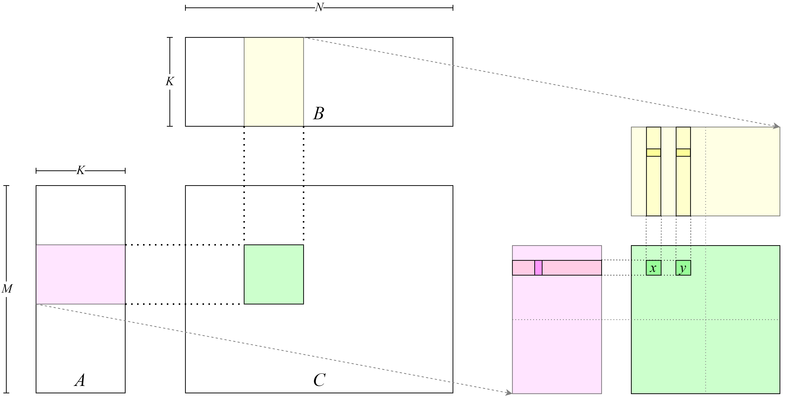
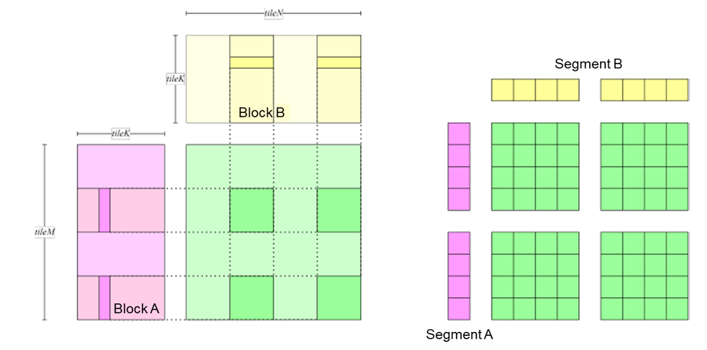
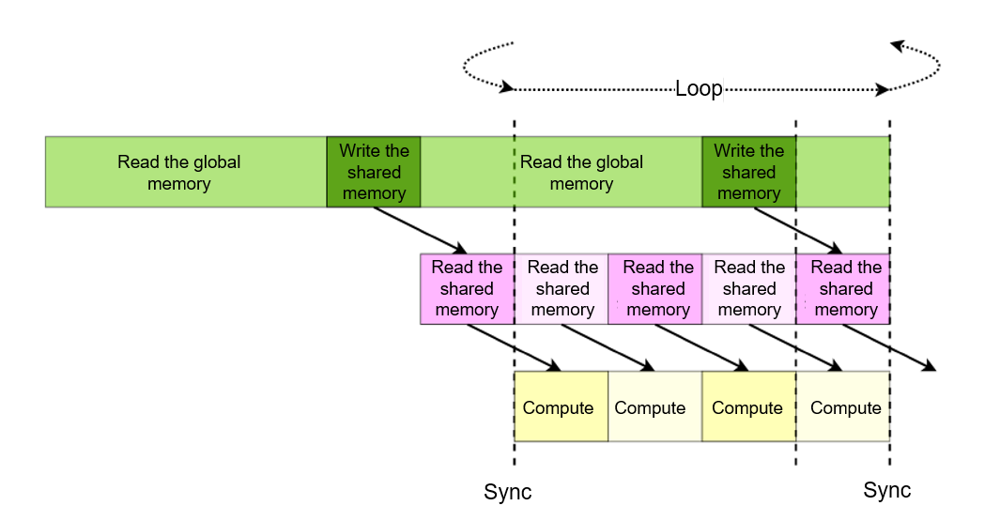

# Performance Optimization Methods

Hardware accelerators boast intricate computational and memory
architectures. To maximize their performance, developers frequently need
to grasp a variety of performance optimization methods. Common methods
encompass enhancing arithmetic intensity, capitalizing effectively on
shared memory, optimizing the memory load/store pipeline, among others.
The subsequent sections will elucidate these methods through practical
programming examples, all aimed towards a singular objective:
accelerating an FP32 GEMM program.

## Implementing General Matrix Multiplication {#sec-accelerator-naive}

Code [\[lst:cpu\]](#lst:cpu){reference-type="ref" reference="lst:cpu"}
shows a reference implementation of GEMM in C++.

     [caption={CPU-based matrix multiply}, label={lst:cpu}]
    float A[M][K];
    float B[K][N];
    float C[M][N];
    float alpha, beta;

    for (unsigned m = 0; m < M; ++m) {
        for (unsigned n = 0; n < N; ++n) {
            float c = 0;
            for (unsigned k = 0; k < K; ++k) {
                c += A[m][k] * B[k][n];
            }
            C[m][n] = alpha * c + beta * C[m][n];
        }
    }

Each element in matrix $C$ is independently computed, and numerous GPU
threads can be launched to compute the corresponding elements in matrix
$C$ in parallel. The GPU kernel function is shown in
Code [\[lst:gpu\]](#lst:gpu){reference-type="ref" reference="lst:gpu"}.

     [caption={GPU-based matrix multiply}, label={lst:gpu}]
    __global__ void gemmKernel(const float * A,
    const float * B, float * C,
    float alpha, float beta, unsigned M, unsigned N,
    unsigned K) {
        unsigned int m = threadIdx.x + blockDim.x * blockIdx.x;
        unsigned int n = threadIdx.y + blockDim.y * blockIdx.y;
        if (m >= M || n >= N)
        return;
        float c = 0;
        for (unsigned k = 0; k < K; ++k) {
            c += A[m * K + k] * B[k * N + n];
        }
        c = c * alpha;
        float result = c;
        if (beta != 0) {
            result = result + C[m * N + n] * beta;
        }
        C[m * N + n] = result;
    }

Figure :numref:`cuda_naive_gemm` shows the layout of the implementation.
Each element in matrix $C$ is computed by one thread. The row index $m$
and column index $n$ of the element in matrix $C$ corresponding to the
thread are computed in lines 5 and 6 of the GPU kernel. Then, in lines 9
to 11, the thread loads the row vector in matrix $A$ according to the
row index and the column vector in matrix $B$ according to the column
index, computes the vector inner product. The thread also stores the
result back to $C$ matrix in line 17.

:label:`cuda_naive_gemm`

The method of launching the kernel function is shown in
Code [\[lst:launch\]](#lst:launch){reference-type="ref"
reference="lst:launch"}.

     [caption={Method of starting the GPU kernel function}, label={lst:launch}]
    void gemmNaive(const float *A, const float *B, float *C,
    float alpha, float beta, unsigned M,
    unsigned N, unsigned K) {
        dim3 block(16, 16);
        dim3 grid((M - 1) / block.x + 1, (N - 1) / block.y + 1);
        
        gemmKernel<<<grid, block>>>(A, B, C, alpha, beta, M, N, K);
    }

Each thread block processes $16\times16$ elements in matrix $C$.
Therefore, $(M - 1) / 16 + 1 \times (N - 1) / 16 + 1$ thread blocks are
used to compute the entire matrix $C$.

Eigen is used to generate data and compute the GEMM result on the CPU.
In addition, error computing and time profiling code are implemented for
the GPU computing result. For details, see
[first_attempt.cu](https://github.com/openmlsys/openmlsys-cuda/blob/main/first_attempt.cu).
After the program is compiled and executed, output results are as
follows:

    Average time: 48.961 ms
    Max error: 0.000092

The peak GPU throughput can be approximated by using the following
formula: 2 $\times$ Frequency $\times$ Number of single-precision
compute units. The number of single-precision compute units equals the
number of SMs in the GPU multiplied by the number of single-precision
compute units in each SM. The results are as follows:

    FP32 peak throughput 29767.680 GFLOPS
    Average Throughput: 185.313 GFLOPS

A significant gap exists between the performance that can be achieved by
the current code and the peak device performance. In an entire computing
process, the process with the highest computing density is matrix
multiplication $A\times B$. Its time complexity is $O(M*N*K)$, whereas
that time complexity of the entire computing process is
$O(M*N*K+2*M*N)$. Therefore, optimizing matrix multiplication is key to
improving performance.

## Enhancing Arithmetic Intensity

Arithmetic intensity is the ratio of computational instructions to
load/store instructions. Modern GPUs typically have numerous compute
units, constrained only by a limited load/store bandwidth. This
limitation often leaves these units waiting for data loading in a
program. Thus, boosting arithmetic intensity is a crucial step to
improve program performance.

In the GPU kernel function discussed previously, we can approximate its
arithmetic intensity by dividing the total number of floating-point
operations by the number of data reads. When calculating the inner
product within $K$ loops, floating-point multiplication and addition
operations occur each time elements from matrix $A$ and $B$ are loaded.
Consequently, the arithmetic intensity is 1, derived from two 32-bit
floating-point operations divided by two 32-bit data load/store
instructions.

In the original code, each thread handles one element in matrix $C$,
computing the inner product of a row in matrix $A$ and a column in
matrix $B$. In essence, we can elevate the arithmetic intensity by
amplifying the elements in matrix $C$ that each thread can process,
computing the inner product of multiple rows in matrix $A$ and multiple
columns in matrix $B$. More specifically, if $m$ elements in matrix $A$
and $n$ elements in matrix $B$ are loaded concurrently while calculating
the inner product in $K$ loops, there are $m+n$ 32-bit load/store
instructions and $2mn$ 32-bit computational instructions. Hence, the
arithmetic intensity becomes $\frac{2mn}{m+n}$. Therefore, by increasing
$m$ and $n$, we can optimize the arithmetic intensity.

In the preceding section, a `float` pointer was employed to access
global memory and store data in it, utilizing the hardware instructions
`LDG.E` and `STG.E`. Multiple `float` elements can be loaded
concurrently using the 128-bit wide instructions `LDG.E.128` and
`STG.E.128`. These wide instructions can streamline the instruction
sequence, potentially saving dozens of instruction issue cycles compared
to four standard instructions, thereby enabling the issue of more
computational instructions within the saved time. Wide instructions can
also enhance the cache line hit rate. Despite these benefits, we advise
against the blanket use of wide instructions in all code. Instead,
programmers should prioritize direct optimization methods, such as
parallel design and local data reuse.

A specific implementation is stacking four `float` numbers to form a
128-bit `float4` class. The load/store operations will be completed
using a wide instruction for the `float4` class. For details about the
code implementation, see
[util.cuh](https://github.com/openmlsys/openmlsys-cuda/blob/main/util.cuh).

Note that each thread needs to load four `float` numbers (instead of
one) from matrix $A$ and matrix $B$, requiring each thread to process
$4\times 4$ blocks (`thread tile`) in matrix $C$. Each thread loads data
from matrix $A$ and matrix $B$ from left to right and from top to
bottom, computes the data, and stores the data to matrix $C$, as shown
in Figure :numref:`use_float4`.

:label:`use_float4`

For details about the complete code, see
[gemm_use_128.cu](https://github.com/openmlsys/openmlsys-cuda/blob/main/gemm_use_128.cu).
We can further increase the amount of data processed by each thread in
order to improve the arithmetic intensity more, as shown in
Figure :numref:`use_tile`. For
details about the code used to achieve this, see
[gemm_use_tile.cu](https://github.com/openmlsys/openmlsys-cuda/blob/main/gemm_use_tile.cu).

:label:`use_tile`

The test results are as follows:

    Max Error: 0.000092
    Average Time: 6.232 ms, Average Throughput: 1378.317 GFLOPS

To sample and analyze performance indicators, we will use the analysis
tool Nsight Compute released by NVIDIA. This tool, designed for GPU
kernel functions, samples and collects GPU activity data by hooking
drivers. The following commands can be used to analyze the performance:

    bash
    ncu --set full -o <profile_output_file> <profile_process>

`–set full` indicates that all data is sampled. `-o` indicates that the
result is output as a file. `<profile_output_file>` indicates the output
file name without the file name extension. `<profile_process>` indicates
the executable file to be analyzed and its arguments. For example, to
analyze `first_attempt` and name the output result
`first_attepmt_prof_result`, run the following instructions:

    ncu --set full -o first_attepmt_prof_result ./first_attempt

If the system displays a message indicating that you do not have
permission to run this command, prefix it with `sudo` and run it again.
After obtaining the output file, the program `nv-nsight-cu` can be used
to view the file. We compared the profiling results of the new GPU
kernel function and the previous one.

The result shows that the number of `LDG` instructions decreases by 84%,
and the value of `Stall LG Throttle` decreases by 33%. By using wide
instructions to increase the compute density, we are able to reduce the
number of global load/store instructions, thereby cutting the amount of
time needed to wait before issuing instructions. The improvement on
`Arithmetic Intensity` proves that our analysis of the arithmetic
intensity is correct. The gemm_use_tile.cu test results are as follows:

    Max Error: 0.000092
    Average Time: 3.188 ms, Average Throughput: 2694.440 GFLOPS

The analysis using Nsight Compute shows that the code can also improve
other indicators, such as `Stall LG Throttle`.

## Caching Data in Shared Memory

By increasing the amount of data that a thread can load in one go, we
can improve the arithmetic intensity and performance. However, this
method decreases the degree of parallelism because it reduces the total
number of enabled threads. Other hardware features need to be exploited
in order to improve performance without compromising the degree of
parallelism. In earlier code, several thread blocks are enabled, each of
which processes one or more matrix blocks in matrix $C$. As shown in
Figure :numref:`duplicated_data`, thread $x$ and thread $y$ process the same
row in matrix $C$, so they load the same data from matrix $A$. The
shared memory can be used to improve the program throughput by enabling
different threads in the same thread block to load unique data and reuse
shared data.

:label:`duplicated_data`

We have previously mentioned that the inner product can be computed by
loading and accumulating data in $K$ loops. Specifically, in each loop,
threads that process the same row in matrix $C$ load the same data from
matrix $A$, and threads that process the same column in matrix $C$ load
the same data from matrix $B$. However, the code needs to be optimized
by dividing $K$ loops into $\frac{K}{tileK}$ outer loops and $tileK$
inner loops. In this way, an entire block of data is loaded in each
outer loop and accumulated in each inner loop.
Figure :numref:`use_smem_store` shows the process of moving data from the
global memory to the shared memory. Before each inner loop starts, the
entire `tiles` in matrix $A$ and matrix $B$ is stored in the shared
memory.

Figure :numref:`use_smem_load` shows the process of moving data from the
shared memory to the register. In each inner loop, data is loaded from
the shared memory and computed. An advantage of this design is that each
thread does not need to load all the data it requires from the global
memory. Instead, the entire thread block loads the data required for all
threads from the global memory and stores the data in the shared memory.
During computational processes, each thread only needs to load the data
it requires from the shared memory.

:label:`use_smem_store`

:label:`use_smem_load`

For details about the complete code, see
[gemm_use_smem.cu](https://github.com/openmlsys/openmlsys-cuda/blob/main/gemm_use_smem.cu).

The test results are as follows:

    Max Error: 0.000092
    Average Time: 0.617 ms, Average Throughput: 13925.168 GFLOPS

Again, we use Nsight Compute to profile the kernel function and compare
the results with the previous ones. The analysis shows some major
improvements. Specifically, the number of `LDG` instructions decreases
by 97%, which is consistent with this design. And the value of
`SM Utilization` increases by 218%, which proves that using the shared
memory can reduce the memory access latency and improve the memory
utilization. Furthermore, the performance of other indicators such as
`Pipe Fma Cycles Active` also improves significantly, demonstrating the
benefits of the shared memory.

## Reducing Register Usage

In previous sections, the data blocks that store matrix $A$ in the
shared memory are arranged in a row-first manner, and the shared memory
is loaded by row. We can instead adopt a column-first manner in order to
reduce loops and loop variables, thereby reducing the number of
registers and improving performance.

For details about the complete code, see
[gemm_transpose_smem.cu](https://github.com/openmlsys/openmlsys-cuda/blob/main/gemm_transpose_smem.cu).

The test results are as follows:

    Max Error: 0.000092
    Average Time: 0.610 ms, Average Throughput: 14083.116 GFLOPS

Analysis by Nsight Compute shows that `Occupancy` increases by 1.3%.
This is because only 111 registers are used (17 fewer than used by the
previous GPU kernel function). The benefit of reducing the number of
registers varies depending on the GPU architecture. Observations have
shown that the number of `STS` instructions increases and bank conflicts
occur, meaning that using fewer registers may not have a positive impact
on other GPU architectures.

## Hiding Shared Memory Loading Latency

To load data from the shared memory, a GPU uses the `LDS` instruction.
After issuing this instruction, the GPU will execute the following
instructions without waiting for the data to be loaded to the register
unless the instructions require such data. In the previous section, each
time this instruction is issued during $tileK$ inner loops, the
mathematical operation that requires the loaded data is performed
immediately. However, the compute unit has to wait for the data to be
loaded from the shared memory, as shown in
Figure :numref:`use_smem_pipeline`. Accessing the shared memory may take
dozens of clock cycles, but computation instructions can often be
completed within only a few clock cycles. In order to significantly
accelerate memory access, we can hide the shared memory loading latency
by optimizing the pipeline. Specifically, during $tileK$ inner loops,
loading instructions that prepare data in the next loop can be loaded at
the beginning of each loop, as shown in
Figure :numref:`hide_smem_latency`. In this way, computation instructions in
the current operation do not require the data in the next loop. As such,
the execution of these computation instructions will not be blocked by
the instructions that load the data for the next loop.

:label:`use_smem_pipeline`

:label:`hide_smem_latency`

For details about the complete code, see
[gemm_hide_smem_latency.cu](https://github.com/openmlsys/openmlsys-cuda/blob/main/gemm_hide_smem_latency.cu).

The test results are as follows:

    Max Error: 0.000092
    Average Time: 0.585 ms, Average Throughput: 14686.179 GFLOPS

Analysis by Nsight Compute shows that the value of
`Stall Short Scoreboard` decreases by 67% when compared with that of the
previous GPU kernel function. As mentioned before, after GPU memory
load/store instructions are issued, the GPU executes the next
instruction without waiting for the data to be landed in the register.
However, it will set a flag on the Scoreboard and reset the flag after
the data is landed. If instructions that require such data need to be
executed, the GPU will execute them only after the data is landed. The
decrease of `Stall Short Scoreboard` demonstrates that hiding the access
latency of the shared memory is an effective method to better utilize
the GPU.

## Hiding Global Memory Loading Latency

To load data from the global memory, a GPU uses the textttLDG
instruction, the behavior of which is similar to the `LDS` instruction
used to load data from the shared memory as discussed in the previous
section. At the beginning of each of the $\frac{K}{tileK}$ outer loops,
instructions that load the data tiles in matrix $A$ for the next loop
are issued. Because this data is not required by any inner loop in a
given outer loop, the computational processes in the inner loop will not
wait for the read instruction to be completed, thereby hiding the global
memory loading latency. We can also enable data in `buffer` to be
written to `tile` in the last loop in the inner loop after $tileK - 1$
loops are executed, further reducing the latency of writing data to
`tile`. Figure :numref:`hide_global_latency` shows the optimized pipeline.

:label:`hide_global_latency`

For details about the complete code, see
[gemm_final.cu](https://github.com/openmlsys/openmlsys-cuda/blob/main/gemm_final.cu).

The test results are as follows:

    Max Error: 0.000092
    Average Time: 0.542 ms, Average Throughput: 15838.302 GFLOPS

Similar to the `Stall Short Scoreboard` results obtained in the previous
section, analysis by Nsight Compute shows that the value of
`Stall Long Scoreboard` (a global memory indicator) decreases by 67%.
Such a significant decrease demonstrates that prefetching data can hide
the global memory to reduce the loading latency.

## Performance Optimization Principles

So far, we have discussed various methods to enhance the performance of
an accelerator. Even though other methods exist, the principles of
performance optimization generally adhere to the following:

-   Increasing parallelism through resource mapping: Multi-level
    parallel resources (`blocks`, `warps`, and `threads`) are mapped to
    the data needing computation and transfer to enhance program
    parallelism.

-   Reducing memory access latency through memory structure
    optimization: Based on the recognition of data reuse within the same
    `block` during computation, the reused data is stored in local
    memory (like shared memory and registers) to increase locality.

-   Reducing the instruction issue overhead through optimizing
    instruction execution: The `#pragma unroll` function is used to
    unroll loops in order to improve the degree of parallelism at the
    instruction level and reduce logic judgment. The vectorized load
    instruction is used to increase bandwidth. For the Ampere
    architecture, the maximum vectorized load instruction is
    `LDG.E.128`, and the data type for data loading is `float4`.

-   Hiding load/store latency by optimizing the memory access pipeline:
    In instances where the in-memory data undergoes modifications (such
    as the movement of matrix data), we can optimize the memory access
    pipeline. This way, the accelerator performs computations during the
    intervals between data movement, thereby concealing the latency
    associated with data movement.
