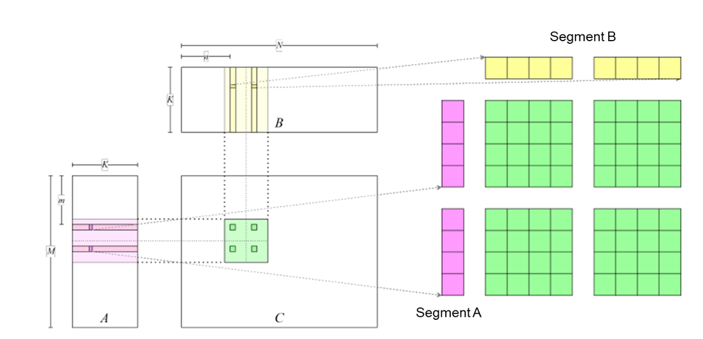

# Performance Optimization Methods

Hardware accelerators boast intricate computational and memory
architectures. To maximize their performance, developers frequently need
to grasp a variety of performance optimization methods. Common methods
encompass enhancing arithmetic intensity, capitalizing effectively on
shared memory, optimizing the memory load/store pipeline, among others.
The subsequent sections will elucidate these methods through practical
programming examples, all aimed towards a singular objective:
accelerating an FP32 GEMM program.

## Implementing General Matrix Multiplication

Code `lst:cpu` shows a reference implementation of GEMM in C++.

**lst:cpu**
```cpp
float A[M][K];
float B[K][N];
float C[M][N];
float alpha, beta;

for (unsigned m = 0; m < M; ++m) {
    for (unsigned n = 0; n < N; ++n) {
        float c = 0;
        for (unsigned k = 0; k < K; ++k) {
            c += A[m][k] * B[k][n];
        }
        C[m][n] = alpha * c + beta * C[m][n];
    }
}
```

ach element in matrix $C$ is independently computed, and numerous GPU
threads can be launched to compute the corresponding elements in matrix
$C$ in parallel. The GPU kernel function is shown in
Code `lst:gpu`.

**lst:gpu**
```cpp
__global__ void gemmKernel(const float * A,
const float * B, float * C,
float alpha, float beta, unsigned M, unsigned N,
unsigned K) {
    unsigned int m = threadIdx.x + blockDim.x * blockIdx.x;
    unsigned int n = threadIdx.y + blockDim.y * blockIdx.y;
    if (m >= M || n >= N)
    return;
    float c = 0;
    for (unsigned k = 0; k < K; ++k) {
        c += A[m * K + k] * B[k * N + n];
    }
    c = c * alpha;
    float result = c;
    if (beta != 0) {
        result = result + C[m * N + n] * beta;
    }
    C[m * N + n] = result;
}
```

Figure :numref:`cuda_naive_gemm` shows the layout of the implementation.
Each element in matrix $C$ is computed by one thread. The row index $m$
and column index $n$ of the element in matrix $C$ corresponding to the
thread are computed in lines 5 and 6 of the GPU kernel. Then, in lines 9
to 11, the thread loads the row vector in matrix $A$ according to the
row index and the column vector in matrix $B$ according to the column
index, computes the vector inner product. The thread also stores the
result back to $C$ matrix in line 17.


:label:`cuda_naive_gemm`

The method of launching the kernel function is shown in
Code `lst:launch`.

**lst:launch**
```cpp
void gemmNaive(const float *A, const float *B, float *C,
float alpha, float beta, unsigned M,
unsigned N, unsigned K) {
    dim3 block(16, 16);
    dim3 grid((M - 1) / block.x + 1, (N - 1) / block.y + 1);
    
    gemmKernel<<<grid, block>>>(A, B, C, alpha, beta, M, N, K);
}
```

Each thread block processes $16\times16$ elements in matrix $C$.
Therefore, $(M - 1) / 16 + 1 \times (N - 1) / 16 + 1$ thread blocks are
used to compute the entire matrix $C$.

Eigen is used to generate data and compute the GEMM result on the CPU.
In addition, error computing and time profiling code are implemented for
the GPU computing result. For details, see
[first_attempt.cu](https://github.com/openmlsys/openmlsys-cuda/blob/main/first_attempt.cu).
After the program is compiled and executed, output results are as
follows:

```
Average time: 48.961 ms
Max error: 0.000092
```

The peak GPU throughput can be approximated by using the following
formula: 2 $\times$ Frequency $\times$ Number of single-precision
compute units. The number of single-precision compute units equals the
number of SMs in the GPU multiplied by the number of single-precision
compute units in each SM. The results are as follows:

```
FP32 peak throughput 29767.680 GFLOPS
Average Throughput: 185.313 GFLOPS
```

A significant gap exists between the performance that can be achieved by
the current code and the peak device performance. In an entire computing
process, the process with the highest computing density is matrix
multiplication $A\times B$. Its time complexity is $O(M*N*K)$, whereas
that time complexity of the entire computing process is
$O(M*N*K+2*M*N)$. Therefore, optimizing matrix multiplication is key to
improving performance.

## Enhancing Arithmetic Intensity

Arithmetic intensity is the ratio of computational instructions to
load/store instructions. Modern GPUs typically have numerous compute
units, constrained only by a limited load/store bandwidth. This
limitation often leaves these units waiting for data loading in a
program. Thus, boosting arithmetic intensity is a crucial step to
improve program performance.

In the GPU kernel function discussed previously, we can approximate its
arithmetic intensity by dividing the total number of floating-point
operations by the number of data reads. When calculating the inner
product within $K$ loops, floating-point multiplication and addition
operations occur each time elements from matrix $A$ and $B$ are loaded.
Consequently, the arithmetic intensity is 1, derived from two 32-bit
floating-point operations divided by two 32-bit data load/store
instructions.

In the original code, each thread handles one element in matrix $C$,
computing the inner product of a row in matrix $A$ and a column in
matrix $B$. In essence, we can elevate the arithmetic intensity by
amplifying the elements in matrix $C$ that each thread can process,
computing the inner product of multiple rows in matrix $A$ and multiple
columns in matrix $B$. More specifically, if $m$ elements in matrix $A$
and $n$ elements in matrix $B$ are loaded concurrently while calculating
the inner product in $K$ loops, there are $m+n$ 32-bit load/store
instructions and $2mn$ 32-bit computational instructions. Hence, the
arithmetic intensity becomes $\frac{2mn}{m+n}$. Therefore, by increasing
$m$ and $n$, we can optimize the arithmetic intensity.

In the preceding section, a `float` pointer was employed to access
global memory and store data in it, utilizing the hardware instructions
`LDG.E` and `STG.E`. Multiple `float` elements can be loaded
concurrently using the 128-bit wide instructions `LDG.E.128` and
`STG.E.128`. These wide instructions can streamline the instruction
sequence, potentially saving dozens of instruction issue cycles compared
to four standard instructions, thereby enabling the issue of more
computational instructions within the saved time. Wide instructions can
also enhance the cache line hit rate. Despite these benefits, we advise
against the blanket use of wide instructions in all code. Instead,
programmers should prioritize direct optimization methods, such as
parallel design and local data reuse.

A specific implementation is stacking four `float` numbers to form a
128-bit `float4` class. The load/store operations will be completed
using a wide instruction for the `float4` class. For details about the
code implementation, see
[util.cuh](https://github.com/openmlsys/openmlsys-cuda/blob/main/util.cuh).

Note that each thread needs to load four `float` numbers (instead of
one) from matrix $A$ and matrix $B$, requiring each thread to process
$4\times 4$ blocks (`thread tile`) in matrix $C$. Each thread loads data
from matrix $A$ and matrix $B$ from left to right and from top to
bottom, computes the data, and stores the data to matrix $C$, as shown
in Figure :numref:`use_float4`.


:label:`use_float4`

For details about the complete code, see
[gemm_use_128.cu](https://github.com/openmlsys/openmlsys-cuda/blob/main/gemm_use_128.cu).
We can further increase the amount of data processed by each thread in
order to improve the arithmetic intensity more, as shown in
Figure :numref:`use_tile`. For
details about the code used to achieve this, see
[gemm_use_tile.cu](https://github.com/openmlsys/openmlsys-cuda/blob/main/gemm_use_tile.cu).


:label:`use_tile`

The test results are as follows:
