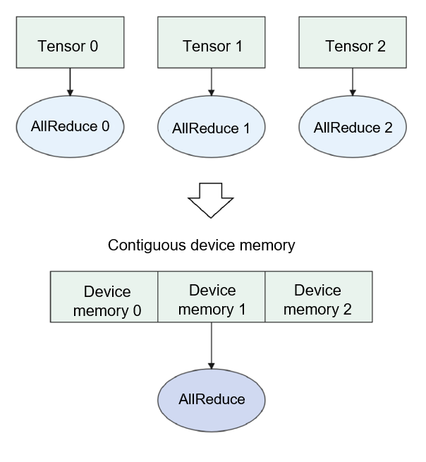

# Memory Allocation

Memory allocation is a crucial aspect of conventional computer memory
hierarchy, acting as a link between cache and disk storage. It provides
more storage capacity than the cache and enables faster access compared
to disk storage. With the progress of deep learning, accommodating large
deep neural networks within the memory of hardware accelerators or AI
processors has become increasingly challenging. To overcome this
obstacle, various solutions have been developed, including memory reuse,
contiguous memory allocation, and in-place memory allocation. Proper
implementation of contiguous memory allocation and in-place memory
allocation can enhance the execution efficiency of operators and further
optimize performance.

## Device Memory

In a deep learning architecture, the memory closest to the hardware
accelerator (such as the GPU or AI processor) is usually referred to as
the device memory, and that closest to the CPU is referred to as the
host memory. As shown in Figure
:numref:`ch07/ch07-compiler-backend-memory-01`, the CPU can
directly access the host memory but not the device memory. Similarly,
the AI processor can directly access the device memory but not the host
memory. In a typical network training process, data needs to be loaded
from disk storage to the host memory, where it is then processed. After
that, the data is copied from the host memory to the device memory, so
that the device can directly access the data. When the computation is
finished, the user can obtain the training result once the result data
is copied from the device memory back to the host memory.

:label:`ch07/ch07-compiler-backend-memory-01`

## Process of Memory Allocation

The memory allocation module allocates device memory to the input and
output of each operator in a graph. The compiler frontend interprets the
user script into an IR, based on which the compiler backend performs
operator selection and optimization to determine information such as the
shape, data type, and format of each input/output tensor of each
operator. With this information, the size of each input/output tensor of
each operator can be calculated using Equation
:eqref:`ch05/equation-04`:

$$\text{size}=\prod_{i=0}^{\text{dimension }}\text{shape}_i \times \text{sizeof}\left ( \text{datatype} \right )
$$ 
:eqlabel:`equation:ch05/equation-04`

Unaligned memory access can be time-consuming, because the transfer of
data to and from memory is most efficient in chunks of 4, 8, or 16
bytes. When the size of the data to be transferred is not a multiple of
any of these sizes, one or more empty bytes are padded to align the data
in memory.

Figure
:numref:`ch07/ch07-compiler-backend-memory-02` illustrates an
example of memory allocation.

:label:`ch07/ch07-compiler-backend-memory-02`

In this example, memory addresses are assigned to the input tensor,
Conv2D's weight, and Conv2D's output. Subsequently, a memory address is
allocated to the input of BatchNorm. Since the input of BatchNorm is the
same as the output of Conv2D, which already has a allocated memory
address, the output address of Conv2D can be shared with the input of
BatchNorm. This approach avoids redundant memory allocation and
unnecessary memory copies. The entire training process in this example
involves allocating memory for three types based on their data lifetime:
the initial input of the graph, the weights or attributes of operators,
and the output tensor of the final operator.

Frequent allocations and deallocations of memory blocks of various sizes
using functions like `malloc` can significantly degrade performance. To
mitigate this issue, memory pools can be employed. Memory pools involve
pre-allocating a specific amount of memory, allowing memory blocks to be
dynamically allocated from the pool as needed and returned for reuse.

Memory pools are widely utilized in AI frameworks to manage frequent
allocations of device memory and ensure consistent memory lifetime for
tensors. Different AI frameworks adopt similar memory pool designs.
Figure
:numref:`ch07/ch07-compiler-backend-memory-03` presents an
example of memory allocation in an AI framework. In this case, each
tensor's memory is allocated from a pre-allocated device memory space
using double pointers to offset the start and end addresses. Weight
tensors of operators are allocated memory by offsetting from the start
address (with a lifetime lasting throughout the training process). The
output tensor of each operator is allocated memory by offsetting from
the end address (with a shorter lifetime that terminates when the tensor
is no longer needed in the computation process). This approach allows
operator memory to be allocated using offset pointers from pre-allocated
device memory, significantly reducing the time required compared to
direct memory allocations from the device.

:label:`ch07/ch07-compiler-backend-memory-03`

## Memory Reuse

In a machine learning system, memory reuse is achieved by analyzing the
lifespan of a tensor and, once it reaches the end of its lifespan,
releasing its device memory back to the memory pool for future reuse by
other tensors. The objective of memory reuse is to enhance memory
utilization and enable the accommodation of larger models within the
constraints of limited device memory. By reusing memory instead of
continuously allocating new memory for tensors, the system can optimize
memory utilization and mitigate the memory limitations inherent in deep
learning computations.

Figure
:numref:`ch07/ch07-compiler-backend-memory-02` provides an
example, where output 1 becomes unused once the computation of the
BatchNorm operator is complete. In this case, the device memory of
output 1 can be reclaimed and reused for output 3 (if output 3 does not
require a larger memory size than output 1).

Figure
:numref:`ch07/ch07-compiler-backend-memory-04` depicts memory
lifetime using coordinate charts. The horizontal axes represent the
tensor lifetime, and the vertical axes represent the memory sizes.
During its lifetime, a tensor occupies a specific amount of device
memory. The objective of memory allocation is to find an optimal
solution that accommodates the maximum number of non-conflicting
rectangular blocks (each denoting a tensor's lifetime and memory size)
in the same memory. In Figure
:numref:`ch07/ch07-compiler-backend-memory-04`, the memory can
accommodate only four rectangular blocks (i.e., tensors T0, T1, T2, and
T3) when no memory reuse policy is applied, as shown in the left chart.

:label:`ch07/ch07-compiler-backend-memory-04`

To determine an appropriate memory reuse policy, we face an NP-complete
problem. AI frameworks often employ greedy algorithms, such as best-fit,
which allocate memory by searching for the smallest available block in
the memory pool one at a time. However, this approach only yields a
locally optimal solution rather than a globally optimal one. To
approximate a globally optimal solution, a method called Safe Optimized
Memory Allocation Solver (SOMAS) can be considered.

SOMAS addresses the computational graph by conducting aggregative
analysis on parallel streams and data dependencies. This analysis
reveals the ancestor-descendant relationships between operators. By
generating a global set of mutually exclusive constraints concerning the
lifetime of each tensor, SOMAS combines multiple heuristic algorithms to
achieve an optimal solution for static memory planning. Through SOMAS,
an optimized memory reuse outcome is obtained, resulting in increased
reusable memory.

As shown in the right chart of Figure
:numref:`ch07/ch07-compiler-backend-memory-04`, with the SOMAS
algorithm, the number of tensors allowed in the same memory is increased
to seven.

## Optimization Techniques for Memory Allocation

In the following, we describe the typical optimization techniques for
memory allocation.

### Memory Fusion

Commonly used memory allocation methods operate at the tensor level,
often resulting in discontinuous device addresses across tensors.
However, certain specialized operators, like AllReduce for
communication, require contiguous memory allocation. Executing a
communication operator involves waiting for communication, which is a
significant performance bottleneck in large-scale distributed systems.
It includes data transfer and computation. To minimize communication
time, we can fuse multiple communication operators into a composite
operator. This allows for contiguous memory allocation of the operator
input, as depicted in Figure
:numref:`ch07/ch07-compiler-backend-memory-06`.

Additionally, the time spent in communication can be reduced during the
weight initialization task in distributed neural network training. This
task involves broadcasting the initialized weight from one process to
all processes. If a network contains multiple weights (which is often
the case), these broadcasts are repeated. To minimize communication time
in this scenario, a typical approach is to allocate contiguous memory
addresses to all weights on the network and then perform a single
broadcast operation.

:label:`ch07/ch07-compiler-backend-memory-06`

### In-place Operators

In the memory allocation process depicted in
Figure :numref:`ch07/ch07-compiler-backend-memory-02`, the input and
output of each operator are assigned different memory addresses.
However, this approach can lead to memory waste and performance
degradation for several other operators. Examples include optimizer
operators used to update neural network weights, Python's `+=` or `*=`
operators that modify variable values, and the `a[0]=b` operator that
updates the value of `a[0]` with `b`. These operators share a common
purpose: updating the input value. The concept of in-place can be
illustrated using the `a[0]=b` operator.

In the original implementation shown on the left of Figure
:numref:`ch07/ch07-compiler-backend-memory-08`, the operator
involves three steps: copying tensor `a` to tensor `a’`, assigning
tensor `b` to tensor `a’`, and then copying tensor `a’` back to tensor
`a`. However, by performing the operation in-place, as depicted on the
right of Figure
:numref:`ch07/ch07-compiler-backend-memory-08`, this process is
simplified to a single step: copying tensor `b` to the position
corresponding to tensor `a`. This reduces data copy time by eliminating
two copies and eliminates the need to allocate memory for tensor `a’`.

:label:`ch07/ch07-compiler-backend-memory-08`

## Data Compression

Deep neural networks (DNNs) in modern training heavily rely on GPUs to
effectively train intricate networks with hundreds of layers. A
prominent challenge faced by both researchers and industry professionals
is the constraint imposed by the available GPU main memory as networks
become deeper. This limitation restricts the size of networks that can
be trained. To address this issue, researchers have recognized the value
of employing DNN-layer-specific encoding schemes. Consequently, they
have directed their attention towards storing encoded representations of
the intermediate layer outputs (feature maps) that are required for the
backward pass. These encoded representations are stored during the
temporal gap between their uses and are decoded only when needed for the
backward pass. The full-fidelity feature maps are promptly discarded
after use, resulting in a noteworthy reduction in memory consumption.

## Memory Swap

Machine learning frameworks frequently necessitate users to optimize
their memory utilization to guarantee that the DNN can be accommodated
within the memory capacity of the GPU. This constraint restricts
researchers from thoroughly investigating diverse machine learning
algorithms, compelling them to make concessions either in terms of
network architecture or by distributing the computational load across
multiple GPUs. One feasible approach is to incorporate DRAM to
facilitate memory swapping. By transferring temporarily inactive data to
DRAM, we can optimize GPU utilization. In recent studies, researchers
have implemented a cautious approach to allocating GPU memory for the
immediate computational needs of a specific layer. This strategy
effectively reduces both the maximum and average memory usage, enabling
researchers to train more extensive networks. To elaborate further, the
researchers promptly release feature maps from GPU memory in the absence
of any potential reuse. Alternatively, if there is a possibility of
future reuse but no immediate requirement, the feature maps are
offloaded to CPU memory and subsequently prefetched back to GPU memory.

The fundamental concept behind memory swapping is straightforward and
inherent. However, its implementation remains challenging and
necessitates prior expertise in our compiler frontend. One such
expertise involves maximizing the overlap between computation and data
swapping time. A precise cost model is essential for evaluating the
estimated time required for data movement and the time cost associated
with each layer in DNN (Deep Neural Network). Additionally, there are
numerous strategies to explore in auto scheduling and auto tuning.
Fortunately, there is an abundance of literature available that
addresses these issues. For additional information, please refer to the
Further Readings section.
