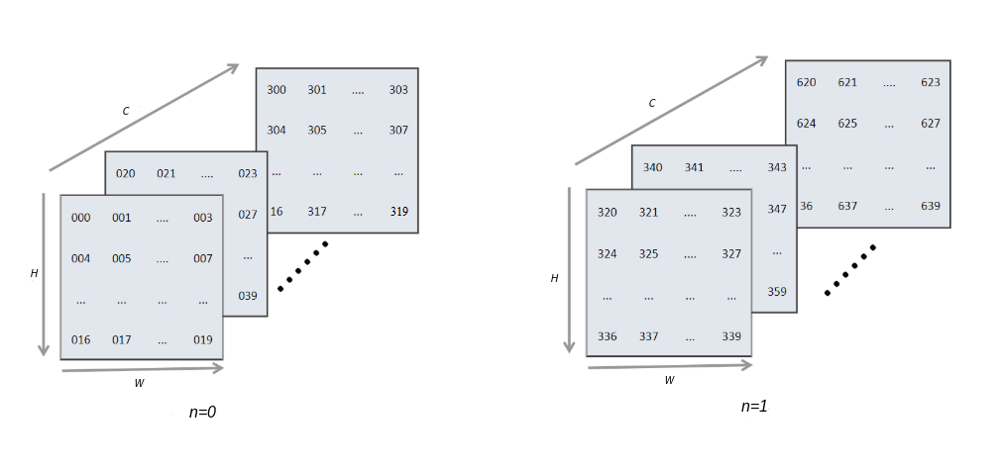

# Operator Selection

Following graph optimization, the compiler backend generates a sequence
of operators that can be executed on hardware. This is achieved by
selecting the most suitable operators from a set of candidate operators
for each node in the IR. Since these candidate operators have diverse
specifications, their execution efficiency varies depending on the
scenario. Therefore, the primary objective of operator selection is to
choose the operators that are most appropriate for the target device
based on the information provided by the IR.

## Basic Concepts of Operator Selection

We can think of the nodes in a backend-optimized IR as being units of
execution that are visible to the user, and each unit represents a
hardware-agnostic operation in the user code. In essence, operator
selection involves selecting appropriate hardware information, which is
referred to as operator information. Such information defines the
following:

1.  The format of an operator, which is a determinant of the operator's
    performance on the target platform. Machine learning systems
    commonly use NCHW and NHWC formats.

2.  The data type (such as float32, float16, or int32) of an operator on
    the target platform. The operators selected are those with data
    types close to (or the same as) user definitions.

### Data Formats

In machine learning systems, many operations are converted into matrix
multiplication (e.g., convolution) for faster computation. Matrix
multiplication in the form of
$\textit{\textit{A}}\times \textit{\textit{B}} = \textit{\textit{C}}$ is
essentially a row-by-column multiplication. Specifically, the entry *ij*
of **C** is obtained by multiplying the entries in the *i*th row of
**A** and the corresponding entries in the *j*th column of **B** and
then adding the results together. Consider the example shown in Figure
:numref:`ch07/ch07-compiler-backend-06`. Matrix data is stored in
row-major order by default, as shown at the top of the figure. However,
matrix **B** is read in column-major order in the matrix multiplication
process, as shown at the bottom.

:label:`ch07/ch07-compiler-backend-06`

Storing matrix **B** in the reading order increases the computation
efficiency because access to contiguous blocks of memory is faster. We
can therefore see that data formats play an important role in
performance improvement.

There are two major formats in machine learning systems: NCHW and NHWC.
For an image input, N denotes the batch size, C denotes the number of
channels, and H and W denote the height and width respectively. Figure
:numref:`ch07/ch07-compiler-backend-07` depicts the logical
diagram of an input with batch size 2, channels 16, height 5, and width
4.

:label:`ch07/ch07-compiler-backend-07`

A multidimensional matrix is flattened into 1D format before it is
written to memory. This involves indexing, which maps logical data to
physical memory.

Access to machine learning data is performed in an axis-wise order from
the last axis forward. For instance, data in NCHW format is read in the
axis order of W, H, C, and N. Equation
:eqref:`ch05/equation-01` denotes the mapping between
logical memory and physical memory for this format of data.

$$\text{offsetnchw}(n,c,h,w) = n \times \textit{C} \times \textit{H} \times \textit{W} + c \times \textit{H} \times \textit{W} + h \times \textit{W} + w
$$ 
:eqlabel:`equation:ch05/equation-01`

As shown in Figure
:numref:`ch07/ch07-compiler-backend-08`, matrix elements are
flattened from the lowest dimension (i.e., W axis) forward, and
neighboring elements of an axis reside next to each other in memory. To
take the same element on the next image in the same location, the whole
image size ($C*H*W$) has to be jumped. Assume we have a batch of eight
RGB images of size 32$\times$`<!-- -->`{=html}32, or a matrix with
$N=8,C=3,H=32,W=32$. Memory storage of these images begins from the
first channel of the first image by flattening the matrix along axis W
and then arranging matrix elements along axis H. This is performed
before the next channel is processed. The same procedure is repeated
until the last channel of the last image is processed. NCHW is the
default format on PyTorch and MindSpore.

:label:`ch07/ch07-compiler-backend-08`

Access to data in NHWC format also begins at the lowest dimension (i.e.,
C axis) forward. NHWC is the default format on TensorFlow (PyTorch
refers to it as the channel-last format). Equation
:eqref:`ch05/equation-02` denotes the mapping from logical
memory to physical memory for this format of data.
$$\text{offsetnchw}(n,h,w,c) = n \times \textit{H} \times \textit{W} \times \textit{C} + h \times  \textit{W} \times \textit{C} + w \times \textit{C} + c
$$ 
:eqlabel:`equation:ch05/equation-02`

Figure
:numref:`ch07/ch07-compiler-backend-nchwandnhwc` compares the
logical indexing of the NCHW and NHWC formats. The \[x:1\] marks refer
to the jumps from the innermost axis to the next. For example, \[a:1\]
indicates the jump from axis W to axis H, and \[b:1\] indicates the jump
from axis C (the innermost) to axis W.

:label:`ch07/ch07-compiler-backend-nchwandnhwc`

These two formats offer a high degree of flexibility and are therefore
used on many frameworks. However, to accelerate computing on hardware,
further optimization is needed. In a machine learning system, if the
size of the user input exceeds what the compute component can pass
through the network at a time (which is often the case), the input will
be batched before computation. For further optimization, many frameworks
introduce blocked formats (which are more hardware-friendly), such as
the nChw16c and nChw8c formats of the oneAPI Deep Neural Network Library
(oneDNN) and the NC1HWC0 format on the Ascend platform. By leveraging
hardware acceleration instructions to move and compute data, matrices
can be quickly transformed into vectors, increasing the utilization of
the on-chip cache.

### Data Types

Single-precision (float32), occupying 32 bits in memory, is the most
commonly used data type in machine learning systems. In applications
where higher precision is not essential, the half-precision (float16)
data type may be used, occupying 16 bits in memory. When used on
hardware, float16 offers up to 7 times more arithmetic throughput with
less memory footprint compared with the single-precision data type ---
this allows for larger batch sizes and consequently reduced training
time. Next, we will look at the differences between half-precision
floating-point numbers and single-precision floating-point numbers.

In Figure :numref:`ch07/ch07-float32andfloat16`, *Sig* refers to the sign
bit that indicates the sign of a number, *Exponent* refers to the
exponent bits, and *Mantissa* refers to the mantissa bits.

:label:`ch07/ch07-float32andfloat16`

Applying Equation
:eqref:`ch05/equation-03` will convert a float16 number in
binary scientific notation to decimal format.
$$(-1)^{\text{Sig}}\times 2^{\text{Exponent}-15}\times (\frac{\text{Mantissa}}{1024}+1)
$$ 
:eqlabel:`equation:ch05/equation-03`

If the exponent bits and mantissa bits are all 0s, the number is 0. If
the exponent bits are all 0s but the mantissa bits are not, the number
is very small. If the exponent bits are all 1s and the mantissa bits are
all 0s, the number is an infinity, either positive or negative depending
on the sign bit. Not a Number (NaN) is denoted by the exponent bits
being all 1s while the mantissa bits are not all 0s. bfloat16 is a
special data type developed by Google for machine learning on its tensor
processing units (TPUs). Although bfloat16 is not an industry-standard
IEEE 16-bit floating-point data type, it has the same exponent size as
float32, meaning that it can be easily converted to and from float32.

### Operator Information Library

Hardware devices support different operators based on their data format
and data type requirements. Each device maintains an operator
information library that contains a comprehensive list of operators
supported by that device. During the operator selection process, the
most suitable operators are chosen from this library. The library serves
as a reference for determining which operators are compatible and can be
efficiently executed on a particular hardware device.

## Process of Operator Selection

Operator selection involves selecting the most appropriate operator for
each operation node in an IR. Operator information contains the
supported device type, data type, and data format. After the compiler
frontend completes type inference and static analysis, the data type of
user code is derived from the IR.

Figure :numref:`ch07/ch07-compiler-backend-select` shows the operator
selection process. First, the target hardware needs to be selected (or
this step can be skipped in order to keep the default hardware selection
defined in the compiler backend). The implementation, supported data
types, and execution efficiency of a given operator vary depending on
the target hardware. Then, the compiler backend selects an operator
based on the data type and data format derived from the IR.

:label:`ch07/ch07-compiler-backend-select`

The result of the operator selection process might not be as expected
due to software or hardware specifications. Sometimes, we might need to
adjust the precision of a particular node to find an operator with the
right data type. For example, the Conv2D operator supported by Ascend
(i.e., the backend of MindSpore) allows only the float16 data type. When
used on a float32 network on Ascend, the Conv2D operator is executable
only when its input precision is reduced from float32 to float16.

Converting operators from one format to another can be time-consuming
and incur memory movement overheads. To avoid this, data should be
transferred between operators of the same format whenever possible. In
addition, data type inconsistency may lead to reduced precision,
potentially slowing down or even preventing network convergence. As
such, thorough operator analysis is needed to ensure that the right data
type is selected.

Simply put, an operator selection algorithm is considered optimal if it
keeps the data type as consistent as possible with user settings while
also minimizing data format conversion.
