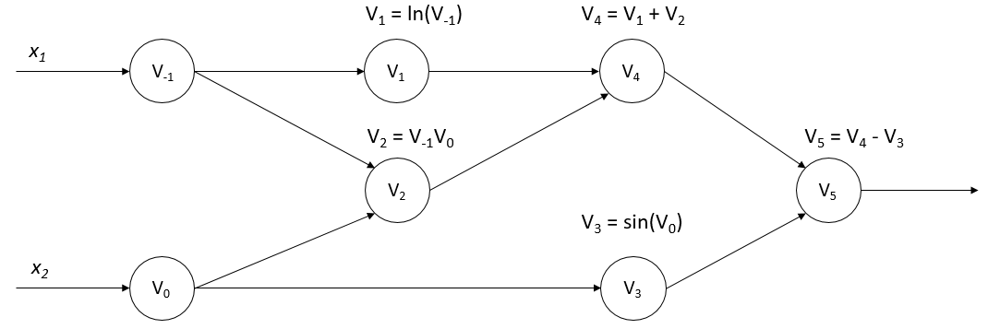

# Automatic Differentiation

In the following, we describe the key methodologies applied in automatic
differentiation.

## Types of Differentiation Methods

Differentiation constitutes a collection of methodologies enabling the
efficient and precise evaluation of derivatives within computer
programs. Since the 1960s and 1970s, it has been extensively utilized
across multiple sectors including fluid mechanics, astronomy, and
mathematical finance . Its theories and implementation have been
rigorously studied over time.

With the advancement of deep learning, which has shown remarkable
progress across an expanding range of machine learning tasks in recent
years, automatic differentiation has found wide-spread application in
the field of machine learning. Given that many optimization algorithms
employed in machine learning models necessitate derivatives of the
models, automatic differentiation has emerged as an integral component
within mainstream machine learning frameworks such as TensorFlow and
PyTorch.

There are four primary methods to evaluate derivatives in computer
programs, each of which is explained in the following sections.

### Manual Differentiation

Manual differentiation involves the direct computation of the derivative
expression of a function, a task which hinges upon the input values
specified within a program. Although this method could seem appealing
due to its simplicity and directness, it is worth noting that it comes
with its share of limitations.

A primary drawback of manual differentiation is the need to re-derive
and re-implement the derivative every time a function changes, which can
be laborious and time-consuming. This is especially true for complex
functions or when working on large-scale projects where the function
might undergo frequent updates.

Moreover, manual differentiation can be prone to human errors. The
process of deriving complex functions often involves intricate chains of
mathematical reasoning. A slight oversight or error in any of these
steps can lead to an incorrect derivative, which, in turn, can greatly
affect the outcome of the computation. This susceptibility to mistakes
can add a layer of uncertainty to the reliability of this method.

Furthermore, in cases where high-order derivatives or partial
derivatives with respect to many variables are needed, manual
differentiation quickly becomes unfeasible due to the increase in
complexity. The difficulty of computing these derivatives correctly
grows exponentially with the number of variables and the order of the
derivative.

### Numerical Differentiation

Numerical differentiation is an approach that logically stems from the
fundamental definition of a derivative and employs the method of
difference approximation. The basic formula for numerical
differentiation can be described as follows:

$$f^{'}(x)=\lim_{h \to 0}\frac{f(x+h)-f(x)}{h}$$

In this equation, for a sufficiently small value of the step size $h$,
the difference quotient $\frac{f(x+h)-f(x)}{h}$ is used as an
approximation of the derivative. The inherent error in this
approximation is referred to as the truncation error, which
theoretically diminishes as the value of $h$ approaches zero. This
suggests that a smaller step size would yield a more accurate
approximation.

However, the scenario in practice is not always so straightforward due
to the phenomenon of round-off error. This error arises from the finite
precision of floating-point arithmetic operations in digital computer
systems. As the value of $h$ decreases, the round-off error conversely
increases, adding a degree of uncertainty to the computation.

This creates a complex interplay between truncation error and round-off
error. When the value of $h$ is large, the truncation error dominates,
whereas when $h$ is small, the round-off error is more significant.
Consequently, the total error of numerical differentiation achieves a
minimum at an optimal $h$ value that balances these two types of errors.

In a nutshell, while numerical differentiation offers the advantage of
relative simplicity in implementation, it suffers from certain
limitations with regard to accuracy. The complexities arising from the
interplay between truncation and round-off errors make it less reliable
for certain tasks, particularly when high precision is required.
Therefore, for many practical applications, more sophisticated
techniques of automatic differentiation are preferred.

### Symbolic Differentiation

Symbolic differentiation involves the use of computer programs to
automatically calculate derivatives. This is accomplished by recursively
transforming function expressions in accordance with specific
differentiation rules. These rules can be summarized as follows:

$$\frac{\partial}{\partial x}(f(x)+g(x))\rightsquigarrow\frac{\partial}{\partial x}f(x)+\frac{\partial }{\partial x}g(x)$$

$$\frac{\partial}{\partial x}(f(x)g(x))\rightsquigarrow(\frac{\partial}{\partial x}f(x))g(x)+f(x)(\frac{\partial}{\partial x}g(x))$$

Symbolic differentiation has been integrated into many modern algebraic
systems such as Mathematica, as well as machine learning frameworks like
Theano. It successfully addresses the issues related to hard-coding
derivatives inherent in manual differentiation, thus automating the
differentiation process and minimizing human error.

Despite these advantages, symbolic differentiation has its own set of
challenges. One of its primary limitations is its strict adherence to
transforming and expanding expressions recursively, without the ability
to reuse previous results of transformations. This can lead to a
phenomenon known as expression swell , which results in highly complex
and expanded expressions that can significantly slow down computation
and increase memory usage.

In addition, symbolic differentiation requires that the expressions to
be differentiated are defined in closed form. This constraint largely
restricts the use of control flow statements such as loops and
conditional branches, which are common in programming. This lack of
flexibility can significantly limit the design and expressivity of
neural networks within machine learning frameworks, as these often
require intricate control flow structures for more advanced operations.

### Automatic Differentiation

Automatic differentiation cleverly amalgamates the strategies of
numerical differentiation and symbolic differentiation to offer an
efficient and precise mechanism for derivative evaluation. It breaks
down the arithmetic operations in a program into a finite set of
elementary operations, for each of which the rules of derivative
evaluation are already known. Upon determining the derivative of each
elementary operation, the chain rule is applied to synthesize these
individual results, ultimately yielding the derivative of the entire
program.

The fundamental strength of automatic differentiation lies in its
ability to sidestep the primary drawbacks of both numerical and symbolic
differentiation. Unlike numerical differentiation, which suffers from
precision issues due to truncation and round-off errors, automatic
differentiation facilitates accurate derivative evaluations.
Furthermore, it mitigates the issue of expression swell, a significant
concern in symbolic differentiation, by decomposing the program into a
series of elementary expressions. Symbolic differentiation rules are
only applied to these simplified expressions, and the derivative results
are reused to enhance efficiency.

Automatic differentiation also surpasses symbolic differentiation in its
capability to handle control flow statements. It has the ability to
process branching, looping, and recursion, enhancing its flexibility and
applicability to complex computational scenarios.

In contemporary applications, automatic differentiation has found
widespread use in deep learning frameworks for the evaluation of
derivatives, given its blend of accuracy and efficiency. The subsequent
sections delve into the mechanics and implementation aspects of
automatic differentiation, elucidating its role as a crucial tool in
computational mathematics and machine learning.

## Forward Mode and Reverse Mode

Automatic differentiation can be categorized into two modes, forward and
reverse, based on the sequence in which the chain rule is applied.
Consider a composite function $y=a(b(c(x)))$. The formula to calculate
its gradient, $\frac{\partial y}{\partial x}$, is given as:

$$\frac{\partial y}{\partial x}=\frac{\partial y}{\partial a}\frac{\partial a}{\partial b}\frac{\partial b}{\partial c}\frac{\partial c}{\partial x}$$

In the forward mode of automatic differentiation, the computation of the
gradient originates from the inputs, as shown in the following
formulation:

$$\frac{\partial y}{\partial x}=(\frac{\partial y}{\partial a}(\frac{\partial a}{\partial b}(\frac{\partial b}{\partial c}\frac{\partial c}{\partial x})))$$

Conversely, in the reverse mode, the computation of the gradient begins
from the outputs, represented by the equation:

$$\frac{\partial y}{\partial x}=(((\frac{\partial y}{\partial a}\frac{\partial a}{\partial b})\frac{\partial b}{\partial c})\frac{\partial c}{\partial x})$$

To illustrate the computation methods of the two modes, let us consider
the following function and aim to evaluate its derivative,
$\frac{\partial y}{\partial x_1}$ at the point $(x_1, x_2)=(2,5)$:
$$y=f(x_1,x_2)=ln(x_1)+{x_1}{x_2}-sin(x_2)$$

Figure :numref:`ch04/ch04-calculation_graph` represents the
computational graph of this function, providing a visual demonstration
of how automatic differentiation processes the function in both forward
and reverse modes. This distinction between forward and reverse modes is
particularly important when dealing with functions of multiple
variables, with each mode having specific use cases and efficiency
implications.

:label:`ch04/ch04-calculation_graph`

### Forward Mode

:label:`ch04/ch04-forward-mode-compute-function`
