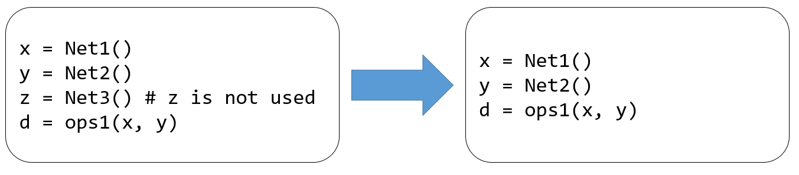
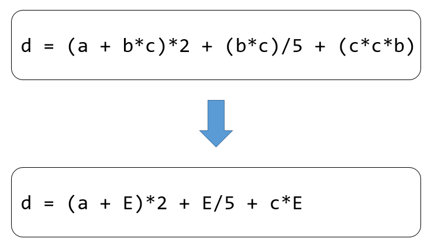

# Frontend Compilation Optimization

Much like classical compilers, AI compilers implement compilation
optimization to enhance the effectiveness of the IRs generated during
the compilation process. This strategy reduces not only the length of
the code and the time required for its compilation and execution but
also diminishes the energy usage of processors during execution.
Compilation optimization techniques can be divided into two categories:
hardware-agnostic optimization and hardware-specific optimization.
However, all optimization techniques applied at the frontend are
inherently hardware-agnostic, as the frontend remains oblivious to the
backend hardware specifics.

## Process of Compilation Optimization

Typically, compilation optimizers execute a sequence of optimization
passes. In each pass, an IR is used as input, which then produces a
revised IR as output. A single pass might incorporate several sub-passes
and can be conducted once or multiple times.

The overall success of compilation optimization significantly depends on
the selection and ordering of optimization operations. Not only does the
compiler execute various compilation optimization operations as needed,
but it can also adjust the number of optimization passes along with the
types and sequence of optimization operations. These adjustments are
contingent upon the set level of compilation optimization, as
illustrated in Figure :numref:`ch06/ch06-opt-pass`.

:label:`ch06/ch06-opt-pass`

## Prevalent Optimization Methods

Today, a wide array of frontend compilation optimization methods exist.
Analogously, machine learning frameworks also employ various
optimization methods, although these diverge from those found in
classical compilers. This section will detail three frequently employed
and versatile frontend compilation optimization methods.

### Elimination of Dead Code and Unreachable Code

Dead code refers to segments of code that yield outputs not utilized by
any other code, while unreachable code refers to segments of code that
are not included in any valid control flow path. Figure
:numref:`ch06/ch06-opt-pass-useless-code0-elimination`
demonstrates these two types of code. The removal of dead or unreachable
code can decrease the size of IRs and expedite both the compilation and
execution of a program. These types of code can result from human errors
or may manifest during other compilation optimizations.

:label:`ch06/ch06-opt-pass-useless-code0-elimination`

In Chapter
[\[subsec:conversion_between_and_combination_of_dynamic_and_static_graphs\]](#subsec:conversion_between_and_combination_of_dynamic_and_static_graphs){reference-type="ref"
reference="subsec:conversion_between_and_combination_of_dynamic_and_static_graphs"},
it was previously mentioned that the tracing method can be employed
during the process of converting dynamic graphs to static graphs. The
tracing method is considered highly effective in identifying dead code
and unreachable code. Consequently, this step is often incorporated into
the graph conversion procedure.

### Constant Propagation and Constant Folding

Constant propagation is a process that replaces specific constants with
their known values during compilation. On the other hand, constant
folding is a process that substitutes variables with constants when the
results of multiple operations can be computed directly during
compilation.
Figure :numref:`ch06/ch06-opt-pass-constant-broadcast` depicts these two
methods.

:label:`ch06/ch06-opt-pass-constant-broadcast`

### Common Subexpression Elimination

In order to understand what common subexpression elimination entails,
let's consider the following: If an expression E has been computed and
the values of all its variables remain unchanged from the prior
computation, E is identified as a common subexpression. This concept is
visualized in
Figure :numref:`ch06/ch06-opt-pass-CSE`. As such, E doesn't need to be
computed again; it can be directly replaced with the expression result
obtained from the preceding computation.

:label:`ch06/ch06-opt-pass-CSE`

Common subexpression elimination, like the elimination of dead code and
unreachable code, is typically carried out during the graph conversion
process. In PyTorch, the torch script module provides a dedicated API
for common subexpression elimination. This approach is inherent as it
simplifies the identification of common subexpressions within
torchscript.
