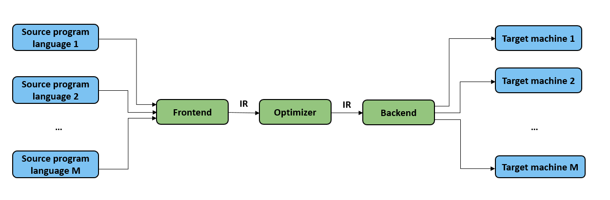

# Intermediate Representation

In this section, we begin by introducing basic IR concepts and the types
of IR employed in classical compilers. Next, we address the new
requirements and challenges that arise in the IR design for machine
learning frameworks. To conclude this section, we examine the types of
IRs utilized by well-known machine learning frameworks and delve into
their implementation.

## Definition of Intermediate Representations

An IR is a data structure or a form of code that a compiler utilizes to
represent source code. Almost all compilers need IRs to model the
program code that requires analysis, transformation, and optimization.
The representational capability of an IR is crucial during the
compilation process. It must accurately depict source code without
information loss, ensure the completeness of the source-to-target code
compilation, and guarantee the effectiveness and performance of code
optimization.

As illustrated in Figure :numref:`ch04/ch04-IR`, IRs facilitate the representation of
multiple source program languages from the frontend and enable the
backend to connect to various target machines. Located between the
frontend and backend is an optimizer, which allows for the addition of
new optimization processes directly into the frontend and backend. These
processes use existing IRs as input and generate new IRs as output. By
analyzing and optimizing IRs, the optimizer enhances the extensibility
of the compilation process and minimizes the impact that might be
introduced during an optimization process on the frontend and backend.

:label:`ch04/ch04-IR`

With the ongoing evolution of compiler techniques, the development of
IRs has progressed through three stages. In the initial stage, IRs were
confined within a compiler and exclusively used by compiler developers.
During the middle stage, when specific compilers became open source, IRs
started being made publicly available, primarily for use by the users of
compilers and related compilation tools. In the current stage, IRs are
advancing toward facilitating an ecosystem of ecosystems (through a
unified IR approach), encouraging increasing stakeholders (for example,
hardware accelerator designers, machine learning framework users, and
more) to participate in advertising AI computing.

## Types of Intermediate Representations

We will discuss various types of IR structures used by classical
compilers. Understanding these IR structures is essential for analyzing
source programs and generating optimized compiled code. Table
:numref:`ch06/ch06-categorize` offers an overview of the
different IR types. It is important to design IR structures carefully,
considering the specific requirements of the compiler's design.

