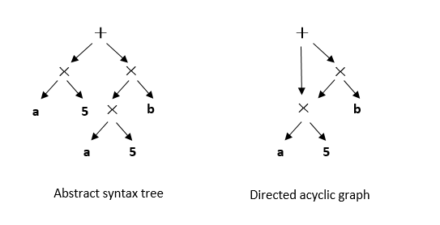

# Intermediate Representation

In this section, we begin by introducing basic IR concepts and the types
of IR employed in classical compilers. Next, we address the new
requirements and challenges that arise in the IR design for machine
learning frameworks. To conclude this section, we examine the types of
IRs utilized by well-known machine learning frameworks and delve into
their implementation.

## Definition of Intermediate Representations

An IR is a data structure or a form of code that a compiler utilizes to
represent source code. Almost all compilers need IRs to model the
program code that requires analysis, transformation, and optimization.
The representational capability of an IR is crucial during the
compilation process. It must accurately depict source code without
information loss, ensure the completeness of the source-to-target code
compilation, and guarantee the effectiveness and performance of code
optimization.

As illustrated in Figure :numref:`ch04/ch04-IR`, IRs facilitate the representation of
multiple source program languages from the frontend and enable the
backend to connect to various target machines. Located between the
frontend and backend is an optimizer, which allows for the addition of
new optimization processes directly into the frontend and backend. These
processes use existing IRs as input and generate new IRs as output. By
analyzing and optimizing IRs, the optimizer enhances the extensibility
of the compilation process and minimizes the impact that might be
introduced during an optimization process on the frontend and backend.


:label:`ch04/ch04-IR`

With the ongoing evolution of compiler techniques, the development of
IRs has progressed through three stages. In the initial stage, IRs were
confined within a compiler and exclusively used by compiler developers.
During the middle stage, when specific compilers became open source, IRs
started being made publicly available, primarily for use by the users of
compilers and related compilation tools. In the current stage, IRs are
advancing toward facilitating an ecosystem of ecosystems (through a
unified IR approach), encouraging increasing stakeholders (for example,
hardware accelerator designers, machine learning framework users, and
more) to participate in advertising AI computing.

## Types of Intermediate Representations

We will discuss various types of IR structures used by classical
compilers. Understanding these IR structures is essential for analyzing
source programs and generating optimized compiled code. Table
:numref:`ch06/ch06-categorize` offers an overview of the
different IR types. It is important to design IR structures carefully,
considering the specific requirements of the compiler's design.

: Types of IRs

| IR Structure  | Characteristics                       | Examples |
| --------------| --------------------------------------| ----------------------------------------------
| Linear IR     | Based on linear code                  | Stack machine code, three-address code |
| Graphical IR  | Based on graphs                       | Abstract syntax tree, directed acyclic graph |
| Hybrid IR     | Based on both graphs and linear code  |LLVM IR |
:label:`ch06/ch06-categorize`


### Linear Intermediate Representation

Linear IRs are widely used in compiler design, resembling assembly code
for abstract machines. They represent the code to be compiled as a
sequentially ordered series of operations. This ordering is important in
practical terms. Linear IRs are popular because most processors utilize
linear assembly languages.

Two common types of linear IRs are stack machine code and three-address
code . Stack machine code, a form of single-address code, offers a
straightforward and compact representation. Instructions in stack
machine code typically consist solely of an opcode that specifies an
operation, with operands stored on a stack. Most instructions retrieve
operands from the stack and push the results of their operations back
onto it. On the other hand, three-address code (3AC) emulates the
instruction format used in modern RISC machines. It employs a set of
quadruples, each containing an operator and three addresses (two
operands and one target). Figure
:numref:`ch04/ch04-linearIR` illustrates the stack machine code
and three-address code representations for the expression $a-b*5$.


:label:`ch04/ch04-linearIR`

### Graphical Intermediate Representation

Graphical IRs store information about the compilation process in the
form of graphs. These graphs utilize nodes, edges, lists, trees, and
other elements to collectively represent an algorithm. Although all
graphical IRs consist of nodes and edges, they differ in terms of
abstraction levels and graph structures. Common examples of graphical
IRs include abstract syntax trees (ASTs), directed acyclic graphs
(DAGs), and control-flow graphs (CFGs).

An AST is a tree-structured IR that closely resembles the structure of
the source code. Figure :numref:`ch04/ch04-AST_DAG` depicts the AST for the expression
$a5+a5b$. It is worth noting that the AST contains two identical copies
of $a5$, which introduces redundancy. To address this redundancy, the
DAG offers a simplified representation where identical subtrees can be
shared by multiple parent nodes. By reusing subtrees, the DAG reduces
the cost of the evaluation process, especially when the compiler can
verify that the value of $a$ remains constant.


:label:`ch04/ch04-AST_DAG`

### Hybrid Intermediate Representation

Hybrid IRs combine both linear IR and graphical IR elements. An example
of a hybrid IR is LLVM IR , which is illustrated in Figure
:numref:`ch04/ch04-LLVM_IR`. LLVM is an open-source compiler
framework with the goal of providing unified IRs for different frontends
and backends.

In LLVM IR, linear IRs are used to construct basic blocks, while
graphical IRs represent the control flow between these blocks. Each
instruction within a basic block is presented as a static single
assignment (SSA) . SSA requires each variable to be defined before use,
with values assigned to them only once. Multiple SSA instructions form a
linear list within a basic block.

In the control flow graph (CFG), each node represents a basic block, and
control transfer between these blocks is implemented through edges. This
combination of linear IR for basic blocks and graphical IR for control
flow allows for a flexible and efficient representation in LLVM IR.


:label:`ch04/ch04-LLVM_IR`

## Intermediate Representation in Machine Learning Frameworks

Classical IRs (such as LLVM IR) primarily target programming languages
for general-purpose computation tasks, which falls short of satisfying
the unique requirements of machine-learning-related computation. When
designing IRs tailored for machine learning frameworks, certain vital
factors warrant attention:

-   **Tensor Representation**. Given the predominance of tensor data in
    machine learning frameworks, it's imperative that the IRs can
    effectively handle tensor representation.

-   **Automatic Differentiation**. A core aspect of machine learning
    involves evaluating derivatives of neural networks and optimizers
    through automatic differentiation. Accordingly, IRs must prioritize
    simplicity, performance, and scalability of higher-order
    differentials for automatic differentiation.

-   **Computational Graph Mode**. Machine learning frameworks like
    TensorFlow, PyTorch, and MindSpore operate on two computational
    graph modes: static and dynamic. The static mode, with pre-defined
    computational graphs, enhances optimization but compromises on
    flexibility. Conversely, the dynamic mode trades running speed for
    flexibility and easier debugging by executing operators immediately
    in the computational graph. IRs should therefore support both modes,
    enabling users to choose the one best suited for their tasks while
    building algorithm models.

-   **Support for Higher-order Functions and Closures**. Essential in
    functional programming, higher-order functions take or return
    functions, while closures bundle code blocks with references to the
    surrounding environment, facilitating access to an outer function's
    scope from an inner function. Such support reduces redundant code,
    improves abstraction, and enhances the flexibility and simplicity of
    framework representations.

-   **Compilation Optimization**. Machine learning frameworks lean on
    compilation optimizations, including hardware-agnostic,
    hardware-specific, and deployment- or inference-related
    optimizations. These rely significantly on IRs implementations.

-   **Just-in-Time (JIT) Compilation**. For expedited compilation and
    execution in machine learning frameworks, JIT compilation is
    frequently utilized. Optimization of JIT compilation, including loop
    unrolling, fusion, and inlining, plays a crucial role in optimizing
    parts of data flow graphs in IRs. A flawed IR design could
    potentially hamper JIT compilation performance in machine learning
    frameworks, thereby impacting the program's running capabilities.

Considering these factors, developers persistently refine classical IRs
and introduce new IRs specifically tailored for machine learning
frameworks. In the following section, we will delve into the IRs
employed by various machine learning frameworks.

### Intermediate Representation in PyTorch

PyTorch is a dynamic, Python-oriented machine learning framework.
Renowned for its usability and flexibility, PyTorch simplifies the
process of writing and debugging machine learning programs. It
introduces TorchScript, a method used for constructing serializable and
optimizable models during the saving and loading of neural networks.

Particularly, TorchScript IR employs JIT compilation to convert Python
code into target model files. All TorchScript programs can be saved
within the Python process and later loaded into processes devoid of
Python dependencies.

Aligning with the imperative programming paradigm, PyTorch incorporates
the TorchScript IR, composed primarily of Single Static Assignment
(SSA)-based linear IRs, to represent Python code. This representation
can be achieved through either the Tracing or Scripting method of JIT
compilation. TorchScript IR not only amplifies model deployment
capabilities but also bolsters compilation performance. Additionally,
TorchScript IR greatly improves the model visualization within the
PyTorch framework.

Code `lst:torchscript` illustrates the use of the Scripting method
to print a TorchScript IR graph.

**lst:torchscript**
```python
import torch
    
    @torch.jit.script
    def test_func(input):
    rv = 10.0
    for i in range(5):
    rv = rv + input
    rv = rv/2
    return rv
    
    print(test_func.graph)
```

Code `lst:torchscriptir` shows the structure of this IR graph.

**lst:torchscriptir**
```
graph(%input.1 : Tensor):
    %9 : int = prim::Constant[value=1]()
    %5 : bool = prim::Constant[value=1]() # test.py:6:1
    %rv.1 : float = prim::Constant[value=10.]() # test.py:5:6
    %2 : int = prim::Constant[value=5]() # test.py:6:16
    %14 : int = prim::Constant[value=2]() # test.py:8:10
    %rv : float = prim::Loop(%2, %5, %rv.1) # test.py:6:1
    block0(%i : int, %rv.9 : float):
    %rv.3 : Tensor = aten::add(%input.1, %rv.9, %9) # <string>:5:9
    %12 : float = aten::FloatImplicit(%rv.3) # test.py:7:2
    %rv.6 : float = aten::div(%12, %14) # test.py:8:7
    -> (%5, %rv.6)
    return (%rv)
```
