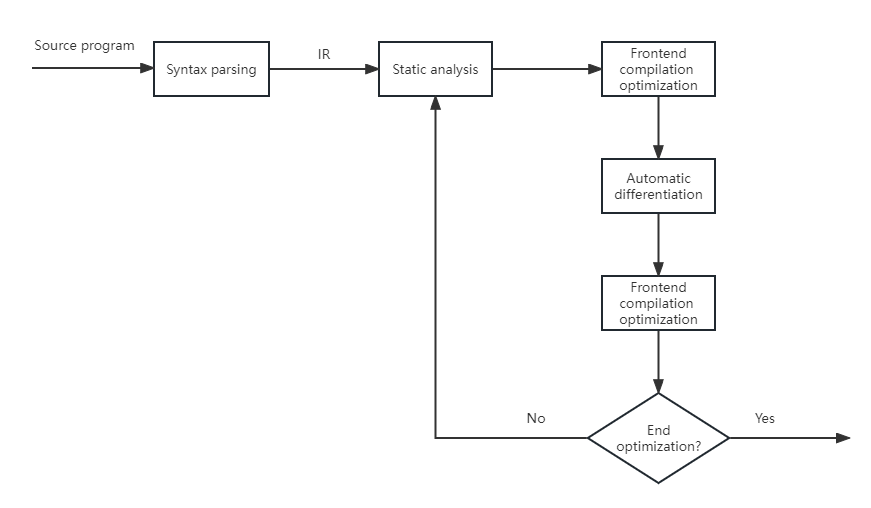

# Overview of AI Compiler Frontends

Figure :numref:`ch04/compiler_frontend_structure` depicts the typical
structure of the AI compiler frontend within a machine learning
framework. As AI compilers parse source programs similarly to classical
compilers, we will not detail the parsing process here. Instead, we will
explore a feature unique to the compiler frontend in a machine learning
framework - its automatic differentiation functionality. To enact
automatic differentiation, the machine learning framework requires a new
IR structure built upon classical IRs. Consequently, this section
concentrates on IRs and automatic differentiation, and later provides a
succinct introduction to basic compiler concepts, including type
systems, static analysis, and frontend optimization.

:label:`ch04/compiler_frontend_structure`

An **Intermediate Representation** is a data structure, or a form of
code, employed by a compiler to represent source code. Essentially, an
IR serves as a bridge between a source language and a target language
during the compilation process. In classical compilers, IRs are divided
into linear IR, graphical IR, and hybrid IR. However, as these classical
IRs do not provide the comprehensive range of functionalities required
by machine learning frameworks, developers have extended classical IRs
and proposed numerous new IRs specifically for machine learning
frameworks.

**Automatic Differentiation** is a method used to compute derivatives
and efficiently resolve symbols for computational graphs. Combining the
benefits of both symbolic and numerical differentiation while mitigating
their shortcomings, automatic differentiation proves particularly
valuable in calculating the gradient of a function. Modern AI
algorithms, such as deep learning algorithms, use vast amounts of data
to learn models with various parameters, and typically employ a gradient
descent approach to update these parameters. Therefore, automatic
differentiation is crucial to deep learning and becomes an integral
component of training algorithms. Automatic differentiation generally
resolves IR symbols during the frontend optimization process to generate
new IRs with gradient functions.

**Type Systems and Static Analysis** are incorporated into the compiler
frontend to help reduce potential runtime errors. A type system can
avert type errors during program execution, while static analysis offers
insights and other information for compilation optimization, effectively
reducing issues like structural errors and security vulnerabilities in
program code.

**Frontend Compilation Optimization** aims to tackle code efficiency
issues. It is a significant aspect in both classical compilers and
machine learning frameworks and is independent of specific hardware
types.
