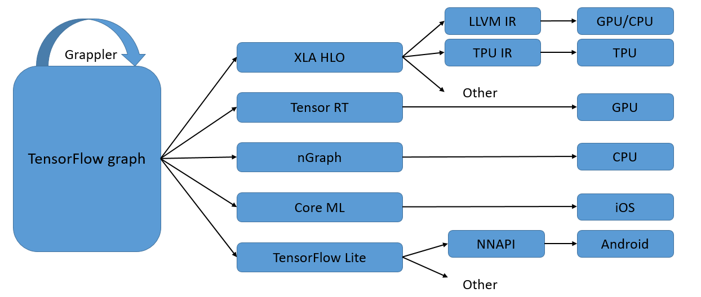
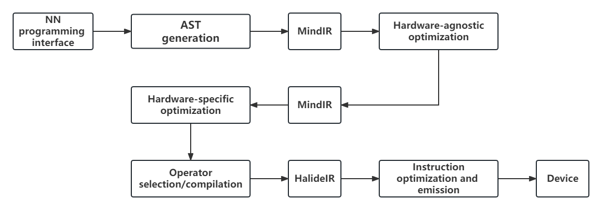

# Overview of AI Compilers

Like classical compilers, AI compilers also convert user-written code
into efficient machine-executable code. In the following, we delve into
the intricacies of AI compilers, discussing various concepts inherent to
general-purpose compilers such as ahead of time (AOT), just in time
(JIT), intermediate representations (IRs), pass-based optimization,
abstract syntax tree, side effects, and closures. Our focus will be
primarily on the distinctive design and functionality of AI compilers as
compared to classical compilers, rather than offering definitions of
these concepts, as these can be found in numerous other compiler-related
textbooks.

The design of AI compilers is significantly influenced by classical
compilers like the Low Level Virtual Machine (LLVM). Thus, gaining an
understanding of the basic architecture of the LLVM compiler, depicted
in Figure :numref:`ch04/llvm-basic`, will be beneficial.

:label:`ch04/llvm-basicwidth="\\linewidth"`

The LLVM compiler consists of three components: the frontend,
intermediate representations, and the backend. The frontend converts
high-level languages into IRs. The backend then transforms these IRs
into machine instructions executable on the target hardware. As their
name implies, IRs serve as a transition phase from the frontend to the
backend, where necessary optimizations can take place. The architecture
of the LLVM compiler ensures that IRs are reusable and compatible with
any newly introduced frontend or hardware. While IRs can exist on one or
more levels, LLVM typically uses a one-level structure, meaning the
frontend and backend optimizations share the same set of IRs.

AI compilers, on the other hand, commonly employ a multi-level IR
structure. An example is the multi-level IR (MLIR) design adopted by
TensorFlow, as depicted in Figure
:numref:`ch04/TF-IR`.
TensorFlow's MLIR comprises three levels of IRs: the TensorFlow graph
IR, the XLA HLO IR, and hardware-specific LLVM IR or TPU IR. The
subsequent sections briefly outline these levels and their corresponding
compilation optimization processes.

:label:`ch04/TF-IRwidth="\\linewidth"`

The process of optimization in computational graphs is known as graph
compilation optimization. The first level of IR, the graph IR, carries
out optimization and operations (e.g., graph optimization and graph
segmentation) for an entire graph. While this complete-graph IR is
suitable for static graph execution, it proves challenging for
hardware-specific optimization due to the absence of hardware
information. To address this, hardware-specific generic compilation
optimization is applied at the mid-level of IRs. Platforms like XLA,
Tensor RT, and MindSpore's graph kernel fusion enhance the execution
performance of various neural networks on specific hardware by executing
operator fusion and other optimizations for different hardware types.

The final level of IR deals exclusively with a certain type of hardware
accelerator and often comes bundled with a hardware vendor's compiler.
For instance, the TBE compiler, paired with the Ascend hardware, is
based on HalideIR as its efficient execution operators are generated
based on TVM's HalideIR.

The multi-level IR design grants IRs enhanced flexibility and
facilitates more efficient pass-based optimization for each specific IR
level. However, this design has limitations. First, achieving fully
compatible IR transformation across different levels is challenging due
to the substantial engineering effort required and potential information
loss during the transformation. Optimization carried out at one IR level
might eliminate some information, and the implications of this removal
must be evaluated at the next level. As a result, IR transformation
imposes stricter constraints on the sequence in which optimization
occurs. Second, the decision of at which of two adjacent levels to
perform certain IR optimizations presents a dilemma for framework
developers. Lastly, because different IR levels can define different
operator granularities, some accuracy might be compromised.

To mitigate these drawbacks, the AI compiler in the MindSpore machine
learning framework uses a unified IR design known as MindIR. Figure
:numref:`ch04/msflow`
illustrates the internal execution process of MindSpore's AI compiler.
In this process, the compiler frontend handles graph compilation and
hardware-agnostic optimization, while the compiler backend conducts
tasks like hardware-specific optimization and operator selection.

:label:`ch04/msflowwidth="\\linewidth"`
