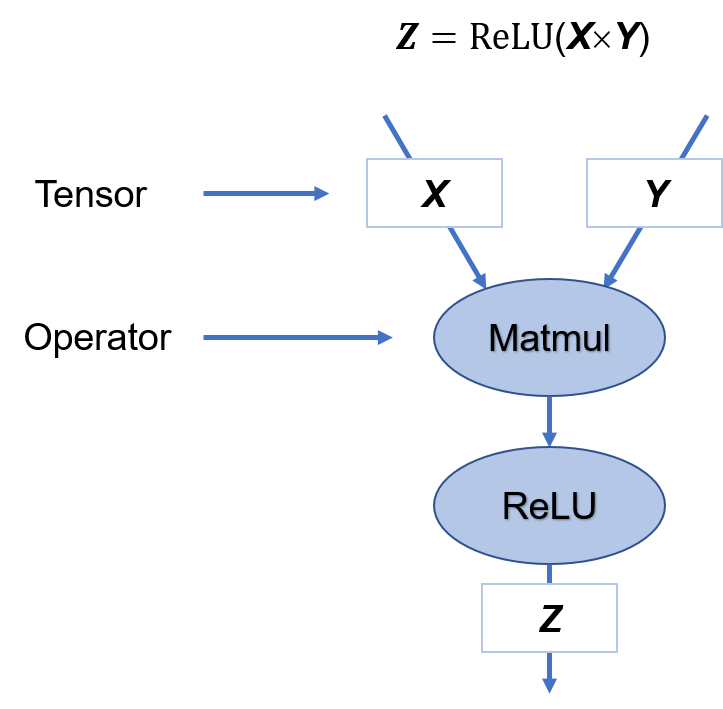
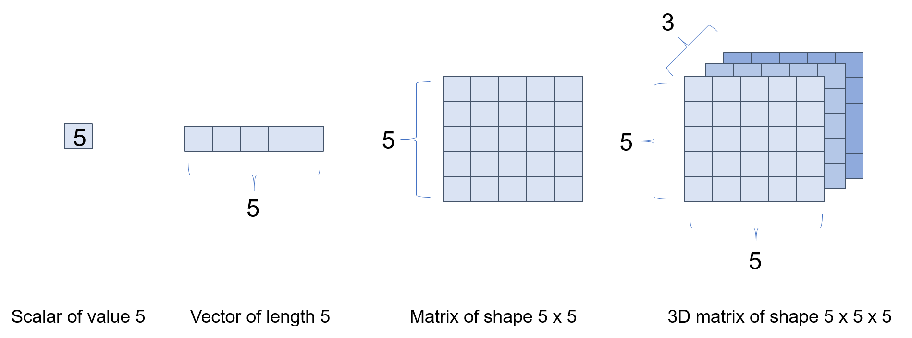
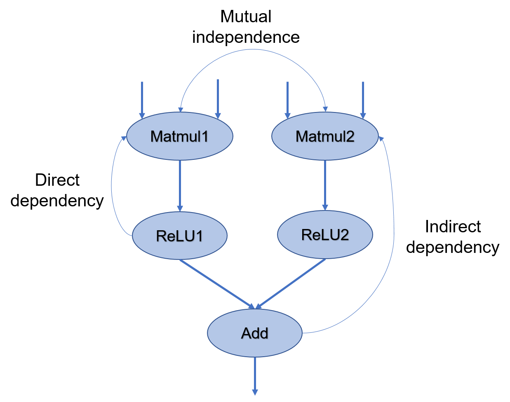
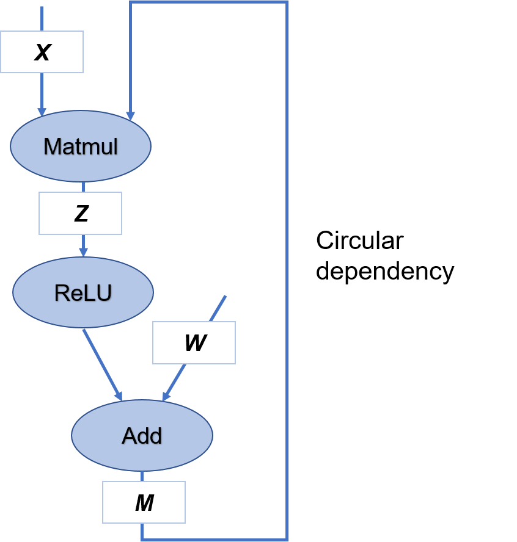
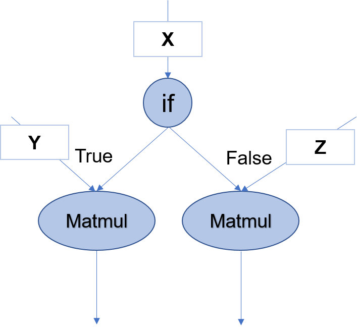
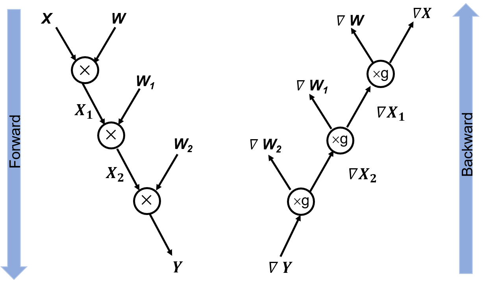

# Computational Graph Basics

A computational graph contains operators (as units of operations) and
tensors (as units of data). The operator nodes in a graph are connected
with directed edges, which indicate the state of each tensor and
dependencies between operators.
Figure :numref:`ch04/ch04-simpleDAG` shows a computational graph example
of $\bf{Z}$=ReLU$(\bf{X}\times\bf{Y})$.


:label:`ch04/ch04-simpleDAG`

## Tensors and Operators

In mathematics, tensors are a generalization of scalars and vectors.
Machine learning defines multidimensional data as tensors. The rank of a
tensor refers to the number of axes (or dimensions) the tensor has. A
scalar is a rank-0 tensor containing a single value, without axes; a
vector is a rank-1 tensor with one axis; and a three-channel RGB color
image is a rank-3 tensor with three axes. See Figure
:numref:`ch04/ch04-tensor`.


:label:`ch04/ch04-tensor`

In a machine learning framework, a tensor stores not only data itself
but also attributes such as the data type, data shape, rank, and
gradient transfer status. Table
:numref:`ch04/ch4-tensor` describes the main attributes of a
tensor.

:Tensor attributes

| Tensor Attribute |                                   Description |
|------------------|--------------------------------------------------------------------------------- |
|      shape       |                Length of each dimension, for example, \[3,3,3\]. |
|       dim        | Number of axes (or dimensions). The value is 0 for a scalar and 1 for a vector. |
|      dtype       |          Data type, such as bool, uint8, int16, float32, and float64. |
|      device      |                      Target device, such as a CPU or GPU. |
|       name       |                                  Tensor name. |
:label:ch04/ch4-tensor


In the following, we explore each tensor attribute with image data as an
example. Assume that our machine learning framework loads a 96-pixel by
96-pixel RGB (3-channel) image and converts the image data into a tensor
for storage. A *rank*-3 tensor of *shape* \[96,96,3\] is generated, with
the three dimensions representing the image height, image width, and
number of channels, respectively. The pixels in the RGB image are
represented by unsigned integers ranging from 0 to 255. Therefore, the
*dtype* of the resulting tensor is uint8. The image data is normalized
before it is fed into a CNN for training. Specifically, its data type is
reformatted to float32 so that it is compatible with the default data
type of common machine learning frameworks.

Before training, the machine learning framework determines the compute
device (i.e., CPU, GPU, or other hardware) and stores the data and
weight parameters necessary for training in the memory of the
corresponding hardware --- as specified by the *device* attribute.
Typically, the device attribute of a tensor is automatically assigned by
the machine learning framework based on the hardware environment.
Tensors are either mutable or immutable. Mutable tensors store weight
parameters and are updated based on gradient information, for example,
convolution kernel tensors that participate in convolution operations.
Immutable tensors store initial user data or data input to models, for
example, the image data tensor mentioned above.

What does a tensor look like in machine learning settings? Most tensors,
like image data and convolution kernel tensors, are \"rectangular\" or
\"cubic\" in shape. That is, such a tensor has the same number of
elements along each of its axes. However, there are specialized tensors
that have different shapes: ragged and sparse tensors. As shown in
Figure :numref:`ch04/ch04-tensor1`, a tensor is ragged if it has
variable numbers of elements along some axes. Ragged tensors enable
efficient storage and processing of irregularly shaped data, such as
variable-length texts in natural language processing (NLP) applications.
Sparse tensors often handle graph data of graph neural networks (GNNs)
and are encoded using special formats such as the coordinate list (COO)
to improve storage efficiency.


:label:`ch04/ch04-tensor1`

Operators are the basic compute units of neural networks. They process
tensor data and implement common computational logic in machine
learning, including data transformation, conditional control,
mathematical calculation, etc. Based on their functionalities, operators
are classified into tensor operators, neural network operators, data
flow operators, and control flow operators.

1.  **Tensor operators** involve tensor structure and mathematical
    operations. Typical tensor structure operations include reshaping
    tensors, permuting tensor dimensions, concatenating tensors, etc.
    For example, we may need to change the dimension order (between
    \"channels first\" and \"channels last\") of image data tensors in
    CNN applications. Mathematical operations are tensor-based and
    include matrix multiplication, norm calculation, determinant
    calculation, eigenvalue calculation, etc. They are often seen in the
    gradient computation of machine learning models.

2.  **Neural network operators**, the foundation of neural network
    models, are the most common operators, including feature extraction,
    activation functions, loss functions, optimization algorithms, etc.
    Feature extraction refers to extracting feature tensors from input
    data in CNN tasks. With the nonlinear ability introduced by
    activation functions, neural networks can model highly complex
    relationships and patterns in data. Optimization algorithms are used
    to update model parameters so that the loss function is minimized.

3.  **Data flow operators** cover data preprocessing and loading. Data
    preprocessing mainly refers to data resizing, padding,
    normalization, and argumentation of mostly visual and textual data,
    whereas data loading involves operations such as shuffling,
    batching, and pre-fetching of the dataset. Data flow operators
    transform raw input data into a format meaningful to the machine
    learning framework and efficiently load the data to the network for
    training or inference according to the defined number of iterations,
    reducing memory usage and wait time.

4.  **Control flow operators**, usually found in flexible and complex
    models, are used to control data flows in computational graphs.
    Typical control flow operators are conditional operators and loop
    operators. They are provided by either the machine learning
    framework or the frontend language. Control flow operations affect
    data flows in both forward and backward computation of neural
    networks.

## Computational Dependencies

In a computational graph, the dependencies between operators influence
the execution sequence and parallelism of operators. The computational
graphs involved in machine learning algorithms are directed acyclic
graphs, where data flows must not lead to circular dependencies. With a
circular dependency, the training program will run into an infinite loop
and never terminate by itself. Data stuck in an infinite loop tends to
either infinity or 0, yielding invalid results. To analyze the execution
sequence and facilitate model topology design, the following describes
the dependencies between the compute nodes in a computational graph.

As shown in Figure :numref:`ch04/ch04-dependence`, if the Matmul1 operator is
removed from the graph, there will be no input to the downstream
activation function, and the data flow will be interrupted. We can
therefore conclude that the operators in this computational graph depend
on each other with transitive relations.


:label:`ch04/ch04-dependence`

Three types of dependencies are available.

1.  **Direct dependency**: For example, the ReLU1 node is directly
    dependent on the Matmul1 node. That is, ReLU1 can run properly only
    when it receives a direct output from Matmul1.

2.  **Indirect dependency**: For example, the Add node indirectly
    depends on the Matmul1 node. Specifically, Matmul1's output is
    processed by one or more intermediate nodes and then transmitted to
    the Add node. The Add node directly or indirectly depends on the
    intermediate nodes.

3.  **Mutual independence**: For example, the graph shows no
    input/output dependency between Matmul1 and Matmul2, meaning that
    the two nodes are independent of each other.

In the computational graph shown in Figure
:numref:`ch04/ch04-recurrent`, the Add node indirectly depends on
the Matmul node; conversely, the Matmul node directly depends on the Add
node. The two nodes are stuck waiting for each other's output to start
their computation. When input data is manually assigned to the two nodes
at the same time, they will compute endlessly, and the training process
can never terminate by itself. A circular dependency produces a positive
feedback data flow, where data values overflow to positive infinity,
underflow to negative infinity, or tend to 0. These all lead to
unexpected training results. As such, we should avoid circular
dependencies between operators when designing deep learning models.


:label:`ch04/ch04-recurrent`

In machine learning frameworks, the *unrolling* method is used to
represent loop iterations. Figure
:numref:`ch04/ch04-recurrent-1` shows a computational graph
involving three loop iterations. The subgraph of the loop body is
replicated to three (according to the number of iterations) to produce
an unrolled loop, where the resulting subgraphs are concatenated in the
iteration sequence. The subgraph of one iteration has a direct
dependency on that of the previous iteration. In one computational
graph, tensors and operators are uniquely identified across the loop
iterations, even for the same operation. Unlike circular dependencies,
loop iterations do not involve mutual dependencies between operators
with unique identifiers. When a subgraph is replicated to produce an
unrolled loop, the replicated tensors and operators are assigned new
identifiers to avoid circular dependencies.


:label:`ch04/ch04-recurrent-1`

## Control Flows

A control flow maintains the sequence of computation tasks, thereby
facilitating the design of flexible and complex models. By introducing a
control flow to a model, we can execute a node iteratively any number of
times or skip a node based on specific conditions. Many deep learning
models rely on control flows for training and inference. For example,
models built on recurrent neural networks (RNNs) and reinforcement
learning rely on recurrence relations and input status conditions to
complete the computation.

Popular machine learning frameworks provide two major types of control
flows:

1.  **Frontend control flows**: Python control flow statements are used
    to implement control decision-making in a computational graph.
    Frontend control flows are easy to use in model building. However,
    because the computation process of the machine learning framework
    runs on the backend hardware and the control flow is decoupled from
    the data flow, the computational graph cannot run entirely on the
    backend hardware. As such, control flow implementations using the
    frontend language are referred to as the *out-of-graph approach*.

2.  **Framework control primitives**: Machine learning frameworks come
    with built-in low-level fine-grained control primitive operators.
    Such operators are executable on compute hardware. When they are
    introduced to a model, the computational graph can run entirely on
    the backend hardware. This type of control flow implementations are
    referred to as the *in-graph approach*.

To explain why we need these different approaches to implement control
flows, let's look at the differences between the two approaches.

The out-of-graph approach is familiar to Python programmers. This
flexible, intuitive approach allows direct use of Python commands such
as `if-else`, `while`, and `for` in building control flows.

The in-graph approach, by contrast, is more complicated. TensorFlow
provides a range of in-graph control flow operators (such as `tf.cond`
for conditional control, `tf.while_loop` for loop control, and `tf.case`
for branch control). These operators are composites of lower-level
primitive operators. The control flow representations adopted by the
in-graph approach are in a different style from common programming ---
this improves computing performance but comes at the expense of
usability.

The out-of-graph approach is easier to use. However, not all backend
compute hardware is compatible with the frontend runtime environment,
and extra efforts may be needed to execute the frontend control flows.
Nevertheless, control flows implemented using the in-graph approach are
directly executable on hardware independent of the frontend environment,
improving efficiency throughout the model building, optimization, and
execution process.

The two approaches serve different application scenarios. To run tasks
such as model training, inference, and deployment on compute hardware
independent of the frontend environment, the in-graph approach is
recommended for building control flows. For model validation purposes,
the out-of-graph approach allows for higher efficiency in generating
model code from the model algorithm.

Major machine learning frameworks support both the out-of-graph and
in-graph approaches. In the following illustrations about the impact of
control flows on forward and backward computation, we adopt the
out-of-graph approach for control flow implementations, given that
frontend control flows are more popular in practice. The most common
control flows include conditional branches and loops. For a model
containing control flow operations, the control flow is replicated to
the gradient computational graph during backpropagation, so that the
required tensor gradients can be accurately calculated.

Code `ch04/code1` shows an example of simple conditional control,
where `matmul` indicates the matrix multiplication operator.

**ch04/code1**
```python
def control(A, B, C, conditional = True):
    if conditional:     
        y = matmul(A, B)   
    else:     
        y = matmul(A, C)
    return y
```

Figure :numref:`ch04/ch04-if` depicts the forward and backward
computational graphs of Code
`ch04/code1`. When running a model containing `if`
conditions, the program needs to know which branch of each condition is
taken so that it can apply the gradient computation logic to the right
branch. In the forward computational graph, tensor $\bf{C}$ does not
participate in computation due to conditional control. Similarly, in the
backward computational graph, tensor $\bf{C}$ is skipped in gradient
computation.


:label:`ch04/ch04-if`

A control loop allows us to execute an operation in a loop zero or
multiple times. When the loop is unrolled, each operation is assigned a
unique identifier to identify different calls to the same operation.
Each iteration directly depends on the result of the previous one.
Therefore, one or more lists of tensors need to be maintained in the
control loop for storing per-iteration intermediate results used in the
forward pass and gradient computation. Code
`ch04/code2` shows a control loop example. In its unrolled
loop, $\bf{X_i}$ and $\bf{W_i}$ are the lists of intermediate result
tensors to be maintained.

**ch04/code2**
```python
def recurrent_control(X : Tensor, W : Sequence[Tensor], cur_num = 3):
    for i in range(cur_num):    
        X = matmul(X, W[i]) 
    return X
# Unroll the loop to obtain an equivalent representation.
def recurrent_control(X : Tensor, W : Sequence[Tensor]):
    X1 = matmul(X, W)   # Let W = W[0], W1 = W[1], and W2 = W[2].
    X2 = matmul(X1, W1)
    Y = matmul(X2, W2) 
    return Y 
```

The forward and backward computational graphs of Code
`ch04/code2` are shown in Figure
:numref:`ch04/ch04-while`. The gradient of the control loop is
also a loop, with the same number of iterations as the forward loop. The
gradient value output by one iteration serves as the input value for
calculating the gradient of the next iteration until the loop ends.


:label:`ch04/ch04-while`

## Gradient Computation Using the Chain Rule

In the loop unrolling example in Section 3.2.3, when input tensor
$\bf{X}$ is fed into the neural network, the data is propagated forward
one layer at a time in the computational graph, and the intermediate
variables are calculated and stored until $\bf{Y}$ is output after
multilayer computation. In DNN training, the loss function result is
calculated based on the output result of forward propagation and the
label value. The model backpropagates the loss function information
through the computational graph and updates the training parameters
based on computed gradients. Typically, backpropagation works by
computing the gradients of the loss function with respect to each
parameter. Backpropagation based on other information can also work but
is not discussed here.

The chain rule method is used to calculate the gradients with respect to
each parameter during backpropagation. In calculus, the chain rule
provides a technique for finding the derivatives of composite functions.
The derivative of a composite function at a given point is the product
of the derivatives of each individual function at the corresponding
point. Assume that *f* and *g* are functions mapped from the real number
*x*. If $y=g(x)$ and $z=f(y)=f(g(x))$, the derivative of *z* with
respect to *x* is

$$\frac{\partial z}{\partial x}=\frac{\partial z}{\partial y}\frac{\partial y}{\partial x}.$$ 
:eqlabel:`eq:ch04/chainrule`

The backpropagation algorithm of neural networks executes the chain rule
in the sequence defined by the backward computational graph. Generally,
neural networks accept 3D tensor inputs and output 1D vectors.
Therefore, we can generalize the gradient computation Equations
:eqref:`ch04/chainrule` of composite functions with respect to
scalars as follows: Assuming that $\bf{X}$ is an *m*-dimensional tensor,
$\bf{Y}$ is an *n*-dimensional tensor, $\bf{z}$ is a 1D vector,
$\bf{Y}=g(\bf{X})$, and $\bf{z}=f(\bf{Y})$, the partial derivative of
$\bf{z}$ with respect to each element of $\bf{X}$ is

$$\frac{\partial z}{\partial x_i}=\sum_j\frac{\partial z}{\partial y_j}\frac{ \partial y_j}{ \partial x_i}.$$ 
:eqlabel:`eq:ch04/chainrule-1`

The equivalent form of Equation
:eqref:`ch04/chainrule-1` is

$$\nabla_{\bf{X}}\bf{z} = (\frac{\partial \bf{Y}}{\partial\bf{X}})^{\top}\nabla_{\bf{Y}}\bf{z},$$ 
:eqlabel:`eq:ch04/chainrule-2`

where, $\nabla_{\bf{X}}z$ represents the gradient matrix of $z$ with
respect to $\bf{X}$.

Figure :numref:`ch04/ch04-chain` shows the application of the chain rule
in neural networks, illustrating both forward and backward passes in a
single graph. The neural network performs matrix multiplication twice to
obtain the predicted value $\bf{Y}$, and then performs gradient
backpropagation based on the error between the output value and label
value to update the weight parameters to minimize the error. The weight
parameters to be updated include $\bf{W}$ and $\bf{W_1}$.


:label:`ch04/ch04-chain`

The mean square error (MSE) is selected as the loss function in this
example. Two important questions arise here: How does the loss function
transfer the gradient information to $\bf{W}$ and $\bf{W_1}$ using the
chain rule method? And why do we need to calculate the gradients of
non-parameter data $\bf{X}$ and $\bf{X_1}$? To answer these questions,
let's analyze the computation details of forward and backward
propagation. First, the loss value is calculated through forward
propagation in three steps: (1) $\bf{X_1}=\bf{XW}$; (2)
$\bf{Y}=\bf{X_1W_1}$; and (3) $Loss=\frac{1}{2} (\bf{Y}-Label)^2$.

The loss function is calculated to minimize the distance between the
prediction value and the label value. According to the chain rule,
backpropagation is performed through Equations
:eqref:`ch04/chainrule-3` and
:eqref:`ch04/chainrule-4` to calculate the gradients of the loss
function with respect to parameters $\bf{W}$ and $\bf{W_1}$:

$$\frac{\partial {\rm Loss}}{\partial \bf{W_1}}=\frac{\partial \bf{Y}}{\partial \bf{W_1}}\frac{\partial {\rm Loss}}{\partial \bf{Y}}$$ 
:eqlabel:`eq:ch04/chainrule-3`

$$\frac{\partial {\rm Loss}}{\partial \bf{W}}=\frac{\partial \bf{X_1}}{\partial \bf{W}}\frac{\partial {\rm Loss}}{\partial \bf{Y}}\frac{\partial \bf{Y}}{\partial \bf{X_1}}$$ 
:eqlabel:`eq:ch04/chainrule-4`

Both Equations
:eqref:`ch04/chainrule-3` and
:eqref:`ch04/chainrule-4` solve
$\frac{\partial {\rm Loss}}{\partial \bf{Y}}$, which corresponds to grad
$\bf{Y}$ in Figure :numref:`ch04/ch04-chain`.
$\frac{\partial {\rm Loss}}{\partial \bf{Y}}\frac{\partial \bf{Y}}{\partial \bf{X_1}}$
in Equation
:eqref:`ch04/chainrule-4` corresponds to grad $\bf{X_1}$ in
Figure :numref:`ch04/ch04-chain`. To calculate the gradient of model
parameter $\bf{W}$, the gradient of intermediate result $\bf{X_1}$ is
calculated. This also answers the second question raised above. The
gradients of non-parameter intermediate results are calculated to
facilitate gradient computation with regard to each parameter.

Because $\bf{X_1}=\bf{XW}$, $\bf{Y}=\bf{X_1W_1}$, and
Loss=$\frac{1}{2}$($\bf{Y}$-Label)$^2$, Equations
:eqref:`ch04/chainrule-3` and
:eqref:`ch04/chainrule-4` are expanded to
:eqref:`ch04/chainrule-5` and
:eqref:`ch04/chainrule-6` according to Equations
:eqref:`ch04/chainrule-2`, respectively. Then, we can analyze how
variables participate in gradient computation when the machine learning
framework uses the chain rule to build a backward computational graph.

$$\frac{\partial {\rm Loss}}{\partial \bf{W_1}}=\frac{\partial \bf{Y}}{\partial \bf{W_1}}\frac{\partial {\rm Loss}}{\partial \bf{Y}}=\bf{X_1}^\top(\bf{Y}-{\rm Label})$$ 
:eqlabel:`eq:ch04/chainrule-5`

$$\frac{\partial {\rm Loss}}{\partial \bf{W}}=\frac{\partial \bf{X_1}}{\partial \bf{W}}\frac{\partial {\rm Loss}}{\partial \bf{Y}}\frac{\partial \bf{Y}}{\partial \bf{X_1}}=\bf{X}^\top(\bf{Y}-{\rm Label})\bf{W_1}^\top$$ 
:eqlabel:`eq:ch04/chainrule-6`

Equation
:eqref:`ch04/chainrule-5` uses intermediate result $\bf{X_1}$ in
the forward computational graph when calculating the gradient of
$\bf{W_1}$. In equation
:eqref:`ch04/chainrule-6`, both input $\bf{X}$ and parameter
$\bf{W_1}$ are used for calculating the gradient of parameter $\bf{W}$.
This answers the first question. The gradient information transferred
backward from downstream network layers, and the intermediate results
and parameter values in forward computation, all have roles to play in
calculating the gradient of each parameter in the graph.

Based on Figure :numref:`ch04/ch04-chain` and Equations
:eqref:`ch04/chainrule-3`,
:eqref:`ch04/chainrule-4`,
:eqref:`ch04/chainrule-5` and
:eqref:`ch04/chainrule-6`, when the chain rule is used to
construct a backward computational graph, the computation process is
analyzed and the intermediate results and gradient transfer status in
the model are stored. The machine learning framework improves the
backpropagation efficiency by reusing buffered computation results.

We can generalize the chain rule to wider applications. With flexible
control flows, the machine learning framework can quickly analyze the
computation processes of the forward data flow and backward gradient
flow by using computational graph technology, effectively manage the
lifetime of each intermediate result in memory, and improve the overall
computation efficiency.
