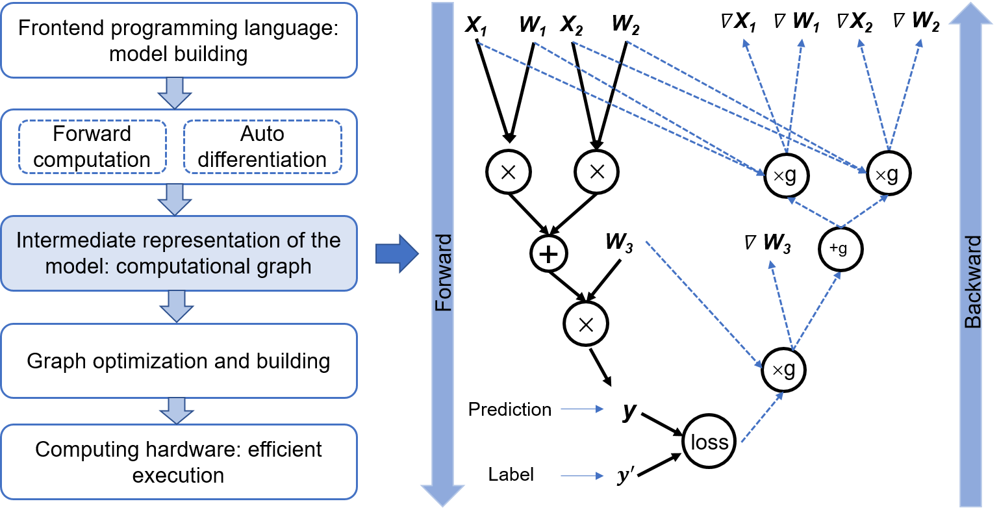

# Computational Graph Functions

Early machine learning frameworks are mainly designed for fully
connected networks and convolutional neural networks (CNNs). Such neural
networks have serial layers, whose topology structures can be
represented in simple configuration files (e.g., Caffe model definition
in Protocol Buffers format).

Conversely, modern machine learning models have ever more complex
structures. Prominent examples include mixture-of-experts (MoE),
generative adversarial network (GAN), and attention models. To improve
the training efficiency with complex model structures (e.g., loops with
branching), machine learning frameworks are expected to quickly analyze
operator dependencies, gradient computation, and training parameters, to
facilitate model optimization, formulate scheduling strategies, and
automate gradient computation. As such, machine learning system
designers call for a common data structure to understand, represent, and
execute machine learning models. To this end, machine learning
frameworks introduce the computational graph technology while still
decoupling the frontend and backend languages in design, as shown in
Figure :numref:`ch04/ch04-DAG`. From a top-level view, computational
graph technology provides the following key functions:

:label:`ch04/ch04-DAG`

1.  **Unified representation of the computation process.** Developers
    tend to write machine learning programs in high-level programming
    languages (e.g., Python, Julia, and C++). However, because most
    devices such as hardware accelerators provide only C/C++ APIs,
    implementations of machine learning systems are largely restricted
    to C/C++. Computational graph technology makes it possible to run
    programs written in different high-level languages on common
    low-level C/C++ system modules. As a unified representation, a
    computational graph describes a model's input data, computational
    logic (usually referred to as operators), and execution sequence of
    operators.

2.  **Automatic gradient computation.** The training program receives
    data samples (or the training dataset), performs forward computation
    through the network, and then calculates the loss value. Based on
    the loss value, the machine learning system computes the gradient
    for each model parameter and then updates the model parameters. The
    gradient computation method should apply universally and run
    automatically, regardless of the model topology and loss computation
    method. Based on the computational graph, the machine learning
    system can quickly analyze the gradient transfer relations between
    parameters, thereby achieving automatic gradient computation.

3.  **Lifetime analysis of model variables.** During model training,
    many intermediate variables are generated, for example, the
    activation values in the forward pass and the gradients in the
    backward pass. Some of the intermediate variables generated in the
    forward pass are used in conjunction with the gradients for updating
    model parameters. With a computational graph, the machine learning
    system can accurately analyze the lifetime of each intermediate
    variable (i.e., from the time the variable is generated to the time
    it is destroyed), helping the framework optimize memory management.

4.  **Execution optimization.** User programs can have different network
    structures. With computational graph technology, the machine
    learning framework can analyze the model topology and operator
    dependencies, and it automatically searches for operator parallel
    computing strategies to improve the model execution efficiency.
