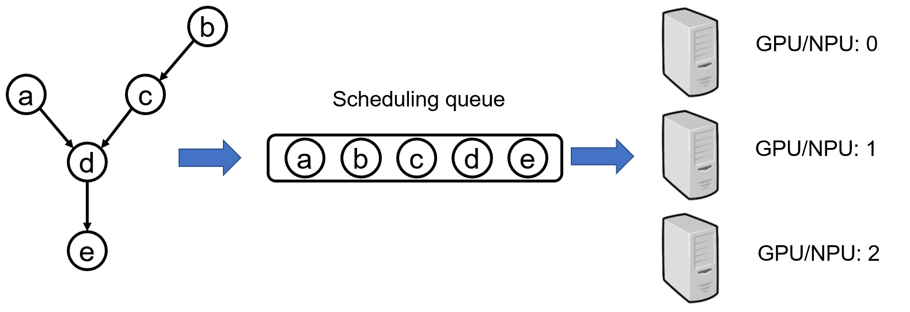
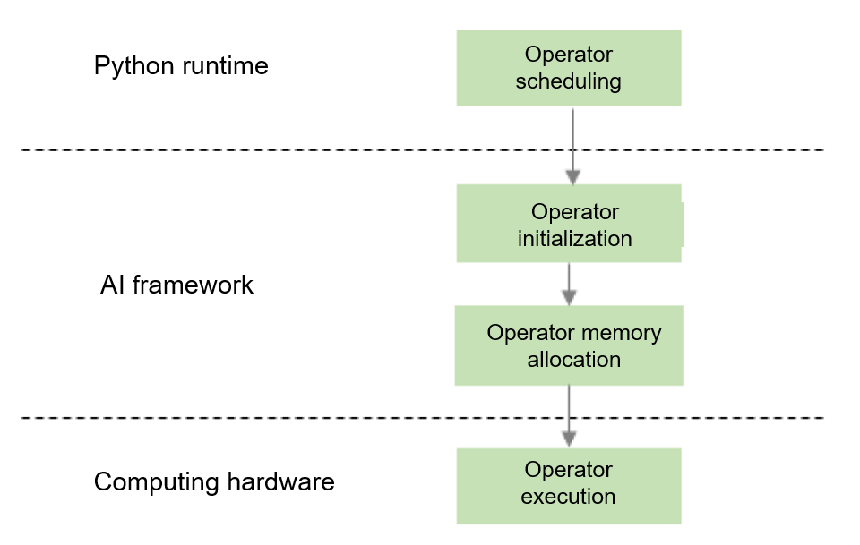
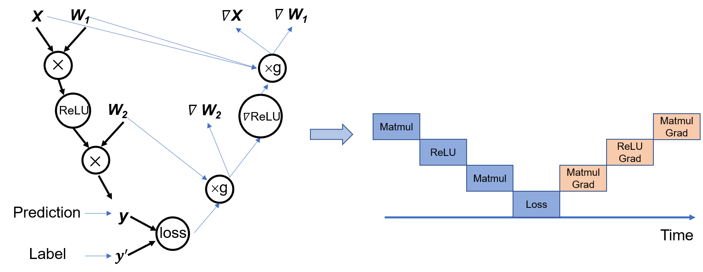
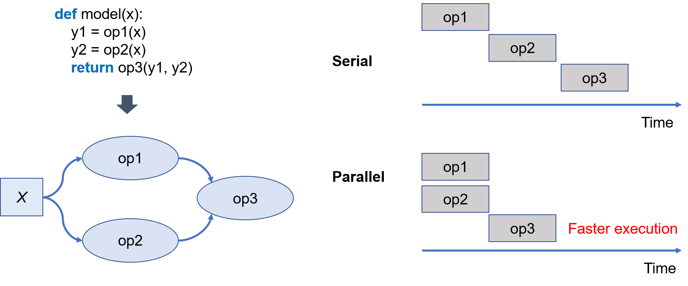

# Scheduling and Executing Computational Tasks

Training a model is conducted by scheduling the execution of the
operators in a computational graph. From a broad perspective, a training
job runs a computational graph for a defined number of iterations,
relying on optimal scheduling of tasks such as data loading and training
(inference) execution. Within each iteration, we need to analyze
operator-level scheduling based on the graph topology, computational
dependencies, and control flows. We optimize the scheduling and
execution of computational graphs to make full use of computing
resources, improve computational efficiency, and shorten the model
training and inference time. The following introduces the typical
techniques of computational graph scheduling.

The scheduling execution of the computation graph can be divided into
three modes according to the graph generation method, which are operator
scheduling, whole graph scheduling, and operator and subgraph combined
scheduling. These three modes also correspond to the three modes of
dynamic graph, static graph, and combination of dynamic and static in
the calculation graph generation mechanism.

Next, we will introduce the scheduling and execution of the calculation
graph in detail.

## Operator Scheduling

Operator scheduling means that the operators contained in the algorithm
or model are scheduled and executed one by one through the runtime of
the Python language. This scheduling mechanism is used when the
calculation graph is executed in dynamic graph mode, such as PyTorch's
default execution mode and TensorFlow's eager mode.

Operator scheduling includes two steps. In the first step, according to
the call sequence of the model operator declaration, the dynamic
calculation graph obtains a linear operator scheduling sequence. And the
second is distributing the ordering of operators to instruction streams.

In Figure :numref:`ch04/ch04-diaoduzhixing`, the directed acyclic graph on
the left contains five nodes a, b, c, d, and e and four dependency edges
a-\>d, b-\>c, c-\>d, and d-\>e (e.g., a-\>d indicates that d depends on
a). According to the operator call sequence of the model code, such as
a-\>b-\>c-\>d-\>e, all operator nodes are put into the queue in turn,
and the scheduling ends.

:label:`ch04/ch04-diaoduzhixing`

With the ordering, we then prepare to distribute the operators in the
ordering and related data to the GPU hardware for execution. Figure
:numref:`ch04/ch04-single-op-exec` shows the trace of operator
scheduling. Once the Python runtime calls an operator, the machine
learning framework initializes the operator by determining information
such as the operator precision, type and size of each input/output, and
target device. It then allocates memory for the operator before copying
the memory to the specific device for execution.

:label:`ch04/ch04-single-op-exec`

The operator scheduling method offers high flexibility because operators
are directly scheduled by the Python runtime. It facilitates the
representation of complex computational logic (such as control flows)
and use of Python-native data structures for implementing complex
algorithms. Operators are driven by the Python runtime to finish
computational tasks, facilitating easy collaboration with Python's
large, rich ecosystem.

Despite its advantages, operator scheduling also has some disadvantages.
One is that context-based runtime optimizations such as operator fusion
and algebraic simplification become difficult. This is because global
information about the computational graph is unavailable. Another
disadvantage is that computational tasks have to run in serial mode,
rather than in parallel, due to the lack of computational topology.

## Graph Scheduling

When the calculation graph uses the static graph mechanism for
whole-graph scheduling execution, operators will be sent to the hardware
for execution one by one according to a certain execution sequence.
However, global information about the computational graph is available.
it can analyze operator dependencies and the number of computing
devices, and complete the scheduling and execution of the entire graph
in the following two ways:

1.  **Serial**: executes its tasks one at a time, in the order that they
    are added to the queue.This method expands a computational graph
    into a sequence of operators, which are then run separately.
    Operators are executed in a static order using a single thread,
    thereby requiring fewer resources.

2.  **Parallel**: executes its tasks concurrently for higher
    efficiency.This method expands a computational graph based on
    operator dependencies. Operators are executed in the order defined
    by their input dependencies, and those without input dependencies
    are executed concurrently. This method executes operators in a
    dynamic order (which may vary in each iteration) using multiple
    threads, thereby consuming more system resources.

Within a computational graph, most operators are dependent on each other
directly or indirectly. When scheduling such operators, their sequence
must be guaranteed. Figure
:numref:`ch04/ch04-diaodu` shows a computational graph, where a
forward pass is run on the input data to produce a predicted value and
then the gradient of the loss function is computed for backpropagation.
In general, downstream operators run dependently on the output from the
upstream. As such, we have to schedule the operators in this
computational graph to a serial queue in order to ensure that each
operator receives the necessary input.

:label:`ch04/ch04-diaodu`

A computational graph may also contain operators independent of each
other, for example, op1 and op2 shown in Figure
:numref:`ch04/ch04-para`. We can have each operator run on
different hardware devices to implement parallel computing. Compared
with the serial mode, parallel computing decreases execution time by
leveraging more computing resources at the same time.

:label:`ch04/ch04-para`

Serial execution and parallel execution have their own advantages and
disadvantages, as summarized in Table
:numref:`ch04/ch4-graph`.

:Comparison between serial execution and parallel execution

|   Execution Method   | Serial execution | Parallel execution |
|----------------------|------------------|-------------------- |
|   Execution Order    |      Static      |      Dynamic |
|  Execution Threads   |  Single thread   |  Multiple threads |
| Resource Consumption |       Low        |        High |
:label:`ch04/ch4-graph`

A computing environment contains more than one type of computing device,
such as a CPU, GPU, or other. As such, a computational graph consisting
of operators that run on more than one type of computing device is
referred to as a heterogeneous computational graph.

The graph contains the following types of operators based on the
computing hardware.

-   **CPU operators**: They are C++ operators that run on the host CPU.
    The computing performance of the CPU depends on the extent to which
    the multi-core capability of the CPU is utilized.

-   **GPU operators**: They run on the GPU (e.g., NVIDIA GPU). GPU
    kernels are delivered to the host GPU one by one for execution. The
    GPU features ample parallel computing units that offer significant
    speedup to parallel algorithms.

-   **Python operators**: They run on the host CPU. Unlike CPU
    operators, Python operators are interpreted and executed by the
    Python runtime interpreter.

We mentioned earlier that the dynamic graph mechanism relies on the
Python interpreter to distribute operators and execute them serially
according to the order of operators defined by the model code. This mode
usually allows data to be transmitted on different computing devices.
Communication bottlenecks may increase the time spent waiting for
operators to execute data, reducing the overall execution efficiency of
the calculation graph. Therefore, the first condition for the efficient
execution of the calculation graph is to accurately identify the device
where the operator is executed, try to avoid the transmission of data
between different devices. Independent operators are scheduled on
different devices in parallel. The static graph mechanism can get rid of
the constraints of the Python interpreter. The calculation graph is sent
to the device at one time, which reduces the number of interactions
between the host and the computing chip, and improves computing
efficiency and performance.

The combination of operators and subgraphs for scheduling execution mode
is a combination of the previous two execution modes. Due to the
flexibility of the computing graph structure, the efficiency of
computing graphs in complex scenarios may not be optimal when executed
on the entire computing chip. For example, computing chips can
accelerate floating-point operations, while CPUs are good at processing
logical judgments. Therefore, the parts with low execution efficiency
for computing chips can be separated and handed over to devices with
higher execution efficiency such as CPU for processing, which can take
into account both performance and flexibility.

There are different levels of parallelism: operator parallelism, model
parallelism, and data parallelism. Operator parallelism is not just
about executing independent operators in parallel. Where applicable, we
can further partition an operator into multiple parallel child
operations. Model parallelism refers to partitioning a computational
graph among several devices in order to shorten the time taken by each
training iteration. And data parallelism involves training the same
computational graph on different data, reducing the total number of
iterations and improving training efficiency. We will discuss these
three parallelism methods in Chapter Distributed Training.

## Synchronous and Asynchronous Data Loading

As previously mentioned, a single training iteration of a computational
graph goes through three serial tasks: data loading, data preprocessing,
and model training. Each task is dependent on the output of the previous
one. To schedule the three types of tasks in iterative graph training,
we can use the synchronous and asynchronous mechanisms at the iteration
level.

1.  **Synchronous**: Tasks are executed in order, one after the other.
    Tasks have to wait for and coordinate between each other.

2.  **Asynchronous**: When a task is complete, the same task in the next
    iteration can be executed immediately.

If the synchronous mechanism is adopted to train the computational graph
shown in Figure :numref:`ch04/ch04-tongbu`, in each iteration, a batch of input
data is loaded, preprocessed, and then passed to the computational graph
for model training and parameter update. Tasks in the next iteration
wait until the current iteration is complete. The synchronous mechanism
wastes computation and communication resources because the data
preprocessing and model training tasks must wait until a batch of data
is completely loaded, and because the I/O channel for data loading is
idle at model training time.

:label:`ch04/ch04-tongbu`

In the asynchronous setting shown in Figure
:numref:`ch04/ch04-yibu`, after loading and passing a batch of
input data to the subsequent data preprocessing task, the I/O channel
immediately moves on to the next batch without waiting for the current
iteration to complete. In contrast with the synchronous mechanism, the
idle time between data loading, data preprocessing, and model training
in the asynchronous mechanism is notably reduced, thereby shortening the
overall training time with improved execution efficiency.

:label:`ch04/ch04-yibu`

To further shorten the training time and improve the execution
efficiency, we can combine the asynchronous mechanism with parallel
computing, as shown in Figure
:numref:`ch04/ch04-yibubingxing`. On the one hand, the
asynchronous mechanism reduces the model's wait time for data loading
and preprocessing, allowing the model to quickly traverse the entire
dataset. On the other hand, parallel computing increases the batch size
in iterative training, increasing the efficiency of computing resources.

:label:`ch04/ch04-yibubingxing`
