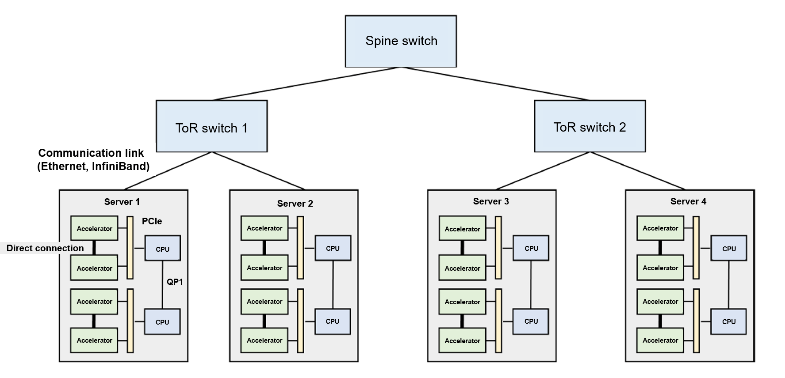

# Architecture of Machine Learning Clusters

Distributed model training is usually implemented in a compute cluster.
Next, we will introduce the composition of a compute cluster and explore
the design of a cluster network.

Figure :numref:`ch010/ch10-datacentre` shows the typical architecture of
a machine learning cluster. There are many servers deployed in such a
cluster, and each server has several hardware accelerators. To
facilitate server management, multiple servers are placed into one
*rack*, which is connected to a *top of rack (ToR) switch*. If ToR
switches are fully loaded but more new racks need to be connected, we
can add a *spine switch* between ToR switches. Such a structure forms a
multi-level tree. It is worth noting that cross-rack communication
within a cluster may encounter network bottlenecks. This is because the
network links used to construct the cluster network have the same
specifications (necessary to facilitate hardware procurement and device
management), increasing the probability of *network bandwidth
oversubscription* on the network links from the ToR switches to the
spine switch.

Network bandwidth oversubscription can be defined as a situation wherein
the peak bandwidth required exceeds the actual bandwidth available on
the network. In the cluster shown in Figure
:numref:`ch010/ch10-datacentre`, when server 1 and server 2 send
data to server 3 through their respective network links (say 10 Gb/s of
data), ToR switch 1 aggregates the data (that is, 20 Gb/s) and sends it
to spine switch 1. However, because there is only one network link (10
Gb/s) between spine switch 1 and ToR switch 1, the peak bandwidth
required is twice the actual bandwidth available, hence network
bandwidth oversubscription. In real-world machine learning clusters, the
ratio between peak bandwidth and actual bandwidth is generally between
1:4 and 1:16. One approach for avoiding network bottlenecks is to
restrict network communication within individual racks. This approach
has become a core design requirement for distributed machine learning
systems.

:label:`ch010/ch10-datacentre`

So, how much network bandwidth is required for training a large-scale
neural network in a compute cluster? Assume a neural network has
hundreds of billions of parameters (e.g., GPT-3 --- a huge language
model released by OpenAI --- has nearly 175 billion parameters). If each
parameter is expressed with a 32-bit floating-point number, a single
model replica in data parallelism mode will generate 700 GB (175 billion
$*$ 4 bytes) of local gradient data in each round of training iteration.
If there are three model replicas, at least 1.4 TB \[700 GB $*$
$(3-1)$\] of gradient data needs to be transmitted. This is because for
$N$ replicas, only $N-1$ of them need to be transmitted for computation.
To ensure that the model replicas will not diverge from the parameters
in the main model, the average gradient --- once computed --- is
broadcast to all model replicas (1.4 TB of data) for updating local
parameters in these model replicas.

Currently, machine learning clusters generally use Ethernet to construct
networks between different racks. The bandwidth of mainstream commercial
Ethernet links ranges from 10 Gb/s to 25 Gb/s. [^1] Using Ethernet to
transmit massive gradients will encounter severe transmission latency.
Because of this, new machine learning clusters (such as NVIDIA DGX) are
often configured with the faster InfiniBand. A single InfiniBand link
can provide 100 Gb/s or 200 Gb/s bandwidth. Even this high-speed network
still faces high latency when transmitting TB-level local gradients.
Even if network latency is ignored, it takes at least 40 seconds to
transmit 1 TB of data on a 200 Gb/s link.

To address this issue, InfiniBand uses remote direct memory access
(RDMA) as the core of its programming interfaces. RDMA enables
InfiniBand to provide high-bandwidth, low-latency data read and write
functions. As such, its programming interfaces are vastly different from
the TCP/IP socket interfaces used by conventional Ethernet. For
compatibility purposes, people use the IP-over-InfiniBand (IPoIB)
technology, which ensures that legacy applications can invoke socket
interfaces whereas the underlying layer invokes the RDMA interfaces of
InfiniBand through IPoIB.

To support multiple accelerators (typically 2--16) within a server, a
common practice is to build a heterogeneous network on the server. Take
server 1 in Figure :numref:`ch010/ch10-datacentre` as an example. This server is
equipped with two CPUs, which communicate with each other through
QuickPath Interconnect (QPI). Within a CPU interface (socket), the
accelerator and CPU are connected by a PCIe bus. Accelerators use
high-bandwidth memory (HBM), which offers much more bandwidth than PCIe
does. A prominent example is the NVIDIA A100 server: In this server, HBM
offers 1935 GB/s bandwidth, whereas PCIe 4.0 offers only 64 GB/s
bandwidth. PCIe needs to be shared by all accelerators within the
server, meaning that it becomes a significant communication bottleneck
when multiple accelerators simultaneously transmit data through PCIe. To
solve this problem, machine learning servers tend to use accelerator
high-speed interconnect technologies (e.g., NVIDIA GPU NVLink). Such
technology bypasses PCIe to achieve high-speed communication. A
prominent example is NVIDIA A100 GPU --- its NVLink provides 600 GB/s
bandwidth, enabling accelerators to transmit large amounts of data to
each other.

## AI Cluster Network Topology

[^1]: Network bandwidth is typically measured in Gb/s, whereas memory
    bandwidth is in GB/s --- *b* stands for bit, and *B* stands for
    byte.
