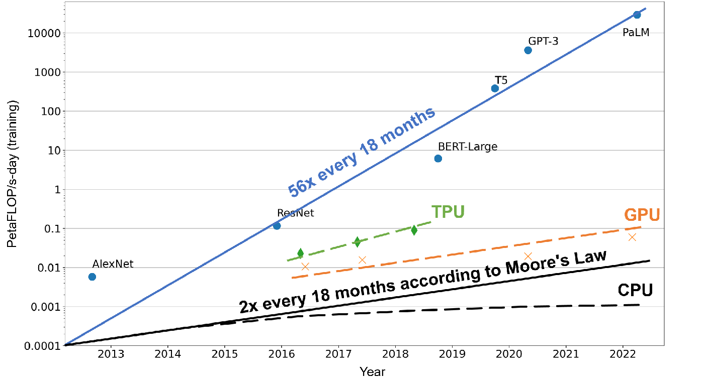
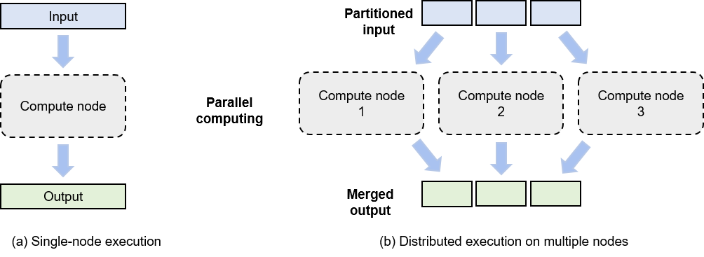

# Overview

This section provides an overview of the need for distributed training
systems.

## Motivation

The principal objective of implementing distributed training systems is
to circumvent the restrictions imposed by single-node training systems,
primarily characterized by their computational and memory constraints.

### Computational Constraints

A single processor, confined by its inherent limitations, can only yield
a certain extent of computational power, quantified in terms of
*floating-point operations per second (FLOPS)*. The advent of
distributed training systems emerged as an innovative resolution to
overcome these constraints associated with a single processor's
computational prowess.

Figure :numref:`ch010/ch10-computation-increase` illustrates the
escalating demands for computational power required by machine learning
models compared to the growth rate of a processor's computational
capabilities over the past few years. In this context, computational
power is measured in petaFLOP/s-day, a unit implying the execution of
$10^{15}$ neural network operations every second for an entire day,
summing up to approximately $10^{20}$ operations in total. According to
Moore's Law, the computational power of CPUs approximately doubles every
18 months. This exponential growth principle also extends to
accelerators, such as GPUs and TPUs, which are leveraged to support
machine learning computations with their immense computational
abilities.

However, the evolution of machine learning models is outpacing this
growth rate. A few years back, machine learning models, like AlexNet,
could only recognize a limited array of objects. Now, with models like
AlphaStar, we have reached a point where machines can outperform humans
in executing certain intricate tasks. In this short timeframe, the
computational demands of machine learning models have escalated 56-fold
every 18 months.

Distributed computing is designed to reconcile this divergence between
the performance of processors and the rising demand for computational
power. By capitalizing on the myriad of processors available in
expansive data centers and cloud computing facilities and managing them
effectively through distributed training systems, we can cater to the
surging computational requirements of evolving models.

:label:`ch010/ch10-computation-increase`

### Memory Constraints

The process of training machine learning models often necessitates
substantial memory. Take, for instance, a neural network model boasting
100 billion parameters in a 32-bit floating-point format (4 bytes); it
would demand 400 GB of memory to store all parameters. In practice,
additional memory is needed to store activation values and gradients.
Assuming these are also stored in a 32-bit floating-point format, an
extra 800 GB of memory would be required. This would result in an
overall memory requirement exceeding 1200 GB (or 1.2 TB). Nevertheless,
current accelerators, such as the NVIDIA A100, can only provide a
maximum memory of 80 GB.

However, unlike individual accelerators, whose memory growth is largely
hindered by factors such as hardware specifications, heat dissipation,
and costs, distributed training systems have the potential to train
models with hundreds of billions of parameters across hundreds of
accelerators simultaneously. This approach can fulfill the model's
memory requirements in the terabyte range.

## System Architecture

Data centers, housing hundreds of clusters with each cluster operating
hundreds to thousands of servers, provide an ideal environment for
distributed training. We can harness the power of numerous servers in a
distributed training system to parallelly train a machine learning
model.

:label:`ch010/ch10-single-vs-multi`

For enhancing the efficiency of the distributed training system, it is
crucial to assess the computational power and memory usage of computing
tasks, ensuring no single task turns into a bottleneck. As depicted in
Figure :numref:`ch010/ch10-single-vs-multi`, the system evenly
distributes a task across all computing nodes by partitioning the input
data into segments. Each model training job, which takes a dataset
(e.g., training samples) or a group of tasks (e.g., operators) as input,
is run on a computing node (e.g., a GPU) to generate outputs (e.g.,
gradients).

Distributed execution generally comprises three steps:

1.  *Partitioning* the input into smaller segments.

2.  *Distributing* these partitions across multiple compute nodes for
    parallel computing.

3.  *Merging* the outputs from all compute nodes to generate a result
    akin to that of single-node computing.

This process fundamentally adheres to the divide-and-conquer approach,
where each compute node runs a small portion of the workload in parallel
with others, thus expediting the overall computing process.

## Benefits

Distributed training systems bring the following benefits:

1.  **Improved system performance:** Distributed training significantly
    improves training performance. Generally, we use the
    time-to-accuracy metric to measure the performance of a distributed
    training system. This metric is determined by two parameters: time
    taken to process all training samples one time and the accuracy
    improved within the time. By adding parallel compute nodes, we can
    shorten the time taken to process all training samples one time and
    therefore achieve smaller time-to-accuracy values.

2.  **Reduced costs:** Distributed training reduces the cost of training
    machine learning models. Due to the limited heat dissipation
    capacity of a single node, nodes with higher computing power will
    incur higher costs in terms of dissipating heat. By combining
    multiple compute nodes, we can obtain the same computing power in a
    more cost-effective way. This drives cloud service providers (such
    as Amazon and Microsoft) to focus more on providing distributed
    machine learning systems.

3.  **Hardware fault protection:** Machine learning training clusters
    typically run commodity hardware (such as disks and NICs). As such,
    hardware faults are inevitable over long-term operations. In
    single-node training, the failure of one hardware device will cause
    the entire training job to fail. In distributed training, a training
    job is jointly completed by multiple hardware devices. This means
    that the system can transfer the workload on the faulty device to a
    good one, eliminating concerns that hardware faults will interrupt
    training.
