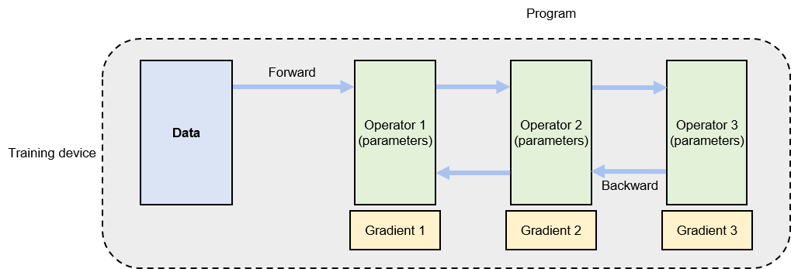
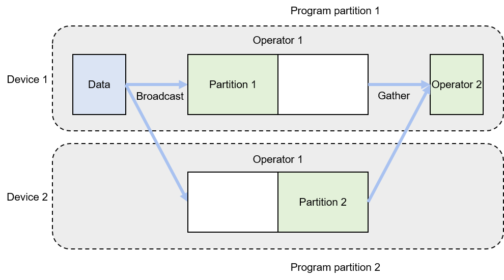
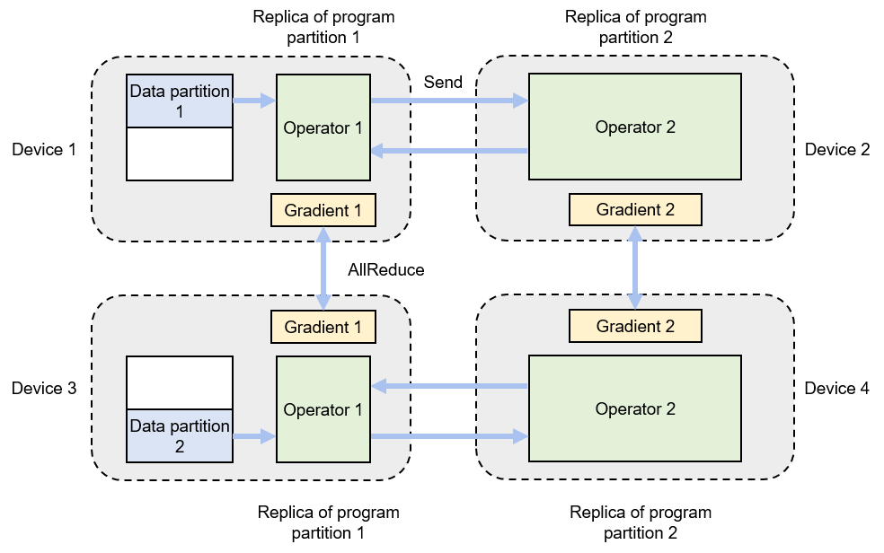

# Parallelism Methods

This section explores the prevalent methods for implementing distributed
training systems, discussing the design goals and a detailed examination
of each parallelism approach.

## Classification of Methods

Distributed training amalgamates multiple single-node training systems
into a parallel structure to expedite the training process without
sacrificing model accuracy. A single-node training system, depicted in
Figure :numref:`ch010/ch10-single-node`, processes training datasets
split into small batches, termed as mini-batches. Here, a mini-batch of
*data* is input into the model, guided by a training *program*, which
generates gradients to enhance model accuracy. Typically, this program
executes a deep neural network. To illustrate the execution of a neural
network, we employ a computational graph, comprising connected
operators. Each operator executes a layer of the neural network, storing
parameters to be updated during the training.

:label:`ch010/ch10-single-node`

The execution of a computational graph involves two phases: *forward*
and *backward* computation. In the forward phase, data is fed into the
initial operator, which calculates and generates the data required by
the downstream operator. This process is continued sequentially through
all operators until the last one concludes its computation. The backward
phase initiates from the last operator, computing gradients and updating
local parameters accordingly. The process culminates at the first
operator. Upon completion of these two phases for a given mini-batch,
the system loads the next mini-batch to update the model.

Considering a model training job, partitioning the *data* and *program*
can facilitate parallel acceleration. Table
`ch010/ch10-parallel-methods` compiles various partition
methods. Single-node training systems enable a \"single program, single
data\" paradigm. For parallel computing across multiple devices, data is
partitioned and the program is replicated for simultaneous execution,
creating a \"single program, multiple data\" or *data parallelism*
paradigm. Another approach involves partitioning the program,
distributing its operators across devices---termed as \"multiple
programs, single data\" or *model parallelism*. When training
exceptionally large AI models, both data and program are partitioned to
optimize the degree of parallelism (DOP), yielding a \"multiple program,
multiple data\" or *hybrid parallelism* paradigm.

:Parallelism methods
|  Classification  |      Single Data      |   Multiple Data |
|------------------|-----------------------|-------------------- |
|  Single program  | single-node execution |  data parallelism |
| Multiple program |   model parallelism   | hybrid parallelism |
:label:`ch010/ch10-parallel-methods`

## Data Parallelism

Data parallelism is used when a single node cannot provide sufficient
computing power. This is the most common parallelism approach adopted by
AI frameworks. Specific implementations include TensorFlow
DistributedStrategy, PyTorch Distributed, and Horovod
DistributedOptimizer. Given a data-parallel system, assume that the
training batch size is $N$, and that there are $M$ devices available for
parallel acceleration. To achieve data parallelism, the batch size is
partitioned into $M$ partitions, with each device getting $N/M$ training
samples. Sharing a replica of the training program, each device executes
and calculates a gradient separately over its own data partition. Each
device (indexed $i$) calculates a gradient $G_i$ based on local training
samples. To ensure that training program parameters are coherent, local
gradients $G_i$ on different devices are aggregated to calculate an
average gradient $(\sum_{i=1}^{N} G_i) / N$. To complete the training on
this mini-batch, the training program updates model parameters based on
the average gradient.

Figure :numref:`ch010/ch10-data-parallel` shows a data-parallel training
system composed of two devices. For a batch size of 64, each device is
assigned 32 training samples and shares the same neural network
parameters (or program replicas). The local training samples are passed
through the operators in the program replica in sequence for forward and
backward computation. During backward computation, the program replicas
generate local gradients. Corresponding local gradients on different
devices (e.g., gradient 1 on device 1 and gradient 1 on device 2) are
aggregated (typically by AllReduce, a collective communication
operation) to calculate an average gradient.

:label:`ch010/ch10-data-parallel`

## Model Parallelism

Model parallelism is useful when memory constraints make it impossible
to train a model on a single device. For example, the memory on a single
device will be insufficient for a model that contains a large operator
(such as the compute-intensive fully connected layer for classification
purpose). In such cases, we can partition this large operator for
parallel execution. Assume that the operator has $P$ parameters and the
system consists of $N$ devices. To minimize the workload on each device
given the limited memory capacity, we can evenly assign the parameters
across the devices ($P/N$ = number of parameters per device). This
partitioning method is called **intra-operator parallelism**, which is a
typical application of model parallelism.

Figure :numref:`ch010/ch10-model-parallel-intra-op` shows an example of
intra-operator parallelism implemented by two devices. The neural
network in this example consists of two operators. To complete forward
and backward computation, operator 1 and operator 2 require 16 GB and 1
GB of memory, respectively. However, in this example, the maximum amount
of memory a single device can provide is only 10 GB. To train this
network, parallelism is implemented on operator 1. Specifically, the
parameters of operator 1 are evenly partitioned into two partitions
between device 1 and device 2, meaning that device 1 runs program
partition 1 while device 2 runs program partition 2. The network
training process starts with feeding a mini-batch of training data to
operator 1. Because the parameters of operator 1 are shared between two
devices, the data is broadcast to the two devices. Each device completes
forward computation based on the local partition of parameters. The
local computation results on the devices are aggregated before being
sent to downstream operator 2. In backward computation, the data of
operator 2 is broadcast to device 1 and device 2, so that each device
completes backward computation based on the local partition of
operator 1. The local computation results on the devices are aggregated
and returned to complete the backward computation process.

:label:`ch010/ch10-model-parallel-intra-op`

In some cases, the overall model --- rather than specific operators ---
requires more memory than a single device can provide. Given $N$
operators and $M$ devices, we can evenly assign the operators across $M$
devices. As such, each device needs to run forward and backward
computation of only $N/M$ operators, thereby reducing the memory
overhead of each device. This application of model parallelism is called
*inter-operator parallelism*.

Figure :numref:`ch010/ch10-model-parallel-inter-op` shows an example of
inter-operator parallelism implemented by two devices. The neural
network in this example has two operators, each requiring 10 GB of
memory for computation (20 GB in total). Because the maximum memory a
single device can provide in this example is 10 GB, we can place
operator 1 on device 1 and operator 2 on device 2. In forward
computation, the output of operator 1 is sent to device 2, which uses
this output as input to complete forward computation of operator 2. In
backward computation, device 2 sends the backward computation result of
operator 2 to device 1 for backward computation of operator 1,
completing the training on a mini-batch.

:label:`ch010/ch10-model-parallel-inter-op`

## Hybrid Parallelism

In training large AI models, the computing power and memory constraints
often go hand in hand. The solution to overcoming these constraints is
to adopt a hybrid of data parallelism and model parallelism, that is,
hybrid parallelism. Figure
:numref:`ch010/ch10-hybrid-parallel` shows an example of hybrid
parallelism implemented by four devices. In this example, inter-operator
parallelism is adopted to reduce memory overheads by allocating operator
1 to device 1 and operator 2 to device 2. Device 3 and device 4 are
added to the system to achieve data parallelism, thereby improving the
computing power of the system. Specifically, the training data is
partitioned to data partitions 1 and 2, and the model (consisting of
operators 1 and 2) is replicated on devices 3 and 4 respectively. This
makes it possible for the program replicas to run in parallel. During
forward computation, devices 1 and 3 run the replicas of operator 1
simultaneously and send their respective computation results to devices
2 and 4 to compute the replicas of operator 2. During backward
computation, devices 2 and 4 compute gradients simultaneously, and the
local gradients are averaged by using the AllReduce operation. The
averaged gradient is back-propagated to the replicas of operator 1 on
devices 1 and 3, and the backward computation process ends.

:label:`ch010/ch10-hybrid-parallel`
