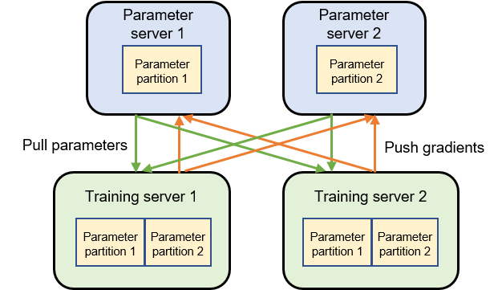

# Parameter Server {#sec:parameter server}

The following describes another common distributed training system:
parameter server. In different machine learning frameworks, the
parameter server may be implemented in different ways. For example,
while TensorFlow and MindSpore come with built-in parameter server
implementations, PyTorch requires users to implement the parameter
servers themselves by using RPC interfaces.

:label:`ch010/ch10-parameter-servers`

## System Architecture

Different from the machine learning systems implemented based on
collective communication, the parameter server system assigns two roles
to servers: training server or parameter server. The parameter server
needs to provide sufficient memory and communication resources, whereas
the training server needs to provide a large quantity of computing
resources (e.g., hardware accelerators).

Figure :numref:`ch010/ch10-parameter-servers` depicts a machine learning
cluster with two training servers and two parameter servers. Assume we
have a model that can be divided into two parameter partitions. Each
partition is assigned to a parameter server for synchronizing
parameters. In the training process, each training server has a complete
model to train a gradient based on the local training dataset shard. The
gradient is then pushed to the corresponding parameter server. After the
two training servers push their gradients, the parameter servers start
to compute the average gradient and update parameters accordingly. The
parameter servers then request the training servers to pull the latest
parameters and start the next round of training iteration.

## Asynchronous Distributed Training

As discussed earlier, after each round of training, training servers
need to compute an average gradient to update each model replica. This
is necessary to ensure that the parameters of all model replicas are
consistent before the next round of training begins. Such implementation
is generally referred to as *synchronous training*.

Although synchronous training helps the training system achieve higher
model accuracy, in a large system, stragglers often appear due to
various causes. Common causes include: 1) The stragglers may not be in
the same rack as other devices. Therefore, the communication bandwidth
of the stragglers is significantly lower than that of the other devices.
2) The stragglers may share local computing and communication resources
with other processes, resulting in resource contention and performance
degradation.

Stragglers will significantly impact the performance of AllReduce-based
synchronous training systems. This is because, in such systems, all
nodes participate in average-gradient computation and communication.
Therefore, the emergence of any straggler will delay the entire
AllReduce operation. To solve this problem, we could use a parameter
server that realizes *asynchronous training* of models.

In an asynchronous training system, all training servers have the same
model parameter replica at the outset of training. During training, once
they finish computing gradients, the training servers immediately push
the results to the parameter server. Based on the received gradients,
the parameter server immediately updates model parameters and requests
training servers to pull the latest parameters. In this process,
different training servers are likely to use model parameters of
different versions for gradient computation. While this method may
negatively affect model accuracy, it enables different training servers
to push and pull parameters based on their operation speeds rather than
waiting for their peers. In this sense, stragglers will not affect the
performance of the entire cluster.

### Training Sparse Models

A substantial number of large-scale machine learning models exhibit
*sparsity*, which signifies that only a subset of their parameters
become activated when a model training or inference request is
processed. An illustrative example of this can be found in recommender
systems, where a sizable embedding table is stored on parameter servers.
In response to an inference request for a specific user, the parameter
server retrieves only the embedding pertinent to that user. A similar
scenario can be observed in mixture-of-expert models, in which a limited
number of experts are activated to process input data, contingent on the
data's characteristics.

Parameter servers can be especially beneficial in streamlining the
training of sparse machine learning models. This advantage stems from
the ability to store the sparse models on the parameter servers, leaving
the dense models---often neural networks---on the training servers where
sophisticated hardware accelerators are deployed. Operating with a lower
resource footprint, parameter servers mainly necessitate an adequate
supply of memory and network resources, rather than the more expensive
parallel cores utilized by CPUs and GPUs. As a result, this approach
significantly cuts costs when accommodating large sparse models. This is
in contrast to the more expensive strategy which relies solely on GPU
servers---coordinated through collective communication---to host both
sparse and dense models. This practice incurs significantly higher
costs.

## Model Replication

In this section, we will discuss the ways parameter servers utilize
model replication to address issues related to data hotspots and server
failures.

### Addressing Data Hotspots

Data on the internet typically follows a power-law distribution, which
means that certain parameters are accessed more often than others during
training. For instance, the embedding item of a widely popular commodity
may be pulled by training servers much more frequently than one from a
less popular commodity. This disparity can result in a parameter server,
storing such popular data, being burdened with a disproportionately high
volume of data pull and push requests, leading to data hotspots that can
undermine system scalability.

To mitigate data hotspots, a machine learning cluster can monitor the
access frequency of each model parameter. It can then create multiple
replicas of frequently accessed parameters, distributing them across
different parameter servers. To facilitate this, a router is created
which directs a parameter query to an appropriate parameter replica.
Within this router, strategies such as random routing or round-robin
routing can be implemented to ensure a balanced access workload across
all replicas.

### Managing Server Failures

Parameter servers are typically deployed for extended periods, enabling
training servers or inference servers to continually query and update
parameters. During this time, some parameter servers may experience
failures due to hardware issues (such as disk, memory, and processors)
or network partitions caused by network switch failures or network
misconfigurations.

To combat server failures, parameter servers can create replicas of all
parameters and distribute these replicas across different servers. This
distribution decreases the chance that these servers will fail
simultaneously. Generally, these replicas are located on servers placed
in separate racks, clusters, and data centers to further minimize risk.

### Maintaining Replica Consistency

Both training and inference servers can update a parameter replicated on
different servers. To ensure consistency amongst these replicas,
parameter servers must employ a replication protocol to coordinate
simultaneous updates on parameter replicas. A commonly utilized protocol
is the Leader-Follower replication. This protocol designates one of the
replicas as a leader and synchronizes all update operations on training
servers to this leader replica before propagating the updates to the
follower replicas.

Deciding on the leader replica and synchronizing updates between the
leader and follower replicas are enduring challenges in the field of
distributed systems. To address these challenges, industry professionals
have developed numerous robust algorithms, such as Paxos and Raft.

Moreover, striking a balance between availability and consistency when
replicating updates is another key concern. A strong-consistency
replication protocol, like chain replication, may lead to failure of the
training servers' push requests, making the parameter servers
unavailable. On the other hand, adopting a weak-consistency replication
protocol might result in replicas storing inconsistent parameters. To
counter this, recent developments have introduced weak-consistency
replication protocols like Adam and Ekko that leverage machine learning
workload characteristics to reduce the communication cost of
synchronizing replicas. For example, Microsoft's Adam protocol
introduces a two-phase commit protocol for accelerating parameter
synchronization while Ekko features a decentralized algorithm where
parameter servers can analyze the model updates based on the gradient
magnitude. Ekko further prioritizes the synchronization requests that
are more likely to affect the quality of model inference.
