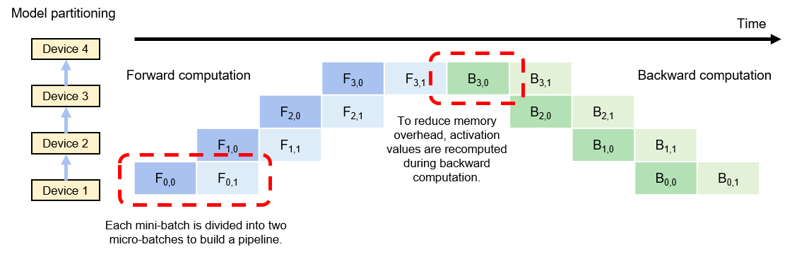

# Pipeline Parallelism with Micro-Batching

In addition to data parallelism and model parallelism, pipeline
parallelism is another common method for distributed training. Pipeline
parallelism is often used in large-scale model-parallel systems that are
designed to overcome the memory shortage in individual devices through
intra- and inter-operator parallelism. However, when such systems are
running, downstream devices in the computational graph remain idle for a
long time --- they cannot perform computation until it is completed in
upstream devices. Consequently, the average utilization of devices is
low. This phenomenon is known as *model parallelism bubbles*.

To reduce bubbles, we can build pipelines in training systems.
Essentially, this approach divides each mini-batch in the training data
into multiple micro-batches. For example, if a mini-batch with $D$
training samples is divided into $M$ micro-batches, then each
micro-batch has $D/M$ data samples. These micro-batches enter the
training system in sequence and go through forward and backward
computation. In this way, the system computes a gradient of each
micro-batch, and then caches the gradient. After the preceding steps are
completed for all micro-batches, the cached gradients are summed to
compute the average gradient (equivalent to the gradient of the entire
mini-batch) based on which the model parameters are updated.

Figure :numref:`ch010/ch10-pipeline-parallel` shows an execution example
of a pipeline training system. In this example, model parameters are
split among four devices for storage. To fully utilize the four devices,
the mini-batch is divided into two micro-batches. It is assumed that
$F_{i,j}$ represents the $i$th forward computation task of the $j$th
micro-batch, and $B_{i,j}$ represents the $i$th backward computation
task of the $j$th micro-batch. After completing the forward computation
of the first micro-batch (denoted as $F_{0,0}$), device 1 sends the
intermediate result to device 2, which then starts the corresponding
forward computation task (denoted as $F_{1,0}$). At the same time,
device 1 starts the forward computation task of the second micro-batch
(denoted as $F_{0,1}$). Forward computation will be finally completed on
the last device in the pipeline, that is, device 3.

:label:`ch010/ch10-pipeline-parallel`

The system then starts backward computation: Device 4 starts the
backward computation task of the first micro-batch (denoted as
$B_{3,0}$). On completion, the intermediate result is sent to device 3,
which then starts the corresponding backward computation task (denoted
as $B_{2,0}$). At the same time, device 4 caches the gradient of the
first micro-batch and starts computation for the second micro-batch
(denoted as $B_{3,1}$). When device 4 completes all backward
computation, it sums the locally cached gradients and then divides the
sum by the number of micro-batches to compute the average gradient. This
gradient is used to update model parameters.

It should be noted that gradient computation often needs the activation
values generated in forward computation. In classical model-parallel
systems, activation values are cached in memory and directly used during
backward computation to avoid repeated computation. In pipeline training
systems, however, these values are not cached due to the strain on
memory resources. Instead, they are recomputed during backward
computation.

For optimal performance of pipeline training systems, the sizes of
micro-batches need to be debugged. Upon completion of forward
computation tasks, devices have to wait until all backward computation
tasks start, meaning that the devices remain idle during this period. As
shown in Figure
:numref:`ch010/ch10-pipeline-parallel`, after completing the two
forward computation tasks, device 1 waits for an extended period of time
before it can start the two backward computation tasks. This waiting
time is referred to as *pipeline bubbles*. To minimize pipeline bubbles,
a common practice is to increase the number of micro-batches to the
maximum extent so that backward computation can start as early as
possible. However, this practice may result in each micro-batch
containing insufficient training samples, failing to fully utilize the
massive computing cores in hardware accelerators. Therefore, the optimal
number of micro-batches is jointly determined by a plurality of factors
(such as pipeline depth, micro-batch size, and quantity of computing
cores in an accelerator).

## Expert Parallelism

Mixture of Experts (MoE) models have gained significant popularity due
to their ability to effectively scale the size of models. Traditional
neural networks typically require a linear increase in computational
resources as the number of parameters grows, making extremely large
networks prohibitively expensive to train. MoE models address this
challenge by specializing different parts of the model---referred to as
experts---to handle specific subsets of the data or tasks, thereby
enabling a more efficient use of computational resources.

MoE models achieve this specialization by dynamically selecting which
experts to activate for a given input. This approach allows the model to
scale to billions of parameters without a proportional increase in
computational demand during inference. In other words, the demand for
computational resources grows sub-linearly with the number of
parameters. This efficiency makes MoE models particularly attractive for
applications that require both high capacity and scalability, such as
natural language processing and recommendation systems.

An MoE model consists of the following key components: (i) *Experts*:
These are individual neural network sub-models, each trained to handle
different aspects or subsets of the data. For example, in a language
model, one expert might specialize in syntax while another focuses on
semantics, (ii) *Gating Network*: This component determines which
experts to activate for a given input. The gating network takes the
input data and outputs a set of weights or selections that decide the
contribution of each expert to the final output, and (iii) *Aggregation
Mechanism*: After the experts process the input, their outputs are
combined (aggregated) to produce the final result. The aggregation is
typically weighted by the gating network's output, allowing the model to
emphasize the contributions of the most relevant experts.

To parallelize an MoE model, the expert parallelism strategy will follow
several key steps: (i)
