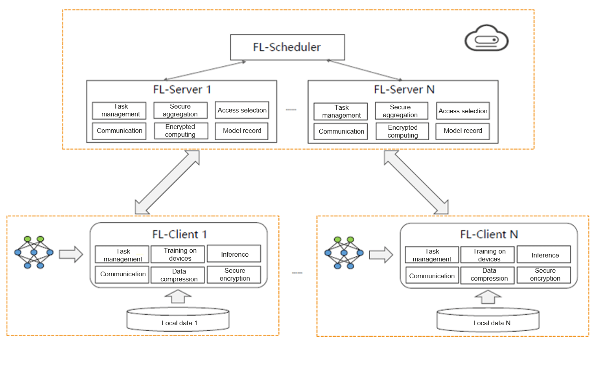

# Horizontal Federated Learning

## Cloud-Cloud Scenarios

In a horizontal federated learning system, multiple participants who
have the same data structure collaboratively establish a machine
learning model by using a cloud server. A typical assumption is that the
participants are trustworthy and that the server is both trustworthy and
curious. This means that no participant is allowed to leak the raw
gradient information to the server. The training process of such a
system generally consists of the following four steps:

1.  Each participant computes the training gradient locally, masks the
    selected gradient by using technologies such as encryption,
    differential privacy, or secret sharing, and sends the masked result
    to the server.

2.  The server performs secure aggregation without knowing the gradient
    information of any participant.

3.  The server sends the aggregation result to the participants.

4.  The participants update their own models by using decrypted
    gradients.

In traditional distributed learning, weights on different training nodes
are synchronized after each single-step training iteration is performed.
However, such synchronization is impossible in federated learning due to
unstable training nodes and high communication costs. To improve the
computation-to-communication ratio and reduce the high energy
consumption caused by frequent communication, Google proposed the
federated averaging (FedAvg) algorithm in 2017. Algorithm
[\[FedAvg\]](#FedAvg){reference-type="ref" reference="FedAvg"} shows the
overall process of FedAvg in cloud-cloud federated learning scenarios.
In each round of training, single-step training is performed multiple
times on each client. The server aggregates the weights of multiple
clients and computes the weighted average value.

:::: algorithm
::: algorithmic
$\rm T$ (Total number of federated learning iterations), $\rm C$ (Number
of FL-Clients participating in federated learning in each iteration),
$\rm model$ (Model) $\rm w$ (Parameters of the final model)  Randomly
select $\rm C$ FL-Clients. // Execution on FL-Clients Receive the weight
($\rm w$) from FL-Servers. Read the weight ($\rm w$) and input it to the
model ($\rm model$). train($\rm model$) Send the weight ($w$) of the
model and the size of training data to FL-Servers. // Execution on
FL-Servers Receive the weight set ($\rm w_{1,...,C}$) from FL-Clients.
$\rm w=allreduce(w_{1,...,C})$ Send the weight ($\rm w$) to FL-Clients.
:::
::::

## Device-Cloud Scenarios

The overall process of device-cloud federated learning is similar to
that of cloud-cloud federated learning, but there are some minor
differences. To be specific, device-cloud federated learning faces
difficulties in the following three aspects:

1.  **High communication costs.** The communication overhead involved in
    device-cloud federated learning is mainly due to the volume of
    one-time communication traffic, whereas that in cloud-cloud
    federated learning is mainly due to the high communication
    frequency. In device-cloud federated learning scenarios, because a
    WLAN or mobile data network is typically used and its speed may be
    many orders of magnitude lower than that of local computing, high
    communication costs become a key bottleneck of federated learning.

2.  **System heterogeneity.** Devices that form part of a federated
    learning network may have varied capabilities in terms of storage,
    computing, and communication due to changes in hardware conditions
    (CPU and memory) of client devices, network connections (3G, 4G, 5G,
    or Wi-Fi), and power supply (battery level). And because of network
    and device limitations, only some devices may be active at any given
    time. In addition, devices may fail to connect instantaneously due
    to emergencies such as power failures and network access failures.
    The heterogeneous system architecture affects how the federated
    learning strategy is formulated overall.

3.  **Privacy issues.** Implementing data privacy protection is more
    difficult in device-cloud federated learning than in other
    distributed learning because the clients in device-cloud federated
    learning cannot participate in each iteration. Sensitive information
    contained in the update information about the device-cloud transfer
    model is also at risk of being exposed to third parties or central
    servers during federated learning. Privacy protection has become a
    key issue that needs to be considered in device-cloud federated
    learning.

To address the preceding difficulties, MindSpore Federated adopts the
distributed FL-Server architecture, which consists of a scheduler
module, server module, and client module, as shown in Figure
:numref:`ch10-federated-learning-architecture`. The following
describes the functions of each module.

:label:`ch10-federated-learning-architecture`

1.  **FL-Scheduler:** Assists in cluster networking and is responsible
    for delivering management-plane tasks.

2.  **FL-Server:** Provides client selection, time-limited
    communication, and distributed federated aggregation functions. An
    FL-Server must be able to serve tens of millions of devices in
    device-cloud scenarios, and support the access of edge servers and
    the security processing logic.

3.  **FL-Client:** Responsible for local data training and performs
    secure encryption on the upload weights when communicating with
    FL-Servers.

MindSpore Federated also provides four key features for device-cloud
federated learning:

1.  **Time-limited communication:** After connections are established
    between FL-Servers and FL-Clients, a global timer and counter are
    started. Aggregation can be performed if the proportion of
    FL-Clients from which FL-Servers receive trained model parameters
    reaches the preset threshold within the preset time window. If the
    threshold is not reached within the time window, the next iteration
    starts. This ensures that, in scenarios with many connected
    FL-Clients, an excessively long training duration or disconnection
    of certain FL-Clients will not cause the entire federated learning
    process to be suspended.

2.  **Loosely coupled networking:** Each FL-Server in an FL-Server
    cluster receives and delivers weights to some FL-Clients in order to
    ease the bandwidth burden on a single FL-Server. In addition,
    FL-Clients can be loosely connected, meaning that the disconnection
    of any FL-Client does not affect the global task, and each FL-Client
    can obtain all the data required for training by accessing any
    FL-Server at any time.

3.  **Encryption module:** Multiple encryption algorithms can be
    utilized in the MindSpore Federated framework to prevent model
    gradient leakage. Such algorithms include the secure aggregation
    algorithms based on local differential privacy (LDP) or MPC, and the
    Huawei-developed sign-based dimension selection (SignDS)
    differential privacy algorithm.

4.  **Communication compression module:** MindSpore Federated uses
    quantization and sparsification (two universal compress methods) to
    compress data into smaller data formats and encode weights. At the
    peer end, it decodes the compressed and encoded data into raw data
    when model parameters are delivered by FL-Servers and uploaded by
    FL-Clients.
