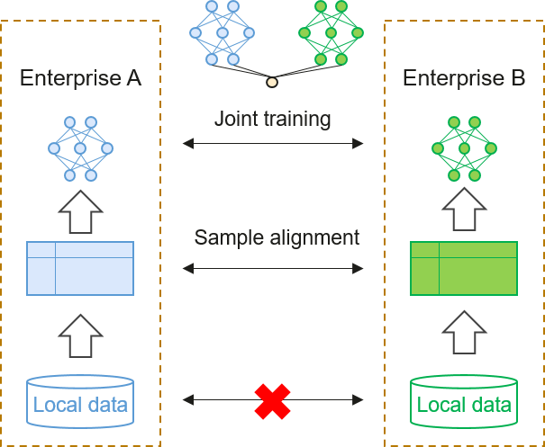
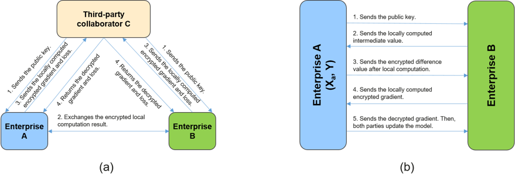

# Vertical Federated Learning

This section focuses on vertical federated learning, which is used
extensively in fields such as finance and advertising. Participants of
vertical federated learning have data that is in the same sample space
but different feature spaces, and the sample data shared by participants
is used for secure joint modeling. Such participants need to collaborate
with each other in order to complete data intersection computation,
joint model training, and joint model inference. A vertical federated
learning system becomes more complex as the number of participants
increases.

The following describes the basic architecture and process of vertical
federated learning by using enterprises A and B as an example. Assume
that enterprise A has both feature data and labeled data, and that it
supports independent modeling, whereas enterprise B has only feature
data and therefore does not support independent modeling. Due to factors
such as privacy regulations and industry norms, data cannot be directly
exchanged between the two enterprises. Both enterprises can use the
vertical federated learning solution for collaboration, meaning that the
sample data they share can be used for joint modeling and training if
data is retained locally. This enables both enterprises to eventually
obtain a more powerful model.

## Architecture of Vertical Federated Learning

Figure :numref:`ch10-federated-learning-vfl-arch` shows a vertical federated
learning system, in which model training is divided into the following
phases.

:label:`ch10-federated-learning-vfl-arch`

1.  **Sample alignment:** The sample data with the same ID is aligned
    for enterprises A and B. In the data sample alignment phase, the
    system uses encryption algorithms to protect data and prevent user
    data of each enterprise from being exposed.

2.  **Joint training:** If enterprises A and B share user data, the
    shared data can be used to train a service model. Note that model
    parameter information is transferred in the encrypted state during
    model training. A trained federated learning model can be deployed
    in each participant of the federated learning system.

## Sample Alignment

The private set intersection (PSI) technology is commonly used for
aligning data samples in vertical federated learning, as illustrated in
Figure :numref:`ch10-federated-learning-vfl-data`. PSI can be implemented
based on circuits, public-key cryptography, oblivious transfer
protocols, or fully homomorphic encryption --- such solutions each have
their own advantages and disadvantages. For example, the PSI solution
based on public-key cryptography does not require assistance from
servers but involves high computational overhead, whereas the solution
based on oblivious transfer features high computing performance but
involves high communication overhead. It is therefore necessary to
select a PSI solution that strikes the optimal balance among functions,
performance, and security based on scenarios.

:label:`ch10-federated-learning-vfl-data`

RSA-based blind signature --- a classical PSI solution based on
public-key cryptography --- is one of the technologies widely used in
vertical federated learning systems. The following describes the basic
process of an RSA-based blind signature algorithm by taking enterprises
A and B as an example.

Enterprise A functions as the server, and has a set of labeled data and
sample IDs. Enterprise B functions as the client and has a set of sample
IDs. Enterprise A uses the RSA algorithm to generate a private key
(which it stores itself) and a public key (which it sends to enterprise
B).

The RSA algorithm is used to generate the signature for the IDs involved
in sample alignment on the server, as shown in Formula
:eqref:`shengcheng`.

$$t_j=H^{'}(K_{a:j})$$ 
:eqlabel:`eq:shengcheng`

In the preceding formula, $K_{a:j}=(H(a_j))^d \ mod \ n$ indicates the
result of encrypting $H(a_j)$ by using the private key $d$ and the RSA
algorithm, where $H()$ and $H^{'}()$ are hash functions.

Similarly, the sample ID is encrypted using the public key on the client
and then multiplied by a random number $R_{b,i}$ for blinded
perturbation, as shown in Formula
:eqref:`raodong`.

$$y_i=H(b_i)\cdot(R_{b,i})^e \ mod \ n$$ 
:eqlabel:`eq:raodong`

The client sends the value of $\{y_1, ..., y_v\}$ obtained after the
preceding computation to the server. Once it receives the value of
$y_i$, the server uses the private key $d$ to sign the value, as shown
in Formula :eqref:`qianming`.

$$y_i^{'}=y_i^d \ mod \ n$$ 
:eqlabel:`eq:qianming`

The server then sends the values of $\{y_1^{'},...,y_v^{'}\}$ and
$\{t_1,...,t_w\}$ to the client.

After receiving the values of $y_i^{'}$ and $t_j$, the client first
performs deblinding, as shown in Formula
:eqref:`qumang`.

$$K_{b:i}={y_i}^{'}/R_{b,i}$$ 
:eqlabel:`eq:qumang`

The client then performs sample alignment based on its own ID signature
and that sent from the server in order to obtain the ID intersection $I$
in the encryption + hash combined state, as shown in Formula
:eqref:`qiujiao`.

$${t_i}^{'}=H^{'}(K_{b:i}) \\I=\{t_1,...,t_w\}\cap \{{t_1}^{'},...,{t_v}^{'}\}$$ 
:eqlabel:`eq:qiujiao`

Finally, the client sends the aligned sample ID intersection to the
server, which uses its own mapping table to obtain the plaintext result.
In this way, enterprises A and B obtain the user intersection in the
encrypted state, without exposing their non-overlapping sample IDs in
the entire process.

## Joint Training

After sample IDs are aligned, developers can use the common data to
establish machine learning models, as shown in Figure
:numref:`ch10-federated-learning-vfl-train`.

:label:`ch10-federated-learning-vfl-train`

Models such as linear regression, decision tree, and neural network have
been widely used in vertical federated learning systems. Assume that
third-party collaborator C, along with enterprises A and B, is
introduced into the model training process of vertical federated
learning to function as the trusted central server and does not conspire
with other participants. Acting as a neutral third party in the training
process, the central server is responsible for generating and
distributing keys, and for decrypting and computing encrypted data. Note
that there is no mandatory requirement to use a dedicated central
server. For example, in a two-party federated learning scenario,
third-party collaborator C is not required to coordinate two-party
training tasks --- instead, enterprise A with labeled data can function
as the central server. Using a solution that adopts a central server
(third-party collaborator C here), the following describes the process
of joint model training in vertical federated learning without loss of
generality:

1.  Third-party collaborator C creates a key pair and sends the public
    key to enterprises A and B.

2.  Enterprises A and B separately compute the intermediate results
    required for computing the gradients and loss values, encrypt the
    results, and exchange the encrypted results.

3.  Enterprises A and B separately compute the encrypted gradients and
    add masks. In addition, enterprise A computes the encrypted loss
    value. After the computation is complete, enterprises A and B send
    the encrypted values to third-party collaborator C.

4.  Third-party collaborator C decrypts the gradients and loss values,
    and sends the decrypted values to enterprises A and B.

5.  After receiving the decrypted values, enterprises A and B remove the
    masks from the gradients, and then update the local model
    parameters.

Throughout the entire training process, all sensitive data exchanged
between enterprises A and B is encrypted before being sent out of their
respective trusted domains. In homomorphic encryption, a form of
encryption commonly used in federated learning frameworks, operations
can be performed on two copies of encrypted data with the results
remaining in an encrypted form. These results, once decrypted, are
identical to those obtained had the same operations been performed on
the unencrypted data. If the operation is addition, the algorithm is
called additive homomorphic encryption. Assuming that the encryption
function is denoted as $[[\cdot]]$, Formula
:eqref:`jiafatongtai` shows the characteristics of additive
homomorphic encryption.

$$[[a+b]]=[[a]]+[[b]]$$ 
:eqlabel:`eq:jiafatongtai`

Paillier is an additive homomorphic encryption algorithm that has been
widely used in third-party data processing and signal processing. In
vertical federated learning, the Paillier encryption algorithm is
generally used to encrypt the loss function and gradient, implementing
cross-institution joint model training.

Once joint model training is complete, the model is ready to be applied
to production environments. Because each participant in vertical
federated learning has a partial model structure, model inference ---
like joint training --- requires collaboration between both parties. The
process of joint inference is similar to that of joint training.
Third-party collaborator C starts by sending the IDs of inference data
to enterprises A and B, with each of them completing inference and
computation locally, encrypting the results, and sending the encrypted
results to third-party collaborator C. Then, third-party collaborator C
computes the final joint inference result of the model.
