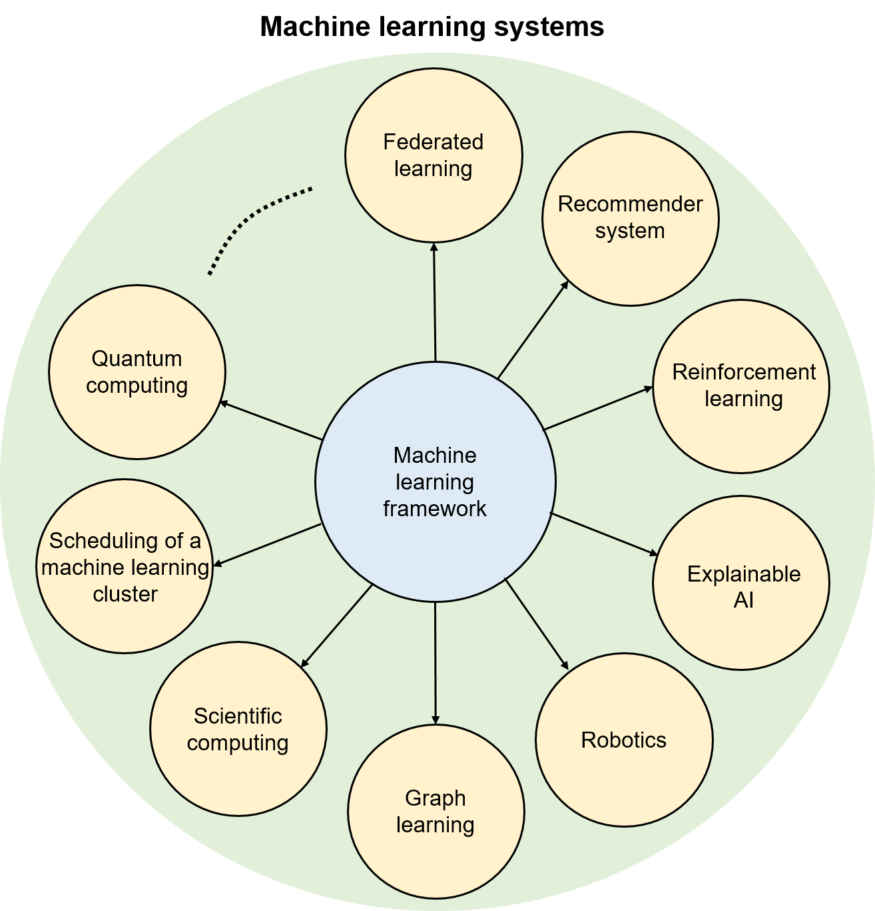

# Application Scenarios of Machine Learning Systems

A machine learning framework is commonly utilized in diverse scenarios,
giving rise to a range of *machine learning systems*. In a broader
context, a machine learning system refers to a collective term
encompassing a variety of software and hardware systems that facilitate
and execute machine learning applications. Figure
:numref:`intro/system-ecosystem` provides an overview of the
various application scenarios for machine learning systems.

:label:`intro/system-ecosystem`

1.  **Federated learning:** Laws and regulations on user privacy
    protection and data protection prevent many machine learning
    applications from accessing user data directly for model training
    purposes. This is where federated learning --- based on a machine
    learning framework --- benefits such applications.

2.  **Recommender system:** Incorporating machine learning (especially
    deep learning) into recommender systems have achieved major success
    over the past few years. Compared with traditional rule-based
    recommender systems, those based on deep learning can analyze
    massive feature data of users more effectively, thereby bringing
    huge improvements to the accuracy and timeliness of recommendations.

3.  **Reinforcement learning:** Because reinforcement learning is
    special in terms of the way it collects data and trains models, it
    is therefore necessary to develop dedicated reinforcement learning
    systems based on a machine learning framework.

4.  **Explainable AI:** As machine learning becomes more and more
    popular in many key areas, including finance, healthcare, and
    governmental affairs, developing explainable AI systems based on a
    machine learning framework is gaining wider attention.

5.  **Robotics:** Robotics is another area where the use of machine
    learning frameworks is gaining popularity. Compared with traditional
    robot vision methods, machine learning methods have achieved
    enormous success in several robot tasks, such as automatic feature
    extraction, target recognition, and path planning.

6.  **Graph learning:** Graphs are the most widely used data structure
    and are used to express large volumes of Internet data, for
    instance, social network graphs and product relationship graphs.
    Machine learning algorithms have been proven effective for analyzing
    large-scale graph data. A machine learning system designed to
    process graph data is referred to as a graph learning system.

7.  **Scientific computing:** Scientific computing covers a wide range
    of traditional fields (such as electromagnetic simulation, graphics,
    and weather forecast), in which many large-scale problems can be
    effectively solved by machine learning methods. Therefore,
    developing special machine learning systems for scientific computing
    is becoming an increasingly common practice.

8.  **Scheduling of a machine learning cluster:** A machine learning
    cluster consists of heterogeneous processors, heterogeneous
    networks, and even heterogeneous storage devices. But in a machine
    learning cluster, computing tasks often have common characteristics
    during their execution (e.g., iterative execution based on the
    collective communication operator AllReduce). In order to take
    account of the cluster's heterogeneity of devices and the common
    characteristics in task execution, a machine learning cluster is
    often designed to use a special scheduling method.

9.  **Quantum computing:** Quantum computers are generally realized
    through a hybrid architecture, in which quantum computing is
    performed by quantum computers and the simulation of quantum
    computers is performed by classical computers. Many simulation
    systems (such as TensorFlow Quantum and MindQuantum) are realized on
    the basis of a machine learning framework because the simulation
    often requires massive matrix computations and gradient computation.

There are too many machine learning systems for this book to cover them
all in depth. Instead, we aim to provide a system designer's perspective
on several core systems used in federated learning, recommenders,
reinforcement learning, explainable AI, and robotics.
