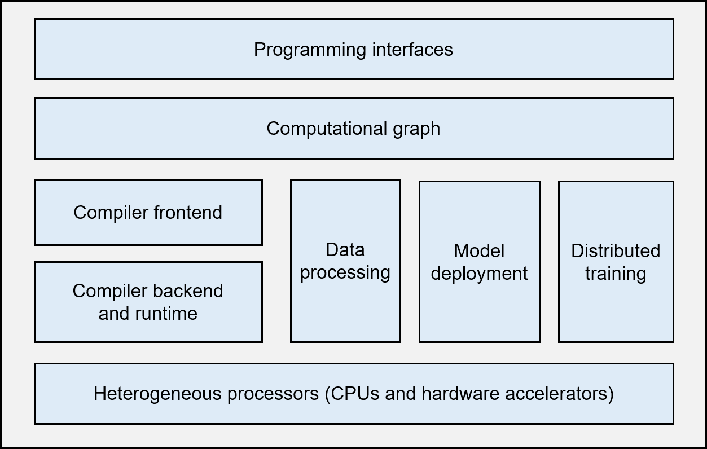

# Machine Learning Framework Architecture

Figure :numref:`intro/framework-architecture` shows the basic
architecture of a typical, complete machine learning framework.

:label:`intro/framework-architecture`

1.  **Programming interfaces:** A machine learning framework needs to
    provide programming interfaces, usually those of high-level
    programming languages (like Python), to cater for the diversified
    backgrounds of machine learning developers. At the same time, the
    framework also needs to support a system implementation that is
    mainly based on low-level programming languages (e.g., C and C++) so
    that operating system features (e.g., thread management and network
    communication) and various hardware accelerators can be utilized
    efficiently for optimized performance.

2.  **Computational graph:** Machine learning applications, though
    implemented through different programming interfaces, need to share
    the same backend when the applications run. The computational graph
    technology is key to realizing this backend. A computational graph,
    which defines a user's machine learning application, includes many
    graph nodes that represent computational operations. These nodes are
    connected by edges, which represent computational dependencies.

3.  **Compiler frontend:** Once a computational graph is built, the
    machine learning framework analyzes and optimizes it (or the
    corresponding application) through the compiler frontend. The
    compiler frontend provides key functions such as intermediate
    representation, automatic differentiation, type derivation, and
    static analysis.

4.  **Compiler backend and runtime:** After analyzing and optimizing the
    computational graph, the machine learning framework uses the
    compiler backend and runtime to optimize different types of
    underlying hardware. In addition to optimizing the selection or
    scheduling sequence of operators, common optimization technologies
    usually analyze the L2/L3 cache size and the instruction pipeline
    length to match hardware specifications.

5.  **Heterogeneous processors:** A machine learning application is
    co-executed by central processing units (CPUs) and hardware
    accelerators (such as NVIDIA GPUs, Huawei Ascend processors, and
    Google TPUs). During the execution, non-matrix operations (e.g.,
    complex data preprocessing and computational graph scheduling) are
    handled by CPUs, whereas matrix operations and certain frequently
    used machine learning operators (e.g., Transformer operators and
    convolution operators) are performed by hardware accelerators.

6.  **Data processing:** A machine learning application needs to perform
    complex preprocessing on raw data and manage a large number of
    training, validation, and test datasets. The data processing module
    (e.g., the tf.data module of TensorFlow, or the DataLoader module of
    PyTorch) is responsible for such data-centered operations.

7.  **Model deployment:** In addition to model training, model
    deployment is another key function needed in a machine learning
    framework. Model compression technologies --- such as model
    conversion, quantization, and distillation --- enable us to run
    models on hardware with limited memory. It is also necessary to
    optimize model operators for specific hardware inference platforms
    (e.g., NVIDIA Orin). Furthermore, in order to ensure the security of
    a model (e.g., to deny unauthorized user reads), model obfuscation
    must be considered in the framework's design.

8.  **Distributed training:** A machine learning model is usually
    trained in parallel on distributed compute nodes. Common parallel
    training methods include data parallelism, model parallelism, hybrid
    parallelism, and pipeline parallelism, all of which are usually
    implemented through the remote procedure call (RPC), collective
    communication, or parameter server.
