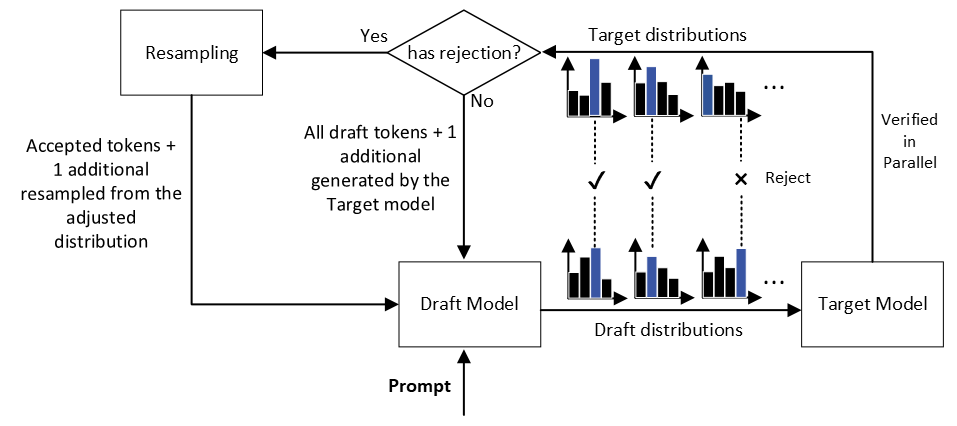
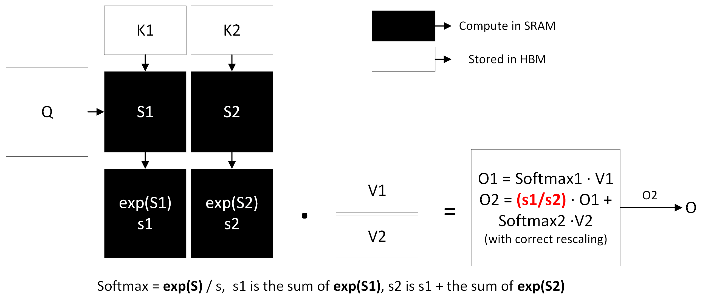

# Advanced Efficient Techniques

In addition to standard model compression methods, some advanced
approaches are being developed to accelerate the decoding process of the
large models. These methods include generating specific tokens using
smaller models and the ability to generate multiple tokens in a single
step, resulting in accelerating the decoding process. Furthermore, there
are techniques that utilize the memory hierarchy for high throughput
computation, aiming to decrease memory I/O, and as a result, be more
efficient.

## Speculative Decoding

Speculative decoding is a strategy to speed up the decoding process,
based on insights provided by Leviathan et al. [@leviathan2023fast].

1.  Complex modeling tasks frequently encompass simpler subtasks that
    can be effectively approximated using more efficient models.

2.  By combining speculative execution with a unique sampling approach,
    it is possible to accelerate exact decoding from larger models. This
    is achieved by processing them with the outputs from the
    approximation models in parallel.

Figure :numref:`ch-deploy/sd` is a brief overview of Speculative
Decoding. It involves initially generating a series of tokens using a
draft model, which is a smaller and less complex model. These generated
tokens are then verified in parallel with the target model, which is a
larger model. The tokens that are finally executed in the output are
those that are accepted by the target model from the initial draft
tokens. Additionally, if rejection occurs, one more token is resampled
and generated from the adjusted distribution. If there is no rejection,
an extra token is generated by the target model using the draft tokens
as context.

<figure id="fig:ch-deploy/sd">

<figcaption>Speculative Decoding Overview</figcaption>
</figure>

To elaborate, the process begins with the draft model generating a
series of $\gamma$ tokens, denoted as $x_1, x_2, ..., x_{\gamma}$.
Subsequently, it preserves the distributions
$q_{1}(x), q_{2}(x), ..., q_{\gamma}(x)$ of these tokens for future
verification by the target model. These $\gamma$ tokens are then
inputted into the target model in parallel to calculate the logits for
the respective token combinations
$p_{1}(x), p_{2}(x), ..., p_{\gamma+1}(x)$, derived from
$M_{\text{target}}(\text{prefix} + [x_1 + ... + x_{\gamma}])$. If the
condition $q(x) < p(x)$ is met, the token is retained. In contrast, if
not met, the token faces a rejection chance of $1 - \frac{p(x)}{q(x)}$,
following which it is reselected from an adjusted distribution:
$$p'(x) = norm(max(0, p(x) - q(x)))$$ 
:eqlabel:`equ:sd_adjusted` In the paper [@leviathan2023fast],
Leviathan et al. have proved the correctness of this adjusted
distribution for resampling.

Under the assumption that the execution time for a single step of the
Target model is denoted as $T$, and that of the draft model as $cT$,
where $0<c\leq1$. The standard procedure using the target model to
generate $\gamma + 1$ tokens would require a total time of
$\gamma T + T$. In contrast, with speculative decoding, where
$\gamma + 1$ tokens are produced ($\gamma$ by the draft model and one
additional by the target model concurrently during the parallel
verification), the time required would be $\gamma cT + T$. If all
$\gamma$ draft tokens are accepted by the target model and $c$ is small
enough to make $cT << T$, speculative decoding has the potential to
significantly reduce latency during the decoding process.

To further explain, if we denote $\alpha = E(\beta)$ where $\beta$ is
the acceptance rate with a given prefix and $E(\beta)$ is a natural
measure of how well the draft model can approximate the target model
assuming $\beta$s are i.i.d., the expected number of tokens generated by
the speculative process is $\frac{1-\alpha^{\gamma+1}}{1-\alpha}$
[@leviathan2023fast]. According to the speculative decoding time for one
superstep $\gamma cT + T$, the expected time for generating one token
with speculative decoding is
$\frac{(c\gamma+1)(1-\alpha)}{1-\alpha^{\gamma+1}}T$. By choosing a good
$\gamma$ and a well-aligned efficient draft model meaning big $\alpha$
and small $c$, the result is desired.

Nevertheless, as the value of $\gamma$ continues to rise, it becomes
progressively more difficult for a draft model to generate draft tokens
with a high acceptance rate by the target model, especially as the
likelihood of acceptance typically diminishes when $\gamma$ exceeds a
certain value. In the worst-case scenario, if all draft tokens generated
by the draft model are rejected by the target model, then only the one
token that is resampled from the adjusted distribution will be decoded
following the speculative process. In this situation, the time spent on
generating $\gamma$ tokens with the draft model represented as
$\gamma cT$ effectively becomes a complete waste of time when compared
to generating a single token directly with the target model; in
addition, the draft model is consuming the GPU memory.

Therefore, finding the best $\gamma$ or having a well-designed draft
model that is effectively accepted by the target model is of importance.
There are some strategies that can be employed to address this issue
effectively. For example:

**Self-Derived Drafts from Target Models**

Is it possible to utilize the target model directly as the draft model,
rather than employing a separate smaller model, which could lead to
increased GPU memory usage? The answer is yes. Similar to the original
approach, the modification involves switching the draft model into the
target model itself, followed by self-verifying these draft tokens. The
advantages of this method are:

1.  Since the draft model is almost the same as the target model, it is
    sufficiently robust to maintain a stable acceptance rate.

2.  Only need to keep one model in the GPU memory.

The challenge now lies in the ability to generate multiple future tokens
in a single decoding step. To achieve this, the concept involves
appending additional concurrent layers to the existing output layer of
the model. Stern et al. first proposed this method in
[@stern2018blockwise].

The training of these extra layers can either start from scratch with
the target model or involve fine-tuning a pre-trained model. This
approach forms the basis of the Medusa [@medusa]. Medusa's architecture
includes extra \"Medusa heads\" attached after the last hidden layer.
This design enables the model to generate a range of token candidates in
just one decoding step. Subsequently, these candidates undergo a
self-verification process, and only the accepted tokens are executed.

Other methodologies, such as implementing Knowledge Distillation between
draft and target models, employing multiple draft models instead of just
one, and replacing draft models with retrieval datasets proposed by
researchers are still being investigated to determine their
effectiveness and reliability.

Speculative decoding is an effective technique that uses smaller models
to reduce the overhead caused by larger models. By developing a
well-trained and aligned draft model, the efficiency of the decoding
process can be significantly improved.

## FlashAttention

FlashAttention is an advanced optimization technique utilizing the
memory hierarchy aimed at enhancing the efficiency of attention
computations in transformer models in terms of memory usage and speed.

Dao et al. were the first to suggest this approach, as indicated in
[@dao2022flashattention]. They noted the absence of *IO-awareness* --
the consideration of I/O interactions across GPU memory layers -- in the
classic Scaled Dot-Product Attention algorithm. To address this, they
introduced FlashAttention, an enhanced version of the attention
algorithm designed to minimize the intensive access to the GPU's high
bandwidth memory (HBM). This innovation led to significant gains in both
computational speed and throughput.

Figure :numref:`ch-deploy/memory` shows the memory hierarchy with
corresponding bandwidths. The main goal of FlashAttention is to avoid
reading and writing the large attention matrix to and from HBM. And
perform computation in SRAM as much as possible.

The standard Scaled Dot-Product Attention [@attention] formula is
$$\textbf{A} = Softmax(\frac{\textbf{QK}^T}{\sqrt{d_k}})\textbf{V}$$ 
:eqlabel:`equ:std_attn`

As $d_k$ is a scalar, we can simplify it into three parts:

$$\begin{aligned}
    \textbf{S} = \textbf{QK}^T\\
    \textbf{P} = Softmax(\textbf{S})\\
    \textbf{O} = \textbf{PV}
\end{aligned}$$ 
:eqlabel:`equ:attn_sep`

The matrices **K**, **Q**, **V** are all stored in HBM. The standard
implementation of attention follows these steps:

1.  Load **K, Q** from HBM, compute **$S$ = $QK^T$**, and write **S** to
    the HBM.

2.  Read **S** from HBM, compute **P** = $Softmax$(**S**), and write
    **P** to HBM.

3.  Load **P** and **V** from HBM, compute **O** = **PV**, and write
    **O** to HBM. Finally, return **O**.

The standard implementation of attention involves frequent I/O
interactions with HBM for large matrices reads/writes, leading to
reduced speed due to the intensive memory access requirements. Moreover,
it stores large intermediate matrices in HBM for backward propagation.

To handle such issues, FlashAttention divides the input components **Q,
K**, and **V** into blocks. These blocks are then transferred from
slower HBM to faster SRAM. Once in SRAM, the attention output is
computed with respect to these blocks. Two strategies involved are
called **tiling** and **recomputation**.

**Tiling**: Assuming a vector $x\in \mathbb{R}^D$, the basic Softmax can
be calculated as: $$\begin{aligned}
m(x) = \max\limits_{i} x_i\\
l_{1}(x) = [e^{x_{1} - m(x)},\, ...\,,e^{x_{D} - m(x)}]\\
s_{1}(x) = \sum_{i} l_{1}(x)_i\\
Softmax(x) = \frac{l_{1}(x)}{s_{1}(x)}
\end{aligned}$$

Attention can be computed by blocks, so large Softmax can be decomposed
into separated parts. To elaborate, assuming a vector
$x \in\mathbb{R}^{2D}$: $$\begin{aligned}
x = [x_{1}, \,x_{2}], \quad x_{1}, \, x_{2} \in\mathbb{R}^D\\
m(x) = \max(m(x_{1}), \,m(x_{2}))\\
l(x) = [e^{m(x_{1})-m_(x)}l_{1}(x_1),\, ... \, ,e^{m(x_2)-m(x)}l_{1}(x_2)]\\
s(x) = e^{m(x_{1})-m(x)}s_{1}(x_1) + e^{m(x_2)-m(x)}s_{1}(x_2)\\
Softmax(x) = \frac{l(x)}{s(x)}
\end{aligned}$$

Figure :numref:`ch-deploy/flashattn` shows a brief overview of
FlashAttention with two blocks. Following decomposition, Softmax
calculations can be executed block by block. Therefore, **K, Q** and
**V** are initially divided into blocks. Subsequently, compute the
Softmax values together with the respective $s(x)$ and $m(x)$.
Ultimately, aggregate **O** blocks, the outcomes of the block-wise
Softmax values with the multiplication of corresponding **V** block
vectors. To enhance the efficiency of these steps, it's necessary to
load all the required matrix blocks from the HBM to the on-chip SRAM for
the current step's computation. All the calculations take place on-chip,
that is, within the SRAM. To ensure that all required blocks are
sufficiently proper to fit within the on-chip SRAM, which has a capacity
of 20MB, careful consideration must be given to setting the size of
these blocks. For **K, Q** and **V** $\in\mathbb{R}^{N \times d}$, the
block size is set to $\lfloor \frac{M}{4d} \rfloor$ where M is the SRAM
size and the output block size is set to be
$min(\lfloor \frac{M}{4d} \rfloor, d)$ [@dao2022flashattention].
Post-computation of each block, the resulting output block along with
the corresponding $s(x)$ and $m(x)$ are transferred back to the HBM.
These blocks are sufficiently small for reads/writes to avoid causing
significant latency; in addition, all related computations are
implemented in one CUDA kernel using **kernel fusion**. This avoids
repeatedly reading and writing from and to HBM.

<figure id="fig:ch-deploy/memory">

<figcaption>Memory Hierarchy Overview</figcaption>
</figure>

<figure id="fig:ch-deploy/flashattn">

<figcaption>FlashAttention Overview with Two Blocks</figcaption>
</figure>

**Recomputation**:

Standard attention requires $O(N^2)$ memory to store intermediate
matrices **S** and **P** for gradient computation w.r.t. **Q, K, V** in
the backward pass. For FlashAttention, **S** and **P** can be recomputed
with the HBM-stored $s(x)$, $m(x)$ and **O** in SRAM easily. Therefore,
only $O(N)$ memory is required. Furthermore, FlashAttention has fewer
HBM accesses than Standard Attention which results in faster runtime
[@dao2022flashattention].

The standard FlashAttention implementation doesn't eliminate the
redundant computation of zero elements within the attention mechanism.
To address this, a mask is incorporated in FlashAttention to focus
computation exclusively on non-zero elements. Termed as Block-Sparse
FlashAttention, this approach is also discussed in
[@dao2022flashattention]. By using sparsity, Block-Sparse FlashAttention
effectively reduces the larger component of the I/O complexity, leading
to a direct improvement in performance.

However, FlashAttention has not been fully optimized. Dao noted that its
inefficiency stems from suboptimal work distribution among various
thread blocks and warps on the GPU. This leads to either low occupancy
or unnecessary shared memory reads and writes. Thus, Dao proposed
**FlashAttention-2** [@dao2023flashattention2] which has better
parallelism and work partitioning.

FlashAttention-2 includes several tweaks to reduce the non-matmul
operations.

1.  Remain output **O** blocks un-scaled until the very end of the loop.

2.  Instead of saving both $s(x)$ and $m(x)$ in HBM, save
    $logsumexp_{i} = m_{i} + log(s_{i})$ which is enough for backward
    pass.

3.  For blocks where column indices are greater than row indices, which
    occupy about half of the blocks in large sequences, computation is
    skipped. It leads to a 1.7-1.8X speedup compared to those without
    this skip.

4.  Only use the row-wise $logsumexp$ instead of both the row-wise max
    $m(x)$ and row-wise sum $s(x)$ of exponentials in the softmax.

For parallelism, In the original version of FlashAttention, parallel
processing was done over the batch size and number of heads, with one
thread block processing one attention head. There are as many thread
blocks as the product of the batch size and the number of heads. This
works well on an A100 GPU, which has 108 Streaming Multiprocessors
(SMs), as long as the number of thread blocks is large enough to engage
most of the SMs, like 80 or more.

However, for long sequences, this isn't as efficient because of the
smaller number of thread blocks. FlashAttention-2 introduces additional
parallelization over the sequence length dimension, which significantly
speeds up the process in these cases by improving GPU occupancy, i.e.
the fraction of GPU resources being used.

In the forward pass, the method schedules different parts of the
sequence length on different thread blocks that operate independently.
The backward pass also incorporates parallelization over the sequence
length. To update the gradients of the query matrix **dQ**, it uses
atomic additions to synchronize updates between different thread blocks.

Within each thread block, work partitioning for each wrap is also of
importance. Usually, 4 to 8 warps are allocated to each thread block. To
handle this condition, FlashAttention-2 introduces significant
improvements in both the forward and backward passes of the algorithm.
In the forward pass, unlike FlashAttention which splits **K** and **V**
across 4 warps (the \"split-K\" scheme) leading to inefficient shared
memory operations, FlashAttention-2 splits **Q** across the warps while
keeping **K** and **V** accessible to all. This change eliminates the
need for inter-warp communication and reduces shared memory
reads/writes, resulting in a faster runtime. Each warp directly
multiplies its slice of **Q** with **K** and then with **V**,
simplifying the computation of the output slice. In the backward pass,
FlashAttention-2 continues to avoid the \"split-K\" scheme, aligning the
warps in a way that minimizes shared memory operations. Despite
requiring some synchronization due to complex dependencies among inputs
and gradients, this approach still leads to a speedup by reducing the
shared memory reads/writes.

FlashAttention has gained significant attention in the industry for its
remarkable performance, offering accelerated attention computations in
both forward and backward passes while also reducing memory I/O
complexity. An enhanced version, FlashAttention-2, achieves a notable 2X
speedup over the standard FlashAttention [@dao2022flashattention].
Moreover, continuous optimization efforts are being made, promising an
even more potent version of FlashAttention in the future.
