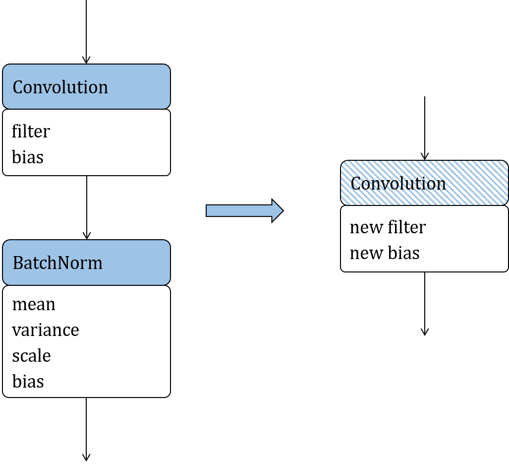

# Conversion to Inference Model and Model Optimization {#sec:ch-deploy/model-optimization}

## Model Conversion

As mentioned earlier, TensorFlow, PyTorch, MindSpore, MXNet, and CNTK
define their own model data structures. This means that the inference
system needs to convert these structures to a unified one. Open Neural
Network Exchange (ONNX) is designed to implement such conversion. It
supports an extensive range of machine learning operators and converts
models from various frameworks (e.g., TensorFlow and PyTorch) into ONNX
models. Because models are structured data, the conversion process
involves converting the data structure. It starts by analyzing the
similarities and differences between two data structures. If they are
the same, data is transferred; if the structures are similar but with
slight differences, data is mapped; if the structures differ
significantly, extra semantics conversion might be required; and if they
are totally incompatible, the conversion will fail. ONNX features strong
expressive power, meaning that it can convert models from most
frameworks in the industry to compatible ONNX models. If a model is
abstracted as a graph, its data structure can be defined as follows:

1.  **Topological expression of model:** The topological connections of
    a model are represented as edges in a graph. From the perspective of
    a model, these edges define the data flows and control flows in the
    model. Based on such definitions, we can extend to the expressions
    of the subgraphs, model inputs and outputs, and control flow
    structures. For example, the control flow on TensorFlow 1.x is
    expressed as a cyclic graph. To prevent the formation of cycles,
    TensorFlow 1.x uses operators such as Enter, Exit, Switch, LoopCond,
    and NextIteration, whereas ONNX uses operators such as Loop and If.
    As such, when converting a TensorFlow1.x control flow model into an
    ONNX model, the control flow graph structure in the TensorFlow model
    must be merged into a While or If operator on ONNX.

2.  **Operator prototype definition:** Operators can be regarded as data
    processing or control flow nodes in a model or as vertices in a
    graph. An operator prototype defines the type, inputs, outputs, and
    attributes of an operator. For instance, Slice has different
    semantics on Caffe and ONNX. To convert a Caffe model into an ONNX
    model, we need to map Slice on Caffe to Split on ONNX.
    FusedBatchnorm on TensorFlow does not have a mapping operator on
    Caffe. Rather, Batchnorm and Scale on Caffe need to be combined to
    express the same semantics of FusedBatchnorm on TensorFlow.
    Generally, the model conversion process involves converting the
    topological relationships and mapping the operator prototypes
    between models.

Following model conversion, some input-agnostic operations are conducted
for optimization purposes prior to model deployment, including constant
folding, operator fusion, operator replacement, and operator reordering
--- optimization methods discussed earlier in this book. For instance,
constant folding is usually performed during the compilation executed on
the compiler frontend, whereas, operator fusion and partition are often
performed (depending on the backend hardware support) once the
compilation is complete. However, some optimization operations can only
be performed in their entirety during the deployment phase.

:label:`ch-deploy/fusion-storage}## Operator Fusion {#sec:ch-deploy/kernel-fusion`

Operator fusion involves combining multiple operators in a deep neural
network (DNN) model into a new operator based on certain rules, reducing
the inference latency and power consumption by lowering the computation
workload and load/store overhead during online inference.

The two main performance benefits brought by operator fusion are as
follows: First, it maximizes the utilization of registers and caches.
And second, because it combines operators, the load/store time between
the CPU and memory is reduced. Figure
:numref:`ch-deploy/fusion-storage` shows the architecture of a
computer's storage system. While the storage capacity increases from the
level-1 cache (L1) to hard disk, so too does the time for reading data.
After operator fusion is performed, the previous computation result can
be temporarily stored in the CPU's register or cache where the next
computation can directly read the result, reducing the number of I/O
operations on the memory. Furthermore, operator fusion allows some
computation to be completed in advance, eliminating redundant or even
cyclic redundant computing during forward computation.

:label:`ch-deploy/conv-bn-fusion`

To describe the principle of operator fusion, we will use two operators,
Convolution and Batchnorm, as shown in Figure
:numref:`ch-deploy/conv-bn-fusion`. In the figure, the
solid-colored boxes indicate operators, the resulting operators after
fusion is performed are represented by hatched boxes, and the weights or
constant tensors of operators are outlined in white. The fusion can be
understood as the simplification of an equation. The computation of
Convolution is expressed as Equation
:eqref:`ch-deploy/conv-equation`.

$$\bf{Y_{\rm conv}}=\bf{W_{\rm conv}}\cdot\bf{X_{\rm conv}}+\bf{B_{\rm conv}}$$ 
:eqlabel:`equ:ch-deploy/conv-equation`

Here, we do not need to understand what each variable means. Instead, we
only need to keep in mind that Equation
:eqref:`ch-deploy/conv-equation` is an equation for
$\bf{Y_{\rm conv}}$ with respect to $\bf{X_{\rm conv}}$, and other
symbols are constants.

Equation
:eqref:`ch-deploy/bn-equation` is about the computation of
Batchnorm:

$$\bf{Y_{\rm bn}}=\gamma\frac{\bf{X_{\rm bn}}-\mu_{\mathcal{B}}}{\sqrt{{\sigma_{\mathcal{B}}}^{2}+\epsilon}}+\beta$$ 
:eqlabel:`equ:ch-deploy/bn-equation`

Similarly, it is an equation for $\bf{Y_{\rm bn}}$ with respect to
$\bf{X_{\rm bn}}$. Other symbols in the equation represent constants.

As shown in Figure
:numref:`ch-deploy/conv-bn-fusion`, when the output of
Convolution is used as the input of Batchnorm, the formula of Batchnorm
is a function for $\bf{Y_{\rm bn}}$ with respect to $\bf{X_{\rm conv}}$.
After substituting $\bf{Y_{\rm conv}}$ into $\bf{X_{\rm bn}}$ and
uniting and extracting the constants, we obtain Equation
:eqref:`ch-deploy/conv-bn-equation-3`.

$$\bf{Y_{\rm bn}}=\bf{A}\cdot\bf{X_{\rm conv}}+\bf{B}$$ 
:eqlabel:`equ:ch-deploy/conv-bn-equation-3`

Here, $\bf{A}$ and $\bf{B}$ are two matrices. It can be noticed that
Equation
:eqref:`ch-deploy/conv-bn-equation-3` is a formula for computing
Convolution. The preceding example shows that the computation of
Convolution and Batchnorm can be fused into an equivalent Convolution
operator. Such fusion is referred to as formula fusion.

The fusion of Convolution and Batchnorm eliminates a Batchnorm
operation, thereby reducing the quantity of parameters and computation
workload are reduced, and thereby the load/store operations are also
reduced. In general, this fusion not only optimizes the power
consumption and performance during model deployment, but also brings
certain benefits in compressing the model size.

Symbols that are considered as constants in the Convolution and
Batchnorm formulas during fusion are considered as parameters during
training. Performing fusion during the training process will result in
missing model parameters. Because the fusion eliminates a Batchnorm
operator and corresponding parameters from the network, the algorithm of
the DNN is changed, degrading the accuracy to unacceptable levels.
Therefore, the fusion of Convolution and Batchnorm is an optimization
method typically used during deployment. To evaluate the optimization
effect, we constructed a sample network with Convolution and Batchnorm
using MindSpore Lite. We ran the sample network and mobilenet-v2 network
for inference in dual threads on a Huawei Mate 30 smartphone to compare
the time of running 3,000 inference epochs before and after the fusion.
As shown in Table
[1](#tab:ch09/ch09-conv-bn-fusion){reference-type="ref"
reference="tab:ch09/ch09-conv-bn-fusion"}, the inference performance of
the sample network and mobilenet-v2 network is improved considerably
after the fusion --- by 8.5% and 11.7% respectively. Such improvements
are achieved without bringing side effects and without requiring
additional hardware or operator libraries.

::: {#tab:ch09/ch09-conv-bn-fusion}
  Fusion           Sample   Mobilenet-v2
  --------------- -------- --------------
  Before fusion    0.035       15.415
  After fusion     0.031       13.606

  : Convolution + Batchnorm inference performance before and after
  fusion (unit: ms)
:::

## Operator Replacement

The principle of operator replacement is to simplify an operator formula
by uniting like terms, extracting common factors, and employing other
mathematical methods, and then map the simplified formula to a certain
type of operators that have the same computational logic but are more
suitable for online deployment. In this way, we can reduce the
computation workload and compress the model.

:label:`ch-deploy/bn-replace`

Figure :numref:`ch-deploy/bn-replace` depicts the replacement of
Batchnorm with Scale, which is used as an example to describe the
principle of operator replacement. After decomposing Equation
:eqref:`ch-deploy/bn-equation` (the Batchnorm formula) and
folding the constants, Batchnorm is defined as Equation
:eqref:`ch-deploy/replace-scale`

$$\bf{Y_{bn}}=scale\cdot\bf{X_{bn}}+offset$$ 
:eqlabel:`equ:ch-deploy/replace-scale`

where **scale** and **offsets** are scalars. This simplified formula can
be mapped to a Scale operator.

Compared with the original Batchnorm formula, the simplified formula has
fewer parameters and involves less computation workload. This indicates
that operator replacement is an effective approach to optimizing the
power consumption and performance of a model during deployment. Symbols
that are considered as constants in Batchnorm during deployment are not
considered as constants during training, meaning that the replacement
can be performed only during deployment. Operator replacement reduces
the quantity of parameters and changes the structure of the model,
weakening the expressive power and reducing the accuracy of the model
during convergence.

## Operator Reordering

Another way of reducing the computation workload of an inference model
is to adjust the topological order of its operators according to certain
rules, on the condition that the inference accuracy is not degraded.
Common methods of operator reordering include moving cropping operators
(e.g., Slice, StrideSlice, and Crop) forward, and reordering Reshape,
Transpose, and BinaryOp.

:label:`ch-deploy/crop-reorder`

Crop is used to cut a part out of the input feature map as the output.
After Crop is executed, the size of the feature map is reduced. As shown
in Figure :numref:`ch-deploy/crop-reorder`, moving Crop forward to cut the
feature map before other operators reduces the computation workload of
subsequent operators, thereby improving the inference performance in the
deployment phase. Such improvement is related to the operator
parameters. Note, however, that Crop can be moved forward only along
element-wise operators.

The experiment result above proves that optimizing models before
inference makes it possible to significantly reduce the latency, power
consumption, and memory usage.
