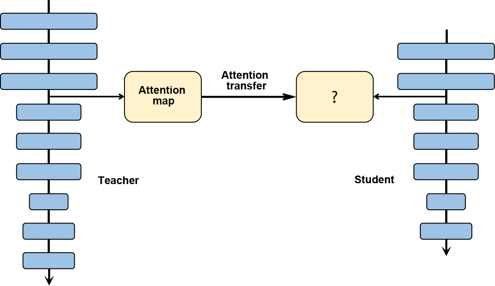

# Model Compression {#sec:ch-deploy/model-compression}

The previous section briefly described the purpose of model conversion
and focused on some common model optimization methods for model
deployment. Hardware restrictions differ depending on where models are
deployed. For instance, smartphones are more sensitive to the model
size, usually supporting models only at the MB level. Larger models need
to be compressed using compression techniques before they can be
deployed on different computing hardware.

## Quantization

Model quantization is a technique that approximates floating-point
weights of contiguous values (usually float32 or many possibly discrete
values) at the cost of slightly reducing accuracy to a limited number of
discrete values (usually int8). As shown in Figure
[1](#fig:ch-deploy/quant-minmax){reference-type="ref"
reference="fig:ch-deploy/quant-minmax"}, $T$ represents the data range
before quantization. In order to reduce the model size, model
quantization represents floating-point data with fewer bits. As such,
the memory usage during inference can be reduced, and the inference on
processors that are good at processing low-precision operations can be
accelerated.

{#fig:ch-deploy/quant-minmax}

The number of bits and the range of data represented by different data
types in a computer are different. Based on service requirements, a
model may be quantized into models with different number of bits based
on service requirements. Generally, single-precision floating-point
numbers are used to represent a deep neural network. If signed integers
can be used to approximate parameters, the size of the quantized weight
parameters may be reduced to a quarter of the original size. Using fewer
bits to quantize a model results in a higher compression rate --- 8-bit
quantization is the mostly used in the industry. The lower limit is
1-bit quantization, which can compress a model to 1/32 of its original
size. During inference, efficient XNOR and BitCount bit-wise operations
can be used to accelerate the inference.

According to the uniformity of the original ranges represented by the
quantized data, quantization can be further divided into linear
quantization and non-linear quantization. Because the weights and
activations of a deep neural network are usually not uniform in
practice, non-linear quantization can theoretically achieve a smaller
loss of accuracy. In real-world inference, however, non-linear
quantization typically involves higher computation complexity, meaning
that linear quantization is more commonly used. The following therefore
focuses on the principles of linear quantization.

In Equation
[\[equ:ch-deploy/quantization-q\]](#equ:ch-deploy/quantization-q){reference-type="ref"
reference="equ:ch-deploy/quantization-q"}, assume that $r$ represents
the floating-point number before quantization. We are then able to
obtain the integer $q$ after quantization.

$$\label{equ:ch-deploy/quantization-q}q=clip(round(\frac{r}{s}+z),q_{min},q_{max})$$

$clip(\cdot)$ and $round(\cdot)$ indicate the truncation and rounding
operations, and $q_{min}$ and $q_{max}$ indicate the minimum and maximum
values after quantization, respectively. $s$ is the quantization
interval, and $z$ is the bias representing the data offset. The
quantization is symmetric if the bias ($z$) used in the quantization is
0, or asymmetric in other cases. Symmetric quantization reduces the
computation complexity during inference because it avoids computation
related to $z$. In contrast, asymmetric quantization determines the
minimum and maximum values based on the actual data distribution, and
the information about the quantized data is more effectively used. As
such, asymmetric quantization reduces the loss of accuracy caused by
quantization.

According to the shared range of quantization parameters $s$ and $z$,
quantization methods may be classified into layer-wise quantization and
channel-wise quantization. In the former, separate quantization
parameters are defined for each layer. Whereas the latter involves
defining separate quantization parameters for each channel.
Finer-grained channel-wise quantization yields higher quantization
precision, but increases the computation complexity.

Model quantization can also be classified into quantization aware
training (QAT) and post-training quantization (PTQ) based on whether
training is involved. In QAT, fake-quantization operators are added, and
statistics on the input and output ranges before and after quantization
are collected during training to improve the accuracy of the quantized
model. This method is therefore suitable for scenarios that place strict
requirements on accuracy. In PTQ, models are directly quantized after
training, requiring only a small amount of calibration data. This method
is therefore suitable for scenarios that place strict requirements on
usability and have limited training resources.

**1. Quantization aware training**

QAT simulates quantization during training by including the accuracy
loss introduced by fake-quantization operators. In this way, the
optimizer can minimize the quantization error during training, leading
to higher model accuracy. QAT involves the following steps:

1.  Initialization: Set initial values for the $q_{min}$/$q_{max}$
    ranges of weights and activations.

2.  Building a network for simulated quantization: Insert
    fake-quantization operators after weights and activations that
    require quantization.

3.  Running QAT: Compute the range (i.e., $q_{min}$ and $q_{max}$) for
    each weight and activation of the quantized network layer. Then,
    perform forward computation with the quantization loss considered,
    so that the loss can be involved in subsequent backpropagation and
    network parameter update.

4.  Exporting the quantized network: Obtain $q_{min}$ and $q_{max}$, and
    compute the quantization parameters $s$ and $z$. Substitute the
    quantization parameters into the quantized formula to transform the
    network weights into quantized integer values. Then, delete the
    fake-quantization operators, and add quantization and dequantization
    operators before and after the quantization network layer,
    respectively.

**2. Post-training quantization**

PTQ can be divided into two types: weight quantization and full
quantization. Weight quantization quantizes only the weights of a model
to compress its size, and then the weights are dequantized to the
original float32 format during inference. The subsequent inference
process is the same as that of a common float32 model. The advantage of
weight quantization is that calibration dataset and quantized operators
are not required, and that the accuracy loss is small. However, it does
not improve the inference performance, because the operators used during
inference are still float32. Full quantization quantizes both the
weights and activations of a model, and the quantized operators are
executed to accelerate model inference. The quantization of activations
requires a small number of calibration datasets (training dataset or
inputs of real scenarios) to collect the distribution of the activations
at each layer and calibrate the quantized operators. Calibration
datasets are used as the input during the quantization of activations.
After the inference, the distribution of activations at each layer is
collected to obtain quantization parameters. The process is summarized
as follows:

1.  Use a histogram to represent the distribution $P_f$ of the original
    float32 data.

2.  Select several $q_{min}$ and $q_{max}$ values from a given search
    space, quantize the activations, and obtain the quantized data
    $Q_q$.

3.  Use a histogram to represent the distribution of $Q_q$.

4.  Compute the distribution difference between $Q_q$ and $P_f$, and
    find the $q_{min}$ and $q_{max}$ values corresponding to the
    smallest difference between $Q_q$ and $P_f$ in order to compute the
    quantization parameters. Common indicators used to measure the
    distribution differences include symmetric Kullback-Leibler
    divergence and Jenson-Shannon divergence.

In addition, the inherent error of quantization requires calibration
during quantization. Take the matrix multiplication
$a=\sum_{i=1}^Nw_ix_i+b$ as an example. $w$ denotes the weight, $x$ the
activation, and $b$ the bias. To overcome the quantization error, we
first calibrate the quantized mean value, and then obtain the mean value
of each channel output by the float32 operator and the quantized
operator. Assume that the mean value output by the float32 operator of
channel $i$ is $a_i$, and that output by the quantized operator after
dequantization is $a_{qi}$. From this, we can obtain the final mean
value by adding the mean value difference $a_i-a_q$ of the two channels
to the corresponding channel. In this manner, the final mean value is
consistent with that output by the float32 operator. We also need to
ensure that the distribution after quantization is the same as that
before quantization. Assume that the mean value and variance of the
weight of a channel are $E(w_c)$ and $||w_c-E(w_c)||$, and the mean
value and variance after quantization are $E(\hat{w_c})$ and
$||\hat{w_c}-E(\hat{w_c})||$, respectively. Equation
[\[equ:ch-deploy/post-quantization\]](#equ:ch-deploy/post-quantization){reference-type="ref"
reference="equ:ch-deploy/post-quantization"} is the calibration of the
weight:

$$\label{equ:ch-deploy/post-quantization}
\begin{aligned}
\hat{w_c}\leftarrow\zeta_c(\hat{w_c}+u_c) \\
u_c=E(w_c)-E(\hat{w_c})   \\
\zeta_c=\frac{||w_c-E(w_c)||}{||\hat{w_c}-E(\hat{w_c})||}
\end{aligned}$$

As a general model compression method, quantization can significantly
improve the memory and compression efficiency of neural networks, and
has been widely used.

## Model Sparsification

Model sparsification reduces the memory and computation overheads by
removing some components (such as weights, feature maps, and convolution
kernels) from a neural network. It is a type of strong inductive bias
introduced to reduce the computation complexity of the model, just like
weight quantization, weight sharing, and pooling.

**1. Motivation of model sparsification**

Convolution on a convolutional neural network can be considered as a
weighted linear combination of the input and the weights of the
convolution kernel. In this sense, tiny weights have a relatively small
impact on the output. Model sparsification can be justified based on two
assumptions:

1.  Most neural network models have over-parameterized weights. The
    number of weight parameters can reach tens or even hundreds of
    millions.

2.  For most computer vision tasks such as detection, classification,
    and segmentation, useful information accounts for only a small
    proportion in an activation feature map generated during inference.

As such, model sparsification can be classified into two types according
to the source of sparsity: weight sparsification and activation
sparsification. Both types reduce the computation workload and model
storage requirements by reducing redundant components in a model. In
model sparsification, some weak connections are pruned based on the
absolute value of weights or activations (i.e. the weight or activation
of such connections is set to 0), with the goal of improving the model
performance. The sparsity of a model is measured by the proportion of
zero-value weights or activation tensors. Because the accuracy of a
model typically decreases as its sparsity increases, we hope to minimize
such loss when increasing the sparsity.

Neurobiology was the inspiration for inventing neural networks --- it
has also inspired the sparsification of neural network models.
Neurobiologists found that most mammalian brains, including humans, have
a process called synapse pruning, which occurs between infancy and
adulthood. During synapse pruning, neuron axons and dendrites decay and
die off, and the neuron connections are continuously simplified and
reconstructed. This process allows brains to work more efficiently and
consume less energy.

**2. Structured and unstructured sparsification**

Let's first look at weight sparsification. It can be classified into
structured and unstructured sparsification. Structured sparsification
involves pruning channels or convolution kernels in order to generate
regular and smaller weight matrices that are more likely to obtain
speedup on CPUs and GPUs. However, this mode is coarse-grained, meaning
that it severely reduces the model accuracy.

In contrast, unstructured sparsification allows a weight at any location
to be pruned, meaning it is a fine-grained mode that causes less loss to
the model accuracy. However, the unstructured mode limits the speedup of
sparse models on hardware for a number of reasons:

1.  The irregular layout of weights requires many control flow
    instructions. For instance, the presence of zero values introduces
    many `if-else` instructions for decision-making, which inevitably
    reduces instruction-level parallelism.

2.  The computation of convolution kernels is typically multi-threaded.
    However, the irregular layout of weight matrices on memory causes
    thread divergence and load imbalance, which therefore affects
    thread-level parallelism.

3.  The irregular layout of weight matrices on the memory hinders data
    locality and reduces the cache hit rate. Consequently, the
    load/store efficiency is reduced.

In an attempt to solve these problems, recent work combines structured
sparsification with unstructured sparsification. This approach
incorporates the advantages of both modes, and overcomes their
disadvantages to an extent.

**3. Sparsification strategies**

Given a neural network model, after deciding to sparsify the weights or
activations, we need to determine when and how to perform the
sparsification. The most common sparsification process is currently
pre-training, pruning, and fine-tuning. With this process, we need to
sparsify and fine-tune a converged dense model obtained through
training. Given the fact that a pre-trained model contains knowledge it
has learned, sparsification on such models will achieve a better effect
than directly on the initial model. In addition to pruning the
pre-trained model, we usually interleave pruning with network training.
Compared with one-shot pruning, iterative pruning is integrated more
closely with training, so that redundant convolution kernels can be
identified more efficiently. As such, iterative pruning is widely used.

To illustrate how to prune a network, we will use Deep
Compression [@han2015deep] as an example. Removing most weights leads to
a loss of accuracy of the neural network, as shown in Figure
[2](#fig:ch-deploy/deepcomp){reference-type="ref"
reference="fig:ch-deploy/deepcomp"}. Fine-tuning a pruned sparse neural
network can help improve model accuracy, and the pruned network may be
quantized to represent weights using fewer bits. In addition, using
Huffman coding can further reduce the memory cost of the deep neural
network.

{#fig:ch-deploy/deepcomp}

In addition to removing redundant neurons, a dictionary learning-based
method can be used to remove unnecessary weights on a deep convolutional
neural network. By learning the bases of convolution kernels, the
original convolutional kernels can be transformed into the coefficient
domain for sparsification. An example of this approach is the work by
Bagherinezhad et al. [@bagherinezhad2017lcnn], in which they proposed
that the original convolution kernel can be decomposed into a weighted
linear combination of the base of the convolution kernel and sparse
coefficient.

## Knowledge Distillation

Knowledge distillation (KD), also known as the teacher-student learning
algorithm, has gained much attention in the industry. Large deep
networks tend to deliver good performance in practice, because
over-parameterization increases the generalization capability when it
comes to new data. In KD, a large pre-trained network serves as the
teacher, a deep and thin brand-new neural network serves as the student,
supervised by the teacher network. The key to this learning algorithm is
how to transfer knowledge converted by the teacher to the student.

Hinton et al. [@Distill] first proposed a teacher-student learning
framework. It is used for the learning of deep and thin neural networks
by minimizing the differences between the teacher and student neural
networks. The teacher network is denoted as $\mathcal{N}_{T}$ with
parameters $\theta_T$, and the student network is denoted as
$\mathcal{N}_{S}$ with parameters $\theta_S$. In general, the student
network has fewer parameters than the teacher network.

 [@Distill] proposed KD, which makes the classification result of the
student network more closely resembles the ground truth as well as the
classification result of the teacher network, that is, Equation
[\[c2Fcn:distill\]](#c2Fcn:distill){reference-type="ref"
reference="c2Fcn:distill"}.

$$\mathcal{L}_{KD}(\theta_S) = \mathcal{H}(o_S,\mathbf{y}) +\lambda\mathcal{H}(\tau(o_S),\tau(o_T)),
\label{c2Fcn:distill}$$

where $\mathcal{H}(\cdot,\cdot)$ is the cross-entropy function, $o_S$
and $o_T$ are outputs of the student network and the teacher network,
respectively, and $\mathbf{y}$ is the label. The first item in
Equation [\[c2Fcn:distill\]](#c2Fcn:distill){reference-type="ref"
reference="c2Fcn:distill"} makes the classification result of the
student network resemble the expected ground truth, and the second item
aims to extract useful information from the teacher network and transfer
the information to the student network, $\lambda$ is a weight parameter
used to balance two objective functions, and $\tau(\cdot)$ is a soften
function that smooths the network output.

Equation [\[c2Fcn:distill\]](#c2Fcn:distill){reference-type="ref"
reference="c2Fcn:distill"} only extracts useful information from the
output of the teacher network classifier --- it does not mine
information from other intermediate layers of the teacher network.
Romero et al. [@FitNet] proposed an algorithm for transferring useful
information from any layer of a teacher network to a small student
network. Note that not all inputs are useful for convolutional neural
network computing and subsequent task execution. For example, in an
image containing an animal, it is important to classify and identify the
region where the animal is rather than the background information.
Therefore, it is an efficient way to select useful information from the
teacher network. Zagoruyko and Komodakis [@attentionTS] proposed a
learning method based on an attention loss function to improve the
performance of the student network. This method introduces an attention
module. The attention module generates an attention map, which
identifies the importance of different areas of an input image to the
classification result. The attention map is then transferred from the
teacher network to the student network, as depicted in Figure
 [3](#fig:ch-deploy/attentionTS){reference-type="ref"
reference="fig:ch-deploy/attentionTS"}.

KD is an effective method to optimize small networks. It can be combined
with other compression methods such as pruning and quantization to train
efficient models with higher accuracy and less computation workload.

<figure id="fig:ch-deploy/attentionTS">

<figcaption>Teacher-student neural network learning
algorithm</figcaption>
</figure>
