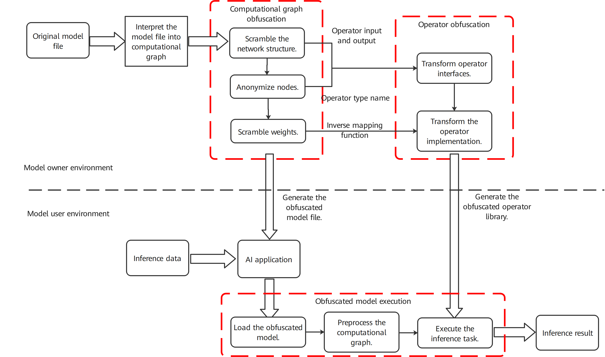

# Security Protection of Models

After training and optimizing models locally, AI service providers
deploy the models on third-party platforms (such as mobile devices, edge
devices, and cloud servers) to provide inference services. The design
and training of the AI models require a large amount of time, data, and
computing power. This is why model and service providers protect the
intellectual property rights of the models (including model structures
and parameters) from being stolen during transfer, storage, and running
in the deployment phase.

## Overview

The security protection of models can be divided into static protection
and dynamic protection. Static protection refers to protecting models
during transfer and storage. At present, it is widely implemented based
on file encryption, in which AI model files are transferred and stored
in ciphertext and are decrypted in the memory before being used for
inference. However, throughout the inference process, models remain in
plaintext in the memory, making it possible for theft. Dynamic
protection refers to protecting models during runtime. Dynamic
protection methods currently available can be classified into three
categories. The first is trusted execution environment-based (TEE-based)
protection. TEEs are usually secure zones isolated on trusted hardware,
and AI model files are stored and transferred in non-secure zones and
running after decryption in the secure zones. Although this method
involves only a short inference latency on the CPU, it requires specific
trusted hardware, making it difficult to implement. In addition, due to
constraints on hardware resources, protecting large-scale deep models is
difficult and heterogeneous hardware acceleration is still challenging.
The second is a cryptographic computing-based protection, which ensures
that models remain in ciphertext during transfer, storage, and running
using cryptographic techniques (such as homomorphic encryption and
secure multi-party computation). Although this method is free from
hardware constraints, it has large computation or communications
overheads and cannot protect model structure information. The third is
obfuscation-based protection. This method scrambles the computational
logic of models with fake nodes, so that attackers cannot understand the
models even if they obtain them. Compared with the former two methods,
obfuscation-based protection brings a smaller overhead to the
performance and neglectable loss of accuracy. Furthermore, it is
hardware-agnostic, and can support protection of very large models. We
will focus on protection using the obfuscation-based method.

## Model Obfuscation

Model obfuscation can automatically obfuscate the computational logic of
plaintext AI models, preventing attackers from understanding the models
even if they obtain them during transfer and storage. In addition,
models can run while still being obfuscated, thereby ensuring the
confidentiality while they are running. Obfuscation does not affect the
inference results and brings only a low performance overhead.

:label:`ch-deploy/model_obfuscate`

Figure :numref:`ch-deploy/model_obfuscate` depicts the model obfuscation
procedure, which is described as follows.

1.  **Interpret the given model into a computational graph:** Based on
    the structure of a trained model, interpret the model file into the
    graph expression (computational graph) of the model computational
    logic for subsequent operations. The resulting computational graph
    contains information such as node identifiers, node operator types,
    node parameters, and network structures.

2.  **Scramble the network structure of the computational graph[^1]:**
    Scramble the relationship between nodes in the computational graph
    using graph compression, augmentation, and other techniques in order
    to conceal the true computational logic. In graph compression, the
    key subgraph structure is matched by checking the entire graph.
    These subgraphs are compressed and replaced with a single new
    computing node. Graph augmentation adds new input/output edges to
    the compressed graph in order to further conceal the dependencies
    between nodes. An input/output edge comes from or points to an
    existing node in the graph, or comes from or points to the new
    obfuscation node in this step.

3.  **Anonymize nodes in the computational graph:** Traverse the
    computational graph processed in Step (2) and select the nodes to be
    protected. For a node to be protected, we can replace the node
    identifier, operator type, and other attributes that can describe
    the computational logic of the model with non-semantic symbols. For
    node identifier anonymization, the anonymized node identifier must
    be unique in order to distinguish different nodes. For operator type
    anonymization, to avoid operator type explosion caused by
    large-scale computational graph anonymization, we can divide nodes
    with the same operator type into several disjoint sets, and replace
    the operator type of nodes in the same set with the same symbol.
    Step (5) ensures that the model can be identified and executed after
    node anonymization.

4.  **Scramble weights of the computational graph:** Add random noise
    and mapping functions to the weights to be protected. The random
    noise and mapping functions can vary with weights. Step (6) ensures
    that the noise of weights does not change the model execution
    result. The computational graph processed after Steps (2), (3),
    and (4) are then saved as a model file for subsequent operations.

5.  **Transform operator interfaces:** Steps (5) and (6) transform
    operators to be protected in order to generate candidate obfuscated
    operators. An original operator may correspond to multiple
    obfuscated operators. The quantity of candidate obfuscated operators
    depends on how many sets the nodes are grouped into in Step (3). In
    this step, the operator interfaces are transformed based on the
    anonymized operator types and operator input/output relationship
    obtained after Steps (2), (3), and (4). Such transformation can be
    implemented by changing the input, output, or interface name.
    Changing the input and output involves modification on the input and
    output data, making the form of the obfuscated operator different
    from that of the original operator. The added data includes the data
    dependency introduced by graph augmentation in Step (2) and the
    random noise introduced by weight obfuscation in Step (4). The
    operator name is changed to the name of the anonymized operator
    obtained in Step (3) to ensure that the model can still be
    identified and executed after the nodes are anonymized and that the
    operator name does not reveal the computational logic.

6.  **Transform the operator implementation:** Transform the operator
    code implementation by encrypting strings, adding redundant code,
    and employing other code obfuscation techniques in order to keep the
    computational logic consistent between the original operator and
    obfuscated operator while also making the logic more difficult to
    understand. A combination of different code obfuscation techniques
    may be applied to different operators in order to realize the code
    implementation transformation. In addition to equivalent code
    transformation, the obfuscated operators further implement some
    additional computational logic. For example, in Step (4), noise has
    been added to the weights of an operator. The obfuscated operator
    also implements an inverse mapping function of the weight noise,
    dynamically eliminating noise in the operator execution process and
    ensuring that the computation result is the same as the original
    model. The generated obfuscated operators can then be saved as a
    library file for subsequent operations.

7.  **Deploy the model and operator library:** Deploy the obfuscated
    model and corresponding operator library file on the desired device.

8.  **Load the obfuscated model:** Parse the obfuscated model file and
    obtain the graph expression of the model computational logic, that
    is, the obfuscated computational graph obtained after Step (2), (3),
    and (4).

9.  **Initialize the computational graph:** Initialize the computational
    graph to generate an execution task sequence. According to security
    configuration options, if runtime model security needs to be
    protected, the obfuscated graph should be directly initialized to
    generate an execution task sequence. Each compute unit in the
    sequence corresponds to execution of one obfuscated operator or
    original operator. If security protection is required during only
    model transfer and storage, restore the obfuscated graph in the
    memory to the source graph, and then initialize the source graph to
    generate an execution task sequence. Each unit in the sequence
    corresponds to the execution of an original operator. In this way,
    performance overheads during inference can be further reduced.

10. **Execute inference tasks:** The model executes the compute units
    sequentially on the input of the AI application in order to obtain
    an inference result. If a compute unit corresponds to an obfuscated
    operator, the obfuscated operator library is invoked. Otherwise, the
    original operator library is invoked.

[^1]: Scrambling refers to adding noise to the computational graph.
    Common methods include adding redundant nodes and edges and merging
    some subgraphs.
