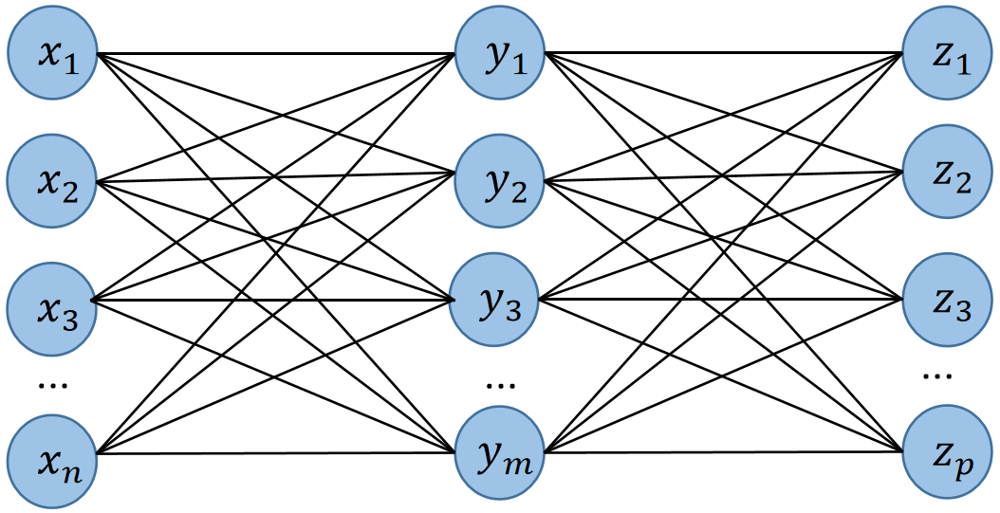
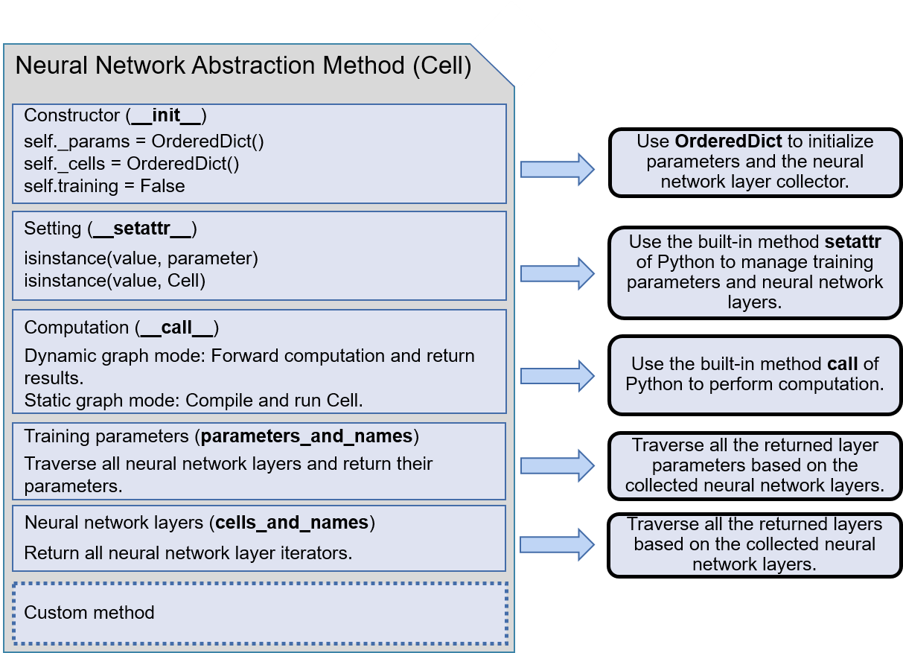

# Neural Network Programming

To implement an AI model, a machine learning framework often takes a
neural-network-centric programming interface. Regardless of their
structures, neural networks are comprised of three elements: (1) Nodes
serve as computational units that carry out the processing of a neural
network, (2) Node Weights are variables updated by gradients during the
training process, and (3) Node Connections specify how data (for
example, activation and gradients) are transmitted within a neural
network.

## Neural Network Layers

In order to simplify the construction of a neural network, many machine
learning frameworks utilize a layer-oriented approach. This method
organizes nodes, their weights, and their connections into cohesive
neural network layers.

To illustrate this, we can examine the use of fully connected layers, a
type of neural network layer. A distinguishing characteristic of fully
connected layers is that every node in one layer is linked to every node
in the succeeding layer. This method facilitates an extensive linear
transformation of the feature space. By doing so, data can be transposed
from a high-dimensional space to a lower-dimensional one, and
conversely.

As shown in Figure :numref:`ch03/fc_layer_1`, the fully connected process transforms
*n* data points from the input into an *m* sized feature space. This is
followed by a further transformation into a *p* sized feature space.
It's important to highlight that the quantity of parameters in a fully
connected layer grows substantially --- from n$\times$m during the
initial transformation to m$\times$p in the subsequent one.

<figure id="fig:ch03/fc_layer_1">

<figcaption>Fully connected layer illustration</figcaption>
</figure>

Several types of neural network layers are widely used in various
applications, including fully connected, convolution, pooling,
recurrent, attention, batch normalization, and dropout layers. When
dealing with problems related to time series association in sequential
data, recurrent neural layers are commonly employed. However, recurrent
neural layers encounter difficulties with vanishing or exploding
gradients as the sequence length increases during the training process.
The Long Short-Term Memory (LSTM) model was developed as a solution to
this problem, enabling the capturing of long-term dependencies in
sequential data. Code `ch02/code2.3.1` shows some examples of NN Layers in Pytorch:

**ch02/code2.3.1**
```python
fc_layer = nn.Linear(16, 5) # A fully connected layer with 16 input features and 5 output features
    relu_layer = nn.ReLU() # A ReLU activation layer
    conv_layer = nn.Conv2d(3, 16, 3, padding=1) # A convolutional layer with 3 input channels, 16 output channels, and a 3x3 kernel
    dropout_layer = nn.Dropout(0.2) # A dropout layer with 20% dropout rate
    batch_norm_layer = nn.BatchNorm2d(16) # A batch normalization layer with 16 channels
    layers = nn.Sequential(conv_layer, batch_norm_layer, relu_layer, fc_layer, dropout_layer) # A sequential container to combine layers
```

In tasks related to natural language processing, the
Sequence-to-Sequence (Seq2Seq) architecture applies recurrent neural
layers in an encoder-decoder framework. Often, the decoder component of
Seq2Seq integrates the attention mechanism, allowing the model to
concentrate on pertinent segments of the input sequence. This
amalgamation contributed to the inception of the *Transformer* model, a
pivotal element in the architecture of the Bidirectional Encoder
Representations from Transformers (BERT) and Generative Pre-trained
Transformers (GPT) models. Both BERT and GPT have propelled significant
progress in diverse language-related tasks.

## Neural Network Implementation

With an increase in the number of network layers, the manual management
of training variables becomes progressively complex. Thankfully, most
machine learning frameworks provide user-friendly APIs that encapsulate
neural network layers into a base class, which is then inherited by all
other layers. Notable examples include `mindspore.nn.Cell` in MindSpore
and `torch.nn.Module` in PyTorch. Code
`ch02/code2.3.2` gives a MLP Implementation using Pytorch.

**ch02/code2.3.2**
```python
class MLP(nn.Module):
    def __init__(self, input_size, hidden_size, num_classes, dropout_rate=0.5):
        super(MLP, self).__init__()
        self.fc1 = nn.Linear(input_size, hidden_size)
        self.bn1 = nn.BatchNorm1d(hidden_size)
        self.relu = nn.ReLU()
        self.dropout = nn.Dropout(dropout_rate)
        self.fc2 = nn.Linear(hidden_size, num_classes)
    
    def forward(self, x):
        out = self.fc1(x)
        out = self.bn1(out)
        out = self.relu(out)
        out = self.dropout(out)
        out = self.fc2(out)
        return out
```

Figure :numref:`ch03/model_build` demonstrates the intricate process of
constructing a neural network. The base class plays a pivotal role in
initializing training parameters, managing their status, and outlining
the computation process. Conversely, the neural network model implements
functions to administer the network layers and their associated
parameters. Both MindSpore's Cell and PyTorch's Module efficiently serve
these functions. Notably, Cell and Module function not just as model
abstraction methods but also as base classes for all networks.

Existing model abstraction strategies can be divided into two
categories. The first involves the abstraction of two methods: Layer
(which oversees parameter construction and forward computation for an
individual neural network layer) and Model (which manages the
connection, combination of neural network layers, and administration of
layer parameters). The second category combines Layer and Model into a
single method, representing both an individual neural network layer and
a model composed of multiple layers. Cell and Module implementations
fall into this second category.

<figure id="fig:ch03/model_build">
<embed src="../img/ch03/model_build.pdf" style="width:90.0%" />
<figcaption>Comprehensive neural network construction
process</figcaption>
</figure>

Figure :numref:`ch03/cell_abstract` portrays a universal method for
designing the abstraction of a neural network layer. The constructor
uses the `OrderedDict` class from the Python `collections` module to
store initialized neural network layers and their corresponding
parameters. This results in an ordered output, which is more compatible
with stacked deep learning models compared to an unordered `Dict`. The
management of neural network layers and parameters is conducted within
the `__setattr__` method. Upon detecting that an attribute pertains to a
neural network layer or represents a layer parameter, `__setattr__`
records the attribute appropriately.

In the neural network model, the computation process is vital. This
process is defined by reloading the `__call__` method during the
implementation of neural network layers. To acquire the training
parameters, the base class traverses all network layers. All retrieved
training parameters are then conveyed to the optimizer through the
assigned interface that returns such parameters. This text, however,
only touches on a few significant methods.

Concerning custom methods, it is often required to implement techniques
for inserting/deleting parameters, adding/removing neural network
layers, and retrieving neural network model information.

<figure id="fig:ch03/cell_abstract">

<figcaption>Abstraction technique of neural network base
classes</figcaption>
</figure>

In order to preserve simplicity, we provide a condensed overview of the
base class implementation for neural network interface layers. In
practical applications, users are typically unable to directly reload
the `__call__` method responsible for computation. Instead, an operation
method is usually defined outside of `__call__`, which users can invoke
to utilize `__call__`.
