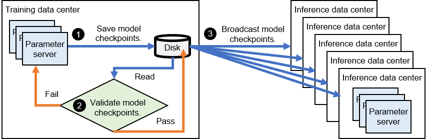

# Model Update

In a real-world setting, it is crucial for these systems to routinely
update their model parameters. However, maintaining seamless user
experience while concurrently updating ultra-large-scale recommendation
models becomes a daunting task, especially when catering to a large
number of online users. This section primarily addresses why continuous
updates to model parameters are necessary for recommender systems,
before delving into the offline update methodology and a recommender
system capable of online updates.

## Necessity for Model Updates

Recommendation models employed in online services encounter highly
dynamic factors in their datasets:

1.  **New users and items**: Both the users targeted by a recommendation
    model and the items encompassed within the model are in constant
    flux. New users and items can emerge at any given time. As depicted
    in Figure [1](#fig:embedding missing){reference-type="ref"
    reference="fig:embedding missing"}, the recommender model will be
    unable to cater to a new user if the embedding table lacks the
    corresponding embedding item. Similarly, if a newly added item is
    absent from the model's embedding table, it will not surface in the
    recommendation pipeline, rendering it impossible to recommend to the
    intended users.

2.  **Shifting user interests**: Recommendation models must adapt to
    continually shifting user interests. Should a model fail to swiftly
    adjust its weights to mirror evolving user interests, the quality of
    its recommendations may suffer. As an example, in a news
    recommendation application, trending news topics alter daily. If the
    model consistently suggests outdated trends, the click-through rate
    (CTR) of users will progressively decline.

<figure id="fig:embedding missing">

 

<figcaption>Examples of Missing Embedding Items</figcaption>
</figure>

While empirical rule formulation (such as directly incorporating new or
statistically popular items into the recommendation results) can
potentially address the above dynamic factors, it only provides a
temporary and partial solution. Such empirical methods cannot entirely
rectify the problems, mainly due to the substantial performance gap
between learning-based recommendation models and experience-based
recommendation rules.

## Offline Process of Model Update

To keep up with the evolving dynamics of datasets, recommender systems
need to consistently accumulate new training data and harness this
information to refine their models. This process, known as model
updating, is integral to improving the efficacy of these systems.
Typically, the trained model is saved as a checkpoint, which is then put
through an offline validation process. This updated model is only
deployed onto the inference servers if it can effectively enhance the
quality of recommendation. A depiction of this offline model update
process can be seen in Figure
[2](#fig:offline update){reference-type="ref"
reference="fig:offline update"}.

:label:`offline`

To break it down, when a model completes a training period, the
subsequent steps unfold:

1.  **Checkpoint step**: The model checkpoint is retrieved from the
    parameter server in the training data center and stored on the disk.

2.  **Validation step**: This checkpoint undergoes validation against an
    offline dataset. If it does not pass this validation, the model
    continues its training.

3.  **Dissemination step**: If the model checkpoint passes the offline
    validation, it is then disseminated to the parameter servers which
    host the replicas of this model in different inference data centers.

## Needs for Low-latency Model Updates

Using an offline process of updating models described above can vary in
duration, ranging from several minutes to hours. Nevertheless, some
systems have streamlined the procedures for storing and propagating
checkpoints, which allows updates to occur on a minute-by-minute basis.
Despite this, the existing minute-level latency in model updates still
falls short of the requirements for several key scenarios that involve
recommender systems.

### Incorporating Fresh Content

There are needs in which applications prioritize the delivery of fresh
content. For example, in the context of short video recommendations, a
content creator might generate videos relevant to the latest trending
topics. If these videos are not recommended in a timely manner, the
topics may become obsolete, resulting in a lower-than-anticipated number
of views.

### Servicing Anonymous Users

There are often needs where user features are either unavailable or
scarce. Users are increasingly opting for anonymous usage of
applications and sharing minimal data due to heightened privacy concerns
(e.g., Internet browsers prohibit recommender systems from collecting
user cookies) and stricter data protection regulations (e.g., the
General Data Protection Regulation -- GDPR -- in Europe). As a result,
recommender systems are compelled to learn user interests online within
a very narrow timeframe.

### Adopting Online Machine Learning Techniques

There are needs that call for the application of online machine learning
techniques. Traditional recommender systems often employ offline
training where data gathered over a specified timeframe (e.g., one day)
is used to train a model, which is subsequently deployed online during
off-peak periods (e.g., early morning). However, recent research and
practice suggest that increasing the training frequency can notably
improve the quality of recommendations. The logical endpoint of
increasing training frequency is online training, where data is
processed in a streaming fashion and fed to the model. The model then
continually fine-tunes its parameters based on these online samples.
