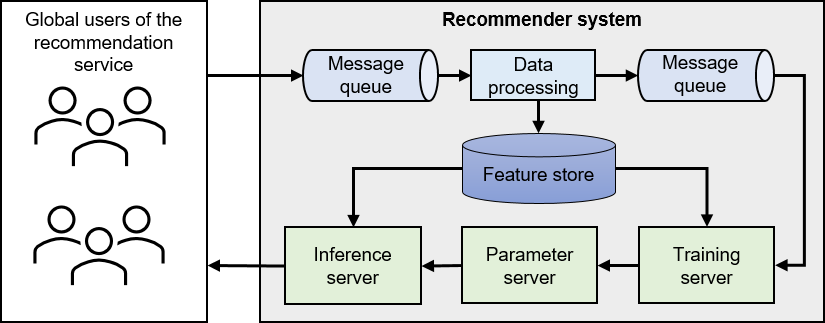

# Overview

The central component of a recommender system is the recommendation
model, which generates prospective items of interest for users based on
given input data. For a large-scale recommender system to function
seamlessly and deliver high-quality results, it needs additional
supporting modules built around this central model.

Figure [1](#fig:recommender systems){reference-type="ref"
reference="fig:recommender systems"} illustrates the essential modules
of a typical recommender system. A messaging queue accepts logs uploaded
from the client-side of the recommendation service. These logs capture
user feedback on previously recommended items, such as a record of
whether users clicked on the suggested items. A separate data processing
module handles the raw data from these logs, generating new training
samples that are subsequently added to another message queue.

Training servers extract these training samples from the message queue
and use them to update model parameters. A typical recommendation model
comprises two components: embedding tables and neural networks. During
the training phase, each training server retrieves the model parameters
from parameter servers, calculates gradients, and then uploads these
gradients back to parameter servers. Parameter servers integrate the
results from each training server and update the parameters accordingly.

Inference servers handle user requests, procure the necessary model
parameters from parameter servers based on these requests, and calculate
the recommendation outcomes.

:label:`recommender`
