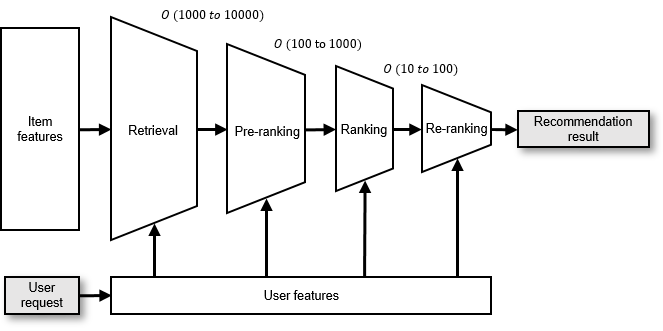
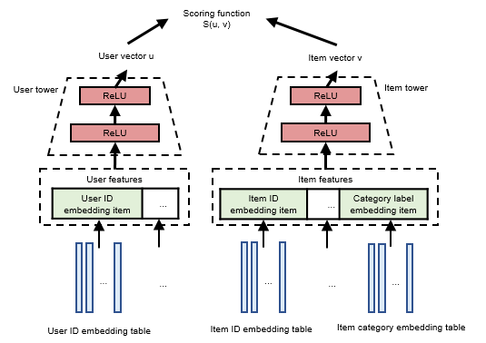

# Recommendation Pipeline

A recommendation pipeline, designed to suggest items of potential
interest to users based on their requests, is an integral part of any
recommender system. Specifically, a user seeking recommendations submits
a request that includes their user ID and the current context features,
such as recently browsed items and browsing duration, to the inference
service. The recommendation pipeline uses these user features and those
of potential items as input for computation. It then derives a score for
each candidate item, selects the highest-scoring items (ranging from
dozens to hundreds) to form the recommendation result, and delivers this
result back to the user.

Given that a recommender system generally contains billions of potential
items, using just a single model to compute the score of each item
necessitates a trade-off between model accuracy and speed. In other
words, opting for a simpler model may boost speed but potentially result
in recommendations that fail to pique the user's interest due to
diminished accuracy. On the other hand, using a more complex model may
provide more accurate results but deter users due to longer waiting
times.

:label:`recommender pipeline`

To mitigate this, contemporary recommender systems typically deploy
multiple recommendation models as part of a pipeline, as illustrated in
Figure :numref:`recommender pipeline`. The pipeline begins with the
retrieval stage, employing fast, simple models to filter the entire pool
of candidate items, identifying thousands to tens of thousands of items
that the user may find appealing. Following this, in the ranking stage,
slower, more complex models score and order the retrieved items. The
top-scoring items (the exact number may vary depending on the specific
service scenario), numbering in the dozens or hundreds, are returned as
the final recommendation. If the ranking models are too intricate and
cannot process all retrieved items within the given time frame, the
ranking stage may be further divided into three sub-stages: pre-ranking,
ranking, and re-ranking.

## Retrieval Stage

The retrieval stage is the initial phase of the recommendation process.
The model takes user features as input and performs a rough filter of
all candidate items to identify those the user might be interested in.
These selected items form the output. The main goal of the retrieval
stage is to reduce the pool of candidate items, thereby lightening the
computational load on the ranking model in the subsequent stage.

### Two-Tower Model

To illustrate the retrieval process, let's consider the two-tower model
as an example, as shown in Figure
:numref:`two tower model`. The two-tower model contains two
multilayer perceptrons (MLPs) which encode user features and item
features, referred to as the user tower[^1] and item tower,
respectively.

Continuous features can be input directly into the MLPs, while discrete
features must first be mapped into a dense vector using embedding tables
before being fed into the MLPs. The user tower and item tower process
these features to generate user vectors and item vectors, respectively,
each representing a unique user or item. The two-tower model employs a
scoring function to evaluate the similarity between user vectors and
item vectors.

:label:`two tower model`

### Training

During training, the model input consists of the user's feedback data on
historical recommendation results, represented by the tuple \<user,
item, label\>. The label denotes whether the user has clicked the item,
with 1 and 0 typically representing a click and non-click, respectively.
The two-tower model uses positive samples (i.e., samples where the label
is 1) for training. To obtain negative samples, an intra-batch sampler
that corrects sampling bias performs sampling within the batch. The
details of the algorithm, while not the focus here, can be found in the
original paper.

The model's output consists of the click probabilities for different
items. During training, a suitable loss function is chosen to ensure
that the predicted results for positive samples are as close to 1 as
possible, and as close to 0 as possible for negative samples.

### Inference

Before inference, item vectors for all items are computed and saved
using the trained model. Given that item features are relatively stable,
this step can reduce computational overhead during inference and speed
up the process. User features, which are related to user behavior, are
processed when user requests arrive. The two-tower model uses the user
tower to compute current user features and generate the user vector. The
same scoring function used during training is then used to measure
similarity. This enables similarity search based on the user vector
across all candidate item vectors. The most similar items are output as
the retrieval result.

### Evaluation Metrics

A common evaluation metric of the retrieval model is the recall metric
when $k$ items are recalled (Recall@k). This metric essentially
quantifies the ability of a model to successfully retrieve the top $k$
items of interest.

The mathematical definition of Recall@k is expressed as follows:

$$\text{Recall@k} = \frac{\text{TP}}{\min(\text{TP} + \text{FN}, k)}$$

In this equation, the term \"True Positive\" (TP) refers to the count of
items correctly identified by the model as relevant (i.e., with a true
label of 1) among the $k$ items retrieved. On the other hand, \"False
Negative\" (FN) denotes the count of relevant items (again, with a true
label of 1) that the model failed to include among the $k$ retrieved
items.

Thus, the Recall@k metric serves as a measure of the model's ability to
correctly identify and retrieve positive samples. Importantly, it is
crucial to understand that if the total number of positive samples
surpasses $k$, the maximum possible count of correctly retrieved items
is $k$. This is due to the fact that the model is limited to retrieving
only $k$ items. Consequently, the denominator in the Recall@k equation
is defined as the lesser of two quantities: the sum of true positives
and false negatives, or $k$.

## Ranking Stage

During the ranking phase, the model appraises the items gathered in the
retrieval stage, evaluating each individually in terms of user features
and item features. Each item's score is indicative of the probability
that the user might be interested in that item. As a result, the
highest-scoring items based on these rankings are then suggested to the
user.

If the number of candidate items evaluated by the recommendation model
continually increases, or if the recommendation logic and rules become
more complex, the entire ranking stage can be efficiently divided into
three sub-stages: pre-ranking, ranking, and re-ranking.

### Pre-ranking

Acting as an intermediary between the retrieval and ranking stages, the
pre-ranking stage serves as an additional layer of filtering. This
becomes particularly useful when there's a large influx of candidate
items from the retrieval stage, or when multi-channel retrieval methods
are used to boost retrieval result diversity. If every retrieved item
was directly fed into the ranking model, the subsequent process could
become overly lengthy due to the sheer volume of items. Thus,
introducing a pre-ranking stage to the recommendation pipeline reduces
the number of items proceeding to the ranking stage, enhancing overall
system efficiency.

### Ranking

Ranking, the second stage, is pivotal in the pipeline. In this phase,
it's essential that the model precisely represents the user's
preferences across varying items. When referring to the \"ranking
model\" in subsequent sections, we are specifically addressing the model
used during this ranking sub-stage.

### Re-ranking

In the final re-ranking stage, the preliminary outcomes derived from the
ranking stage are further refined according to specific business logic
and rules. The goal of this stage is to improve the holistic quality of
the recommendation service, shifting the focus from the click-through
rate (CTR) of a single item to the broader user experience. For
instance, the applied business logic might include efforts to increase
the visibility of new items, filter out previously purchased items or
watched videos, and create rules to diversify the order and variety of
recommended items, thereby decreasing the frequency of similar item
recommendations.

## Ranking with Deep Learning

The ranking stage in a recommender system has largely benefited from the
use of deep learning models. These models are often referred to as the
Deep Learning Recommendation Model (DLRM). As depicted in Figure
:numref:`dlrm model`, a
DLRM consists of embedding tables, multi-layer perceptrons (MLPs) that
include two layers, and an interaction layer.[^2]

:label:`dlrm model`

Similar to the two-tower model, the DLRM initially uses embedding tables
to transform discrete features into corresponding embedding items, which
are represented as dense vectors. The model then combines all continuous
features into a single vector, which is introduced into the bottom MLP,
generating an output vector with the same dimension as the embedding
items. Both this output vector and all the embedding items are then
forwarded to the interaction layer for further processing.

As illustrated in Figure :numref:`interaction`, the interaction layer performs dot product
operations on all features (encompassing all embedding items and the
processed continuous features) to obtain second-order interactions. As
the features interacted within the interaction layer are symmetric, the
diagonal represents each feature's self-interaction result. In the
non-diagonal section, every distinct pair of features interacts twice
(e.g., for features $p$ and $q$, two results are acquired: $<p,q>$ and
$<q,p>$). Therefore, only the lower triangular part of the result matrix
is retained and flattened. This flattened interaction result is merged
with the output from the bottom MLP, and the combined result is used as
the input for the top MLP. After further processing by the top MLP, the
final output score reflects the probability of a user clicking on the
item.

:label:`interaction`

### Training Process

The DLRM bases its training on \<user, item, label\> tuples. It takes in
user and item features as inputs and interacts with these features to
predict the likelihood of a user clicking an item. For positive samples,
the model aims to approximate this probability as closely to 1 as
possible, while for negative samples, the goal is to get this
probability as near to 0 as possible.

The ranking process can be considered a binary classification problem;
the (user, item) pair can be classified either as click (label: 1) or no
click (label: 0). Therefore, the method used to evaluate a ranking model
is analogous to that employed for assessing a binary classification
model. However, it's crucial to consider that recommender system
datasets tend to be extremely imbalanced, meaning the proportion of
positive samples is drastically different from that of negative samples.
To minimize the influence of this data imbalance on metrics, we use the
Area Under the Curve (AUC) and F1 score to evaluate ranking models.

The AUC is the area under the Receiver Operating Characteristic (ROC)
curve, a graph used to define classification thresholds, plotted with
the True Positive Rate (TPR) against the False Positive Rate (FPR) ---
with the TPR on the y-axis and the FPR on the x-axis. An appropriate
classification threshold can be determined by calculating the AUC and
the ROC curves. If the predicted probability exceeds the classification
threshold, the prediction result is 1 (click); otherwise, it is 0 (no
click). From the prediction result, recall and precision can be
computed, which in turn allows for the calculation of the F1 score using
the formula :eqref:`f1`.

$$F1 = 2 \times \frac{recall \times precision}{recall + precision}$$ 
:eqlabel:`equ:f1`

### Inference Process

During the inference stage, the features of the retrieved items, along
with their corresponding user features, are merged and inputted into the
DLRM. The model then predicts scores, and the items with the highest
probabilities are selected for output.

[^1]: In the original paper, the user tower also uses the features of
    videos watched by users as seed features.

[^2]: DLRM is designed for structural customization. This section will
    illustrate an example using the standard code implementation of
    DLRM.
