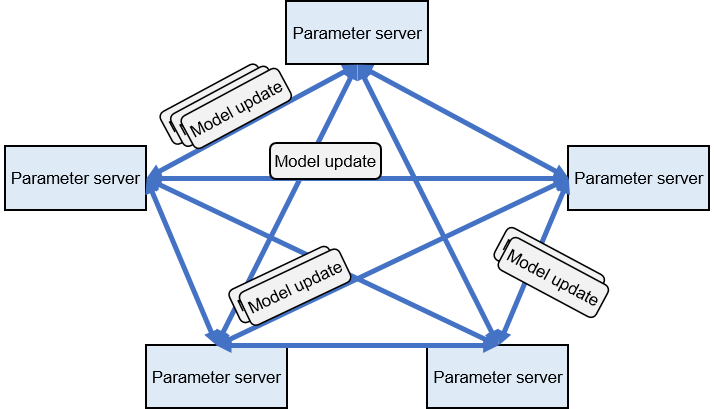
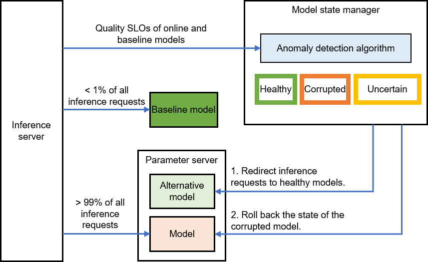

# Supporting Real-time Machine Learning

The landscape of contemporary recommender systems has seen a growing
trend in the adoption of a real-time machine learning architecture.
However, realizing the full potential of such a architecture poses
considerable challenges.

Recommender systems may aim to enhance the quality of their suggestions
by managing an extensive array of parameters. These parameters are often
replicated across multiple data centers to minimize access latency. Yet,
the ongoing updating of these parameters by machine learning models can
generate a significant volume of synchronization traffic. In essence,
any update to a \"leader\" parameter replica necessitates timely
reflection in all corresponding \"follower\" replicas.

## System Challenges

Transitioning from offline model training to the more dynamic real-time
(or online) model training in a recommender system presents several
system-related challenges:

### Needs for Synchronizing Massive Replicas

In a recommender system, model parameters are typically replicated
across multiple servers. These replicas exist on servers within a single
data center and can collaboratively address parameter queries. This
approach enhances query throughput by distributing the load evenly among
the servers. In addition, replicas are also located in geographically
distributed data centers. This strategic placement not only improves the
availability of the model parameters, but also the locality at which
these replicas can be accessed. Consequently, a single model parameter
may have numerous replicas (for instance, between tens and hundreds) in
a distributed environment.

In the context of real-time machine learning, the training servers need
to frequently update the primary (leader) replica of a parameter. The
primary replica must coordinate with all other secondary (follower)
replicas to ensure consistency. Coordinating such a vast number of
replicas often surpasses the capabilities of traditional synchronization
protocols, which are typically designed for syncing smaller sets of file
replicas across different devices.

### Excessive Network Traffic

The training data center continuously collects new training samples and
instantaneously uses these samples to compute gradients for model
parameter updates. These updates must then be transferred over a network
comprising both a Local Area Network (LAN) and a Wide Area Network
(WAN). The LAN connects the servers within a data center, while the WAN
interlinks multiple data centers.

Empirical system traces have revealed that the model update traffic can
reach up to hundreds of gigabytes per second. This volume of traffic is
significantly greater than what a typical LAN or WAN can handle. On
average, a LAN can deliver an aggregated throughput ranging from 100 to
1000 Gbps, while a WAN can provide a bandwidth ranging from 10 to 100
Gbps.

### Lack of Model Validation

In the context of real-time machine learning, the gradient of a
parameter (or an updated version of this parameter) is immediately sent
to all replicas. This gradient however could adversely affect the
recommendation quality. The underlying reason for this is the
architectural design of real-time machine learning systems, which
permits the training server to calculate gradients based on a small
batch of real-time samples. These samples, collected in an online
environment, can potentially be biased or malicious.

Traditionally, the negative impacts of these gradients are mitigated
through extended training periods, with only the checkpoints that pass
validation being disseminated to replicas. However, real-time machine
learning does not allow for such offline validation. As a consequence,
there is an urgent need to devise new strategies that protect the
recommendation system from being negatively impacted by detrimental
gradients.

## Application-Specific Synchronization Protocols

To mitigate the challenge of leader bottlenecks during synchronization
of replicas, designers of distributed machine learning systems have
turned to application-specific synchronization protocols. These
protocols are devised to capitalize on the data characteristics unique
to machine learning applications, with the aim of expediting the
synchronization process. For instance, Microsoft's Adam utilizes a
customized two-phase commit protocol in its parameter server system for
machine learning model replicas. Moreover, some parameter servers are
designed to skip synchronization requests when the gradient magnitude is
relatively small, implying that a model update is unlikely to
drastically affect the inference outcomes of a machine learning model.

Despite their general efficacy, these protocols can encounter
difficulties in real-world recommender systems due to a couple of
factors. Firstly, the requirement of a leader to orchestrate replicas in
these parameter servers can become a limiting factor, particularly when
there are hundreds of replicas to manage. Secondly, the leader replica's
dependence on high-speed networks to facilitate low latency
communication with follower replicas can be problematic, as these
high-speed networks are not always readily available on a wide area
network.

Recently, practitioners in the field of recommender systems have been
exploring the potential of decentralized synchronization protocols. One
noteworthy example is the Ekko system, which expands on traditional
peer-to-peer synchronization protocol to effectively manage the vast
number of synchronization requests in a recommender system.

To demonstrate how a recommender system can utilize the data
characteristics of machine learning applications to accelerate
synchronization, we'll examine Ekko. Figure
[1](#fig:P2P replication){reference-type="ref"
reference="fig:P2P replication"} depicts Ekko's peer-to-peer
architecture where replicas can be synchronized among decentralized
parameter servers.

:label:`P2P`

To execute the peer-to-peer synchronization algorithm, Ekko first
attributes a version to each parameter (each key-value pair) by using
the established version vector algorithm  . Every version records the
time and location of a parameter's update. Moreover, Ekko establishes a
version vector (also referred to as knowledge) within each shard to
document all known versions of the shard. By comparing the version
number with the version vector, a parameter server can retrieve the
updated parameter state from its peers without needing to transmit the
parameters. For a more detailed understanding of the version vector
algorithm, please refer to the original paper.

However, Ekko system researchers have discovered that even with the
version vector algorithm, identifying updated parameters amongst a large
number of model parameters remains a time-consuming task. To hasten the
process of locating updated parameters, Ekko harnesses two key
characteristics of recommendation models:

1.  **Update Sparsity:** While embedding tables in a model may span
    several hundred gigabytes or even several terabytes, the training
    server only updates the embedding items included in the current
    batch at any given time. This is because model training generally
    happens in small batches. From a global perspective, the states of
    only a small fraction of parameters within the embedding tables are
    updated over a certain time period.

2.  **Time Locality:** In a recommender system, model updates aren't
    uniformly distributed across all parameters. Embedding items
    corresponding to popular items and active users undergo frequent
    updates within a specified period of time, whereas those related to
    less popular items and inactive users may not be updated at all.

Based on these two characteristics, the cornerstone of Ekko's comparison
acceleration approach is to circumvent time wasted on comparing versions
of parameters that remain unchanged.

Within the Ekko system, a *model update cache* is developed in each
shard to store the pointers of parameters that have recently been
updated. Suppose parameter server A is trying to pull model updates from
parameter server B. If parameter server A already has all model updates
that parameter server B has not cached, server A can obtain all unknown
model updates by simply comparing the parameters stored in the cache of
parameter server B. This is all that's needed to ensure server A is up
to date.

## Application-Aware Model Update Scheduling

When dealing with limited bandwidth for model update transfer, designers
of distributed machine learning systems often consider the effects of
these updates on their applications. The fundamental intuition is that
not all model updates exert an equal influence on the service quality of
an application. Typically, this quality is assessed in terms of
service-level objectives (SLOs), such as latency, recommendation
accuracy, user engagement metrics, among others.

Various protocols have been developed to prioritize the transmission of
model updates over congested networks, based on the impact of these
updates on the SLOs. The Ekko system serves as a representative example
for illustrating this approach. Typically, three metrics are considered:

1.  **Update Freshness:** If the embedding tables of the recommendation
    model lack embedding items corresponding to new users or items,
    these users or items cannot reap the benefits of the high SLOs
    provided by the recommendation model. To counter this, we can assign
    the highest priority to newly added embedding items, ensuring that
    they are disseminated to all inference service clusters as swiftly
    as possible.

2.  **Update Significance:** Numerous studies have demonstrated that
    model updates with larger gradients considerably impact model
    accuracy. Consequently, we can assign varying priorities to
    different model updates based on their amplitude. [^1]

3.  **Model Importance:** In online services involving multiple models,
    each model attracts different volumes of inference traffic.
    Therefore, during network congestion, we can give precedence to the
    update of models that garner the most traffic.

These aforementioned application-level metrics need to be consolidated
to effectively guide the scheduling of model updates. We demonstrate
this concept using Figure
[2](#fig:model update scheduler){reference-type="ref"
reference="fig:model update scheduler"}, a model update scheduler
implemented in the Ekko system. In this system, the total priority for
each model update is computed and then compared with the k-th
percentile. If the total priority exceeds the kth percentile, it is
considered high priority; otherwise, it is deemed low priority. The
value of *k* is user-defined, and the kth percentile is estimated using
an existing algorithm based on historical priority data.

:label:`model`

## Online Model State Management

In the context of real-time machine learning, it's crucial to have
mechanisms in place that can continuously monitor the performance of a
recommendation model and quickly revert this model to a previous state
if any performance degradation is detected. We demonstrate how this can
be implemented using the Ekko system.

The key design principle involves setting up a group of baseline models
and diverting a small amount of the requests (or traffic) from inference
requests to these baseline models. This strategy allows the collection
of SLO-related metrics from the baseline models.

As depicted in Figure [3](#fig:model state manager){reference-type="ref"
reference="fig:model state manager"}, the time series anomaly detection
algorithm in the inference model state manager persistently monitors the
SLOs of both baseline and online models. The model state, which could be
healthy, uncertain, or corrupted, is maintained by the replicated state
machine.

If an online model is found to be in a corrupted state, the traffic for
this model is redirected to another model in a healthy state. The
corrupted model is then rolled back to a previous healthy state before
being reintroduced online.

:label:`model`

[^1]: The update amplitude could either be the gradient itself or the
    gradient multiplied by the learning rate, contingent on the model
    training mode.
