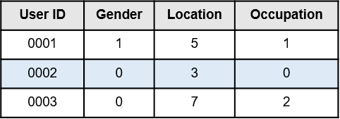
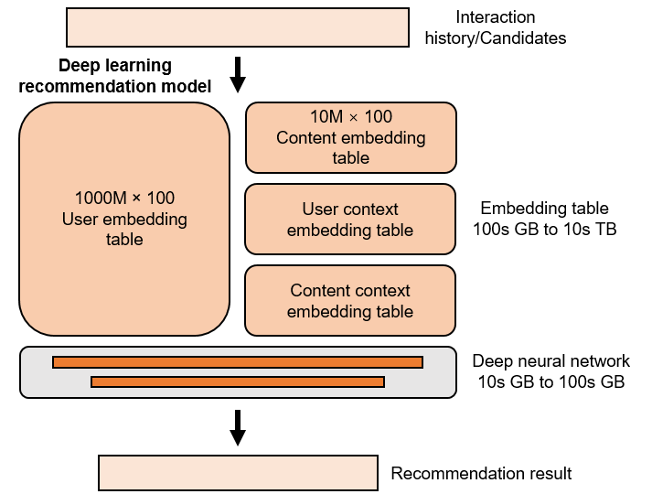
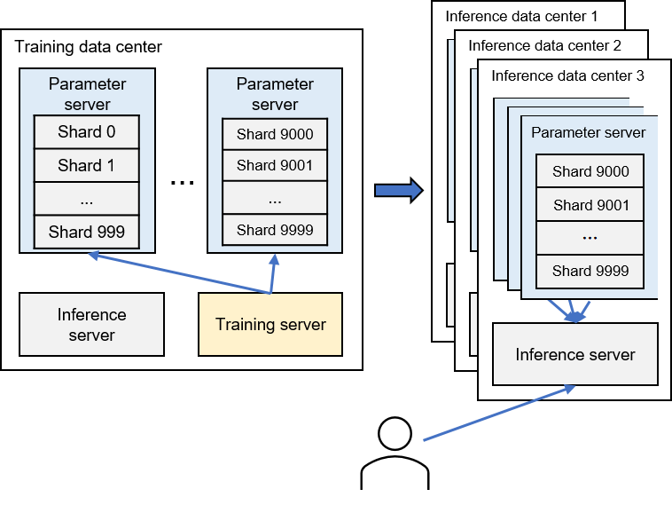

# System Components

The subsequent sections delve into the functionalities and features of
each module within the recommender system's workflow.

## Message Queue

Message queues enable distributed systems to exchange data
asynchronously in the form of messages. In a recommender system, each
model is often encapsulated as a microservice, and message queues
facilitate the data communication among these microservices. Typical
message queue implementations include RabbitMQ, Kafka, and Pulsar.

Specifically, a message queue aggregates logs (which include user
feedback on recommended results) sent from the client to the server. The
data processing module retrieves raw logs from the message queue,
sanitizes and transforms them into user features and item features,
stores these features in feature repositories, and deposits the derived
training samples into another message queue for the training server's
utilization.

Message queues offer multiple advantages, including enabling message
producers (such as client reporting modules) and message consumers (like
server data processing modules) to produce and consume data at different
rates. For instance, during peak usage times of the recommendation
service, the client side might generate a vast amount of feedback. If
the data processing module is expected to receive data directly, a large
portion of it could be discarded due to the data generation pace
surpassing the processing speed. Configuring the data processing module
based on peak feedback volume would result in resource waste during
off-peak times. Message queues can buffer user logs during peak times,
allowing the data processing module to handle them during off-peak
times. This ensures user feedback is processed consistently and
cost-effectively.

## Feature Store

Feature stores serve as repositories where features are stored and
organized for use in model training and inference services. Typical
feature store implementations include those developed by commercial
enterprises, such as Amazon SageMaker and Databricks, as well as
open-source solutions like Hopsworks and Feast.

To generate features, a recommender system has a data processing
component that retrieves raw logs from the message queues. These logs
might contain gender information, for example, *Male*, *Female*, or
*Unknown*. Since these raw features cannot be directly incorporated into
a recommendation model, the data processing module performs a simple
mapping conversion on the raw features: *Male* $\rightarrow$ 0, *Female*
$\rightarrow$ 1, and *Unknown* $\rightarrow$ 2. The transformed features
are then stored in the feature store, where they can be accessed by the
data processing module or the recommendation model.

Figure :numref:`feature store` displays a typical format of a feature
store. When the training or inference module needs to access a specific
user's features, all necessary features can be retrieved from the
feature store using just the user ID.

:label:`feature store`

One significant advantage of utilizing feature stores is the potential
for reusing the data processing module's outputs, thereby reducing the
volume of redundant data that needs to be stored. Essentially, each
module doesn't need to process raw data independently or maintain a
storage system for potentially useful features. A more crucial advantage
of feature stores is that they ensure a consistent view of features
across all system modules. Consider an extreme scenario where the values
for *Male* and *Female* are assigned as 1 and 0 in the training module's
database, but as 0 and 1 in the inference module's database. In such a
situation, the model inference results could be disastrous.

## Neural Networks

Neural networks, particularly dense ones, are integral to the foundation
of recommendation models, owing to their proficiency in discerning
intricate and implicit relationships among features. This capability
enables the suggestion of items potentially appealing to the users.
Multilayer perceptrons (MLPs), a simple form of dense neural networks,
have demonstrated their potency in these systems. Renowned companies
such as Google   and Meta   incorporate MLPs in their recommendation
models, underscoring their efficacy.

The compact size of an MLP, a mere few megabytes, ensures manageable
storage requirements within a recommendation model. Nevertheless, it
should be noted that the extensive matrix multiplication operations
inherent to MLPs are computationally demanding and therefore necessitate
robust computing power.

While MLPs have produced impressive outcomes, the exploration of
innovative deep neural network applications in recommendation systems
continues unabated. An assortment of sophisticated and elaborate network
structures has emerged in recent years, testifying to the relentless
drive for improvement. Notably, there have been attempts to utilize
Transformer models for recommendation tasks  , hinting at the evolving
trajectory of this field.

Looking forward, it is anticipated that the size of dense neural
networks within recommendation models will inevitably expand, possibly
escalating to several gigabytes or even terabytes. This evolution is
poised to bring about significant changes, both in terms of the systems'
effectiveness and their operational demands.

## Embedding Table

Embedding tables constitute a crucial component of recommendation
systems. They primarily serve to transform discrete feature data that
cannot be directly calculated---for instance, user IDs, item IDs,
genders, and item categories---into vectors within a high-dimensional
space. The structure of an embedding table in a recommendation model
bears resemblance to its counterpart in a natural language processing
(NLP) model, though there are subtle distinctions.

:label:`recommendation models`

In NLP models, the majority of parameters are found within deep neural
networks. In contrast, embedding tables carry the bulk of parameters in
recommendation models, as illustrated in Figure
:numref:`recommendation models`. This discrepancy can be
attributed to the plethora of discrete features in recommendation
systems, each necessitating an individual embedding item for every
possible value.

For instance, the gender feature, which can take on the values *Female*,
*Male*, or *Unknown*, would require three separate embedding items.
Assuming that each item is a 64-dimensional single-precision
floating-point vector, a recommendation system catering to 100 million
users would result in a user embedding table (where each embedding item
corresponds to a user) of $4*64*10^8~=23.8$ GB in size.

Moreover, there would also be a requirement for embedding tables for
items (with each table entry corresponding to an item) as well as for
various user and item features. Taken together, the combined size of
these tables could potentially stretch into hundreds of gigabytes, or
even tens of terabytes.

In contrast, as mentioned earlier, the MLP models that are frequently
employed in recommendation systems are relatively small in size. For
instance, in a Deep Learning Recommendation Model (DLRM)   trained on
the Ali-CCP dataset  , the embedding tables surpass 1.44 GB in size,
while the dense neural network only measures approximately 100 KB. This
disparity underscores the dominant role of embedding tables in shaping
the scale and computational demands of recommendation models.

## Parameter Server

Recommendation systems commonly employ a parameter server architecture,
effectively partitioning computational and storage responsibilities.
This is advantageous given that while embedding tables consume a
significant portion of a recommendation model's storage space, their
computation tends to be sparse.

This sparsity results from the piecemeal computation of data in small
batches throughout both the training and inference phases. Within the
computation of a single batch, only the relevant embedding items are
accessed. For example, in a recommender system serving 100 million users
and processing 1000 user requests at a time, only about
$\frac{1}{100000}$ of the total embedding items are accessed
concurrently.

Thus, servers conducting the computations for generating recommendation
results---during either the training or inference stages---do not need
to store the full set of embedding tables. This separation of concerns
offered by the parameter server architecture greatly improves the
efficiency of storage and computation resource management in
recommendation systems.

:label:`parameter server in recommendation`

The parameter servers in a recommender system have a dual role. They
coordinate the training process and also support model inference. During
the model inference process, inference servers need to access model
parameters stored on parameter servers to compute recommendation
results. To minimize delay in the inference process, at least one copy
of the model parameters is stored on the parameter servers located in
the same data center as the inference server (commonly referred to as an
inference data center), as illustrated in Figure
:numref:`parameter server in recommendation`.

This architectural design also aids in failure recovery. If a data
center unexpectedly goes offline and becomes inaccessible, user requests
can be rerouted to other operational inference data centers.

## Training Server

Within a recommender system, a training server is responsible for
pulling a batch of data from the message queue and the corresponding
embedding items and deep neural network parameters from the parameter
servers. This enables the server to generate the recommendation result,
calculate the loss, and carry out backpropagation to compute the
gradients.

The parameter servers, in turn, gather these gradients from all training
servers. Following this, they aggregate the gathered gradients to
compute the new parameters. This cycle of operations signifies the
completion of one round of model training.

Given that the parameter servers need to compile the gradients from all
training servers, these servers are usually housed in the same data
center, also known as the training data center. This setup serves to
mitigate the 'straggler problem', where network delays can severely
impact training efficiency.

## Inference Server

Inference servers in a recommender system play the role of receiving
users' recommendation requests from the client, pulling necessary model
parameters from the parameter servers based on these requests, and
obtaining user features and item features from feature stores. Using
this information, they calculate the recommendation results.

To simplify, this section considers a scenario with only one inference
server processing user requests. However, in a large-scale recommender
system, the recommendation result is typically produced by a
recommendation pipeline composed of multiple models, each running on
separate inference servers.
