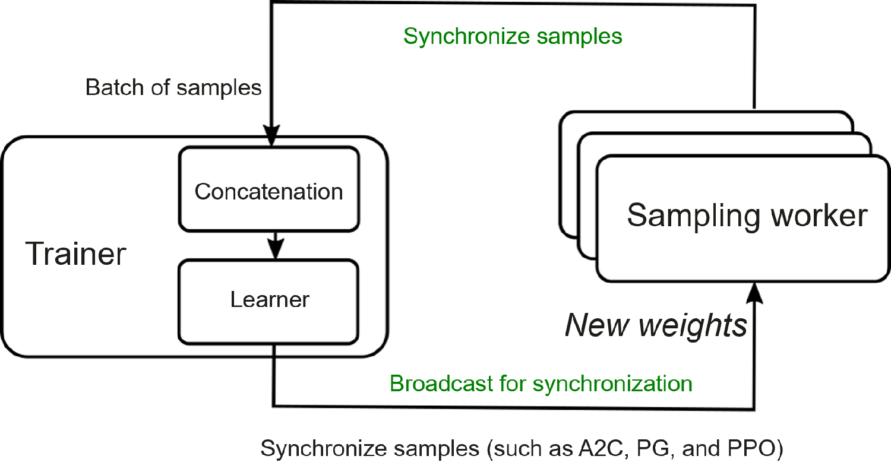

# Distributed Reinforcement Learning System

The distributed reinforcement learning system is more powerful than the
single-node reinforcement system we discussed earlier. It features
parallel processing capability of multiple models in multiple
environments, meaning it can update multiple models on multiple computer
systems at the same time. As such, it significantly accelerates the
learning process and improves the overall performance of the
reinforcement learning system. This section focuses on common algorithms
and systems in distributed reinforcement learning.

## Distributed RL Algorithm--A3C

Asynchronous Advantage Actor-Critic (A3C) was proposed by DeepMind
researchers in 2016. This algorithm can update networks on multiple
computing devices in parallel. Unlike the single-node reinforcement
learning system, A3C creates a group of workers, allocates the workers
to different computing devices, and creates an interactive environment
for each worker to implement parallel sampling and model update. In
addition, it uses a master node to update actor networks (policy
networks) and critic networks (value networks). These two types of
networks correspond to the policy and value functions in reinforcement
learning, respectively. Such a design allows each worker to send the
gradients computed based on the collected samples to the master node in
real time in order to update the parameters on the master node. The
parameters are then transferred in real time to each worker for model
synchronization. Each worker can perform the computing on a GPU. In this
way, the entire algorithm updates the model in parallel on a GPU
cluster. Figure :numref:`ch011/ch11-a3c` depicts the algorithm structure.
Research shows that in addition to accelerating model learning,
distributed reinforcement learning helps stabilize learning performance.
This is because the gradients in distributed reinforcement learning are
computed based on environment sampled from multiple nodes.

:label:`ch011/ch11-a3c`

## Distributed RL Algorithm--IMPALA

Importance Weighted Actor-Learner Architecture (IMPALA) is a
reinforcement learning framework proposed by Lasse Espeholt et al. in
2018 to implement clustered multi-machine training. Figure
:numref:`ch011/ch11-impala` depicts this architecture. Like A3C,
IMPALA enables gradient computation on multiple GPUs in parallel. In
IMPALA, multiple actors and learners are paralleled. Each actor has a
policy network to collect samples by interacting with another
environment. The collected sample trajectories are sent by actors to
their respective learners for gradient computation. Among the learners,
there is a master learner. It can communicate with other learners to
obtain their computed gradients for the update of its model. After the
model is updated, the model is delivered to other learners and actors
for a new round of sampling and gradient computation. As a distributed
computing architecture, IMPALA is proved to be more efficient than A3C.
It benefits from a specially designed gradient computation function in
learners and from V-trace target in addition to stabilizing training
based on importance weights. Because the V-trace technique is not
related to our area of focus here, we will not elaborate on it.
Interested readers can learn more from the original paper.

:label:`ch011/ch11-impala`

## Other Algorithms

Apart from A3C and IMPALA, researchers have proposed other algorithms in
recent studies, for example, SEED  and Ape-X . These algorithms are more
effective in distributed reinforcement learning. Readers can find out
more about these algorithms from the corresponding papers. Next, we move
on to some typical distributed reinforcement learning algorithm
libraries.

## Distributed RL System -- RLlib

RLlib  --- based on Ray , which is a distributed computing framework
initiated by several researchers from UC Berkeley --- is built for
reinforcement learning. It is an open-source reinforcement learning
framework oriented to industrial applications. RLlib contains a
reinforcement learning algorithm library and is convenient for users who
are not that experienced in reinforcement learning.

Figure :numref:`ch011/ch11-rllib-arch` shows the architecture of RLlib.
Its bottom layer is built on Ray's basic components for distributed
computing and communications. Oriented to reinforcement learning, basic
components such as Trainer, Environment, and Policy are abstracted at
the Python layer. There are built-in implementations for the abstracted
components, and users can extend the components based on their algorithm
requirements. With these built-in and customized algorithm components,
researchers can quickly implement specific reinforcement learning
algorithms.

:label:`ch011/ch11-rllib-arch`

RLlib supports distributed reinforcement learning training of different
paradigms. Figure
:numref:`ch011/ch11-rllib-distributed` shows the distributed
training architecture of the reinforcement learning algorithm based on
synchronous sampling. Each rollout worker is an independent process and
interacts with the corresponding environment to collect experience.
Multiple rollout workers can interact with the environment in parallel.
Trainers are responsible for coordinating rollout workers, policy
optimization, and synchronization of updated policies to rollout
workers.

:label:`ch011/ch11-rllib-distributed`

Reinforcement learning is usually based on deep neural networks. For
distributed learning based on such networks, we can combine RLlib with a
deep learning framework such as PyTorch and TensorFlow. Adopting such an
approach means that the deep learning framework takes responsibility for
training and updating the policy network, with RLlib taking over the
computation of the reinforcement learning algorithm. RLlib also supports
interaction with paralleled vectorized environments and pluggable
simulators, as well as offline reinforcement learning.

## Distributed RL System--Reverb and Acme

For management of experience replay buffer, Reverb  is an inevitable
topic. At the beginning of this chapter, we introduced concepts such as
state, action, and reward in reinforcement learning. The data used for
training in real-world applications comes from the data samples stored
in the experience buffer, and the operations performed on the data may
vary depending on the data formats. Common data operations include
concatenation, truncation, product, transposition, partial product, and
mean or extreme value. These operations may be performed on different
dimensions of the data, posing a challenge for existing reinforcement
learning frameworks. In order to flexibly use data of different formats
in reinforcement training, Reverb introduces the concept of *chunk*. All
data used for training is stored as chunks in the buffer for management
and scheduling. This design takes advantage of data being
multidimensional tensors and makes data usage faster and more flexible.
DeepMind recently proposed a distributed reinforcement learning
framework called Acme , which is also designed for academia research and
industrial applications. It provides a faster distributed reinforcement
learning solution based on a distributed sampling structure and Reverb's
sample buffer management. Reverb solves the efficiency problem of data
management and transfer, allowing Acme to fully leverage the efficiency
made possible in distributed computing. Researchers have used Acme to
achieve significant speed gains in many reinforcement learning benchmark
tests.
