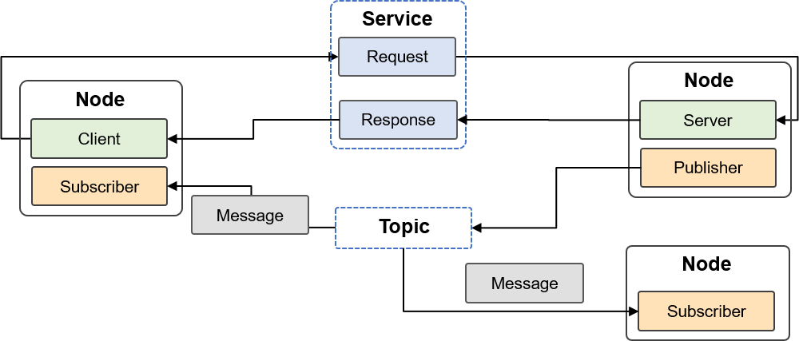
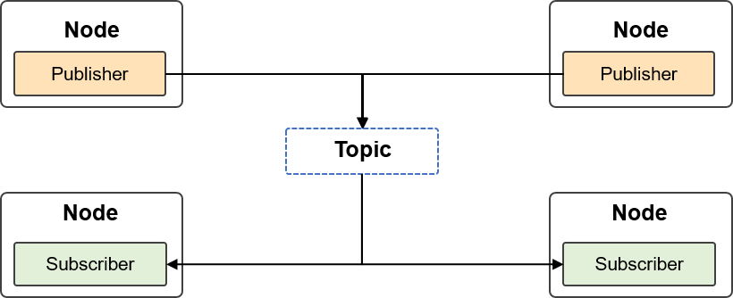
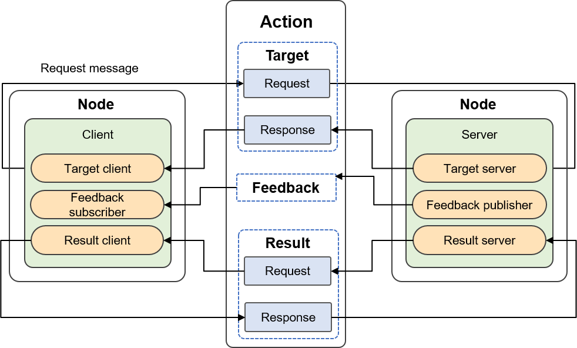

# Robot Operating System

This section provides an overview of the Robot Operating System (ROS),
which emerged as a result of a robot project at the Stanford Artificial
Intelligence Laboratory. It is a free, open-source framework that
provides interfaces and tools to help build advanced robots. Due to the
rapid development and increasing complexity of robotics, demand for code
reuse and modular design continues to rise. ROS is suitable for robots
and other complex scenarios with multiple nodes and tasks. It has been
used as a development platform for some robots, unmanned aerial vehicles
(UAVs), and even unmanned ground vehicles (UGVs). In robot learning,
ROS/ROS 2 can be combined with deep learning. Deep learning nodes have
been developed for ROS/ROS 2 and support Nvidia Jetson and TensorRT.
Nvidia Jetson, developed by Nvidia for autonomous machines, is an
embedded system on module (SOM) that includes the central processing
unit (CPU), graphics processing unit (GPU), power management integrated
circuit (PMIC), dynamic random access memory (DRAM), and flash memory,
increasing the operating speed of autonomous machine software. TensorRT
is a machine learning framework released by Nvidia to run machine
learning inference on its hardware.

As a framework for robot programming, ROS couples loosely connected
components and provides them with a communication framework. Though
called an operating system, ROS is more like a middleware suite that
bridges the communication between various ROS-based applications and
enables robots to organize and run perception, decision-making, and
control algorithms. ROS adopts a distributed design and supports
multiple programming languages such as C++ and Python, making it
possible to port code. Its minimum process unit is node, and nodes are
managed by node masters. The parameter settings defined for ROS are
stored on the parameter server. ROS communication is achieved via topic,
service, parameter server, and actionlib.

ROS provides a number of built-in tools. For example, rviz is a 3D
visualizer used to visualize robots, their working environments, and
sensor data. It is a highly configurable tool with many different types
of plugins for visualization. The build system adopted in ROS is catkin,
which is similar to CMake in Linux. A catkin workspace is a directory
for creating, modifying, and compiling catkin software packages.
roslaunch is a tool used to start multiple ROS nodes locally and
remotely and to set parameters on the ROS parameter server. There is
also a robot simulation tool named Gazebo and a mobile operations
software and planning framework called MoveIt. ROS provides robot
developers with interfaces to different programming languages, such as
`roscpp` for C++ and `rospy` for Python. The Unified Robotic Description
Format (URDF) is an XML file format used in ROS to describe robot files.
In terms of limitations, ROS performs poorly in real-time communication
and system stability required in industrial scenarios.

The ROS 2 project was announced at ROSCon 2014. Ardent Apalone --- the
first non-beta release of ROS 2 --- was released in 2017. ROS 2 adds
support for multi-robot systems, improving network performance for
communication among robots. It also supports embedded microcontrollers,
such as MCUs, and can run on systems including Linux x86, Linux ARM,
Windows, macOS, and RTOS. More importantly, the real-time control
support in ROS 2 improves the timeliness of control and overall robot
performance. The communication system of ROS 2 is based on the data
distribution service (DDS), as shown in
Figure :numref:`ch17/ch17-ROS2_arch`.

:label:`ch17/ch17-ROS2_arch`

ROS 2 relies on combining workspaces using the shell environment.
Workspace is a ROS term that specifies the location of the system
developed by using ROS 2. The core ROS 2 workspace is called the
underlay, and other workspaces are called overlays. When developing with
ROS 2, we typically have several workspaces that are active at the same
time. In the following subsections, we will introduce the core concepts
of ROS 2 with reference to the official ROS 2 Documentation [^1]. The
ROS graph is a network of ROS 2 elements that process data at the same
time. It encompasses all executables and the connections between them.

## ROS 2 Nodes

ROS 2 decomposes a complex system into many modular nodes. Each node in
ROS 2 fulfills a single, modular purpose (e.g., one node for controlling
wheel motors, and another node for controlling a laser range-finder).
Each node can send data to and receive data from other nodes via topics,
services, actions, or parameters. A complete robotic system is comprised
of many nodes working in concert. In ROS 2, a single executable (C++
program, Python program, etc.) can contain one or more nodes, as shown
in Figure :numref:`ch17/ch17-ROS2_graph`. The middleware at the bottom
layer of ROS 2 enables nodes to discover each other. The process is
summarized as follows:

1.  When a node is started, it broadcasts its online state to other
    nodes with the same ROS domain name. Other nodes send back their own
    information after receiving the broadcast. In this way, the
    connection between nodes is established for node communication.

2.  Each node periodically broadcasts its information so that it can
    connect to nodes that come online even if the initial discovery
    process is missed.

3.  Before a node goes offline, it also broadcasts the offline
    information to other nodes.

:label:`ch17/ch17-ROS2_graph`

## ROS 2 Topics

Topics are vital elements in the ROS graph and act as the buses for
nodes to exchange messages. Topics are one of the main ways in which
data moves between nodes and therefore between different parts of the
system. As shown in
Figure :numref:`ch17/ch17-ROS2_topics`, a node can publish data and
subscribe to any number of topics simultaneously.

rqt is a software framework of ROS and implements various GUI tools in
the form of plugins. We can run all existing GUI tools as dockable
windows within rqt. Although we can run such tools in a traditional
standalone manner, rqt makes it easier to manage the various types of
windows on the screen simultaneously.

:label:`ch17/ch17-ROS2_topics`

## ROS 2 Services

Services are another method of communication for nodes in the ROS graph
and are used in ROS 2. Unlike a topic, which is based on a
publisher-subscriber model (a node publishes information that can be
consumed by one or more subscribers), services are based on a
request-and-response model. While topics allow nodes to subscribe to
data streams and receive continual updates, services provide data only
when they are specifically requested by a client. In the
request-and-response model, a client initiates a request to a node
providing a desired service and the service processes the request and
generates a response, as shown in
Figure :numref:`ch17/ch17-ROS2_services`.

:label:`ch17/ch17-ROS2_services`

## ROS 2 Parameters

Parameters are the configuration values of nodes, and can be regarded as
node settings. Nodes can store parameters as integers, floating-point
numbers, Boolean values, strings, and lists. In ROS 2, each node
maintains its own parameters.

## ROS 2 Actions

Actions are one of the communication types in ROS 2 and are applicable
to long-running tasks.
Figure :numref:`ch17/ch17-ROS2_actions` shows the three parts involved
in an action: a goal, feedback, and a result. Actions are built on
topics and services, and function in a similar way to services with the
exception that actions can be canceled. Unlike services, which return a
single response, actions provide stable feedback. Actions use a
client-server model, which is similar to the publisher-subscriber model.
An "action client" node sends a goal to an "action server" node, which
acknowledges the goal and returns a stream of feedback and a result.
Robotic systems are likely to use actions for navigation. For example,
an action goal can tell a robot to head for a position. The robot can
send updates (i.e., feedback) while it navigates a path to the position,
and then send a result message when it arrives at its destination.

:label:`ch17/ch17-ROS2_actions`

[^1]: https://docs.ros.org/en/foxy/Tutorials/Understanding-ROS2-Nodes.html
