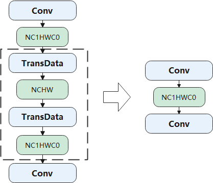

Graph Optimization
==================

Graph optimization techniques at the backend primarily focus on
hardware-oriented approaches. These techniques can be categorized as
hardware-agnostic, such as memory I/O optimization, or specific to
particular hardware, such as subgraph transformation to accommodate
hardware instruction restrictions.

Hardware-Agnostic Optimizations
-------------------------------

Hardware-agnostic optimizations involve subgraph transformation, which
replaces a subgraph in a computational graph with a hardware-friendly
equivalent.

One example of such optimization is memory I/O optimization. In deep
learning models, operators can be categorized as either
compute-intensive (e.g., Conv and FC) or memory-intensive (e.g., ReLU
and element-wise Sum). Memory-intensive operators are mainly used for
element-wise operations. Often, both types of operators are used
together in a typical deep learning model, such as the combination of
"Conv + ReLU". By fusing ReLU and Conv into a composite operator, we can
reduce memory access latency, bandwidth pressure, and improve execution
efficiency.

Figure :numref:`ch07/ch07-compiler-backend-03` illustrates an example
of fusing "Conv + Conv + Sum + ReLU". This fusion optimization
eliminates two read operations and two write operations, optimizing the
read and write of the outputs generated by Conv and Sum.

.. _ch07/ch07-compiler-backend-03:

.. figure:: ../img/ch07/conv_sum_relu.png

   Element-wise operatorfusion

Furthermore, automatic operator generation technology enables more
flexible general optimizations in addition to fusion-based optimizations
for specific operator types. An example of this technology is graph
kernel fusion (available on AI frameworks such as TensorFlow and
MindSpore). It aims to reduce inefficient memory movements and enable
intensive computing through three steps: operator expansion,
aggregation, and reconstruction.

Figure :numref:`ch07/ch07-compiler-backend-graph-kernel` provides an
overview of graph kernel fusion, which involves the following steps:

1. Expander: Composite operators (Op1, Op3, and Op4) in the
   computational graph are expanded into combinations of basic
   operators, as represented by the graph nodes with dash lines.

2. Aggregation: The basic operator (Op2) and expanded operators are
   aggregated into larger operator combinations.

3. Reconstruction: The basic operators are classified based on the
   input-to-output affinity, such as elemwise, broadcast, reduce, and
   transform. This classification allows the derivation of general
   compute rules (e.g., elemwise + reduce) to facilitate efficient
   execution. The operator combination is then analyzed and filtered
   iteratively, leading to the creation of new operators (New Op1 and
   New Op2) through reconstruction. These new operators are designed to
   be hardware-friendly.

Graph kernel fusion enables joint optimization beyond operator
boundaries by expanding and aggregating the computational graph. It
generates new hardware-friendly operators through reconstruction based
on general compute rules, thereby facilitating efficient execution.
However, it should be noted that this approach involves additional
memory movements.

.. _ch07/ch07-compiler-backend-graph-kernel:

.. figure:: ../img/ch07/graph_kernel.png

   Graph kernelfusion

Hardware-Specific Optimizations
-------------------------------

Hardware-specific optimizations are tailored to address the restrictions
imposed by specific hardware instructions and memory formats associated
with particular hardware devices.

Hardware Instruction Restrictions
~~~~~~~~~~~~~~~~~~~~~~~~~~~~~~~~~

Hardware instruction restrictions arise when certain IR nodes lack
direct operator counterparts on a specific hardware device. In such
cases, subgraph transformation can be employed to overcome these
restrictions. Let’s consider an example. The Concat operator on the
accelerator supports a maximum of 63 inputs. If the Concat node in the
frontend IR exceeds this limit, we can partition the node into multiple
smaller Concat nodes. Figure :numref:`ch07/ch07-compiler-backend-04`
illustrates how we can split a 100-input Concat node into two smaller
nodes, one with 63 inputs and the other with 37 inputs, to meet the
63-input requirement of the accelerator.

.. _ch07/ch07-compiler-backend-04:

.. figure:: ../img/ch07/concat.png

   Partitioning of the Concatoperator

Memory Format Restrictions
~~~~~~~~~~~~~~~~~~~~~~~~~~

Different platforms define varying formats for different operators to
achieve optimal performance. When the formats are inconsistent with a
particular framework, a common approach is to insert format
transformation operations to reformat the operator output. However, this
introduces additional memory movements.

Figure :numref:`ch07/ch07-compiler-backend-05` provides an example to
illustrate this scenario. Consider that the default format in an AI
framework is NCHW, but the hardware accelerator is optimized for
performing convolution with inputs and outputs in NC1HWC0 format. To
bridge this gap, the output of the first Conv operator is formatted to
NCHW using a TransData operator. It is then reformatted to NC1HWC0 using
another TransData operator before being passed to the next Conv
operator. The two TransData operations (depicted as dashed lines in the
figure) are inverse operations of each other. By employing pattern
matching on the computational graph, such operations can be easily
eliminated.

.. _ch07/ch07-compiler-backend-05:

   Elimination of format transformationoperations

