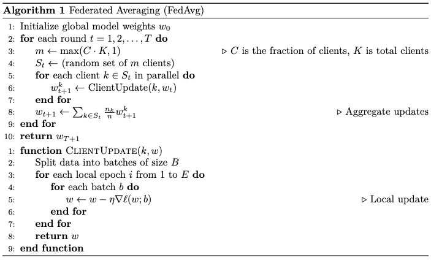

Federated Learning
==================

Federated Learning is a specialized form of distributed machine learning
that enables multiple client devices (such as smartphones and personal
computers) to collaboratively train a model without sharing their
private datasets. This approach primarily aims to enhance privacy
protection for users.

In a federated learning system, training data remains on the clients’
devices, with only model parameters exchanged among participants. This
contrasts with traditional distributed machine learning, where a single
entity collects the entire dataset into a data center. For instance, an
input method software company might record user input on mobile devices
and upload this data to servers for model training. In federated
learning, data stays on users’ devices, and the model is trained and
updated locally, with parameters shared among participants to update the
model.

Federated learning systems can be classified into two types:
cross-device and cross-organizational. The main difference lies in the
nature of the clients involved.

In cross-device federated learning, the clients are typically personal
user devices. These devices often have limited computational
capabilities, unstable communication, and may not always be online. On
the other hand, in cross-organizational federated learning, clients are
usually servers of large institutions like hospitals and banks. These
clients, though fewer in number, possess strong computational
capabilities and stable network connections.

A notable example of federated learning deployment is its optimization
for mobile phone input methods, as demonstrated by Google’s research.
Predicting the user’s next input word using machine learning models can
significantly enhance user experience. Traditionally, user input content
needs to be collected on the service provider’s server for training
data. However, due to privacy concerns, users may not want their input
content collected. Federated learning addresses this by sending only
model parameters to user devices. Client programs locally record input
data, update model parameters, and then upload the updated parameters
back to the server. By aggregating updates from multiple users, the
central server can improve the model’s accuracy without accessing users’
private data.

Other examples of federated learning systems are often found in
healthcare and financial sectors. For example, in healthcare, multiple
hospitals can collaboratively train models through federated learning
without sharing patients’ raw data, thereby enhancing diagnostic
support.

Key Operations in Federated Learning Systems
--------------------------------------------

.. _ch010/ch10-federated-learning-systems:

.. figure:: ../img/ch10/ch10-neo-federated-learning-architecture.pdf

   Architecture of a federated learning system implemented through
   aparameterserver

We use an input method’s next-word prediction task to illustrate the
typical architecture of a federated learning system. As shown in Figure
1, there is usually a server and multiple clients. The server can be a
cloud server belonging to the input method provider, while the clients
run the input method programs on user devices.

To train the latest model using user data, the input method provider can
initiate a federated learning-based model training session. During this
session, they must select a training algorithm, such as FedSGD or
FedAvg. For illustration, we will use the widely-adopted FedAvg
algorithm defined in Algorithm :numref:\ ``fedavg``. FedAvg primarily
has the following steps:

1. Model parameter initialization: In the first step, the server
   initializes the model parameters as input parameters for the
   federated learning system.

2. Client selection: The system selects a batch of clients from the user
   pool based on the following criteria: (i) Devices connected to a
   stable local network (e.g., Wi-Fi), (ii) Users not actively using the
   device, and (iii) Devices being charged The current model parameters
   are then broadcast to these selected clients.

3. Local updates: Clients receive the model parameters and conduct local
   model training, such as using the SGD algorithm. Unlike typical
   distributed training, federated learning performs multiple rounds of
   gradient updates locally to reduce the cost of uploading parameters
   each round. After several updates, clients upload their latest local
   model parameters back to the server.

4. Global aggregation and update: The server calculates a weighted
   average of the received model parameters to obtain the new global
   model parameters. This process repeats until the model accuracy meets
   the requirements or the loss is sufficiently low.

.. _fedavg:

   Federated Averaging (FedAvg)

Deploying the FedAvg system in practice presents several challenges.
First, due to the lack of low-latency, high-bandwidth network
connections between the clients and servers involved in federated
learning, it is not feasible to average gradients every round. To
address this, practitioners often average model parameters every few
rounds instead of averaging gradients every round. Further, the
configurations of devices used for model training can vary
significantly, leading to differences in the time taken by selected
clients to complete training. To address this, practitioners often
Select more clients than needed during client selection. The server then
aggregates parameters and moves to the next iteration once a sufficient
number of clients return model parameters.
