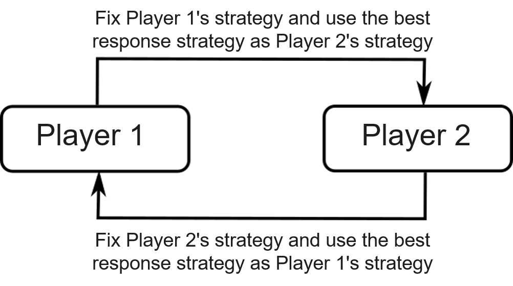

Multi-agent Reinforcement Learning
==================================

Previous sections discussed reinforcement learning involving only one
agent. However, researchers are becoming increasingly interested in
multiagent reinforcement learning. Consider the framework of
single-agent reinforcement learning shown in Figure
:numref:`ch011/ch11-rl`. This framework considers the impact of only a
single agent’s action on the environment, and the reward feedback from
the environment applies only to this agent. If we extend the
single-agent mode to multiple agents, we have at least two multiagent
reinforcement learning frameworks, as shown in Figure
:numref:`ch011/ch11-marl`. Figure :numref:`ch011/ch11-marl`\ (a)
shows a scenario where multiple agents perform actions at the same time.
The agents are unable to observe actions of other agents, and their
actions have an overall impact on the environment. Each agent receives
an individual reward for its actions. Figure
:numref:`ch011/ch11-marl`\ (b) shows a scenario where multiple agents
perform actions in sequence. Each agent can observe the actions of its
previous agents. Their actions have an overall impact on the
environment. Each agent receives an individual or team reward. Aside
from these two frameworks, other frameworks may involve a more complex
mechanism of observations, communications, cooperation, and competition
among agents. The simplest situation is to assume that the agent
observations are the environment states. However, this is the least
possible in the real world. In practice, agents usually have different
observations on the environment.

.. _ch011/ch11-marl:

.. figure:: ../img/ch11/ch11-marl.pdf

   Two possible multiagent reinforcement learning frameworks:
   (a)Synchronous multiagent decision-making; (b) Asynchronous
   multiagentdecision-making

Multi-agent RL
--------------

Based on the Markov decision process used in single-agent reinforcement
learning, we can define that used in multiagent reinforcement learning
as a tuple
:math:`(\mathcal{S}, N, \boldsymbol{\mathcal{A}}, \mathbf{R}, \mathcal{T}, \gamma)`.
In the tuple, :math:`N` indicates the number of agents, and
:math:`\mathcal{S}` and
:math:`\boldsymbol{\mathcal{A}}=(\mathcal{A}_1, \mathcal{A}_2, ..., \mathcal{A}_N)`
are the environment state space and the multiagent action space,
respectively, where :math:`A_i` is the action space of the :math:`i`\ th
agent. :math:`\mathbf{R}=(R_1, R_2, ..., R_N)` is the multiagent reward
function. :math:`\mathbf{R}(s,\mathbf{a})`:
:math:`\mathcal{S}\times \boldsymbol{\mathcal{A}}\rightarrow \mathbb{R}^N`
denotes the reward vector with respect to the state
:math:`s\in\mathcal{S}` and multiagent action
:math:`\mathbf{a}\in\boldsymbol{\mathcal{A}}`, and :math:`R_i` is the
reward for the :math:`i`\ th agent. The probability of transitioning
from the current state and action to the next state is defined as
:math:`\mathcal{T}(s^\prime|s,\mathbf{a})`:
:math:`\mathcal{S}\times\boldsymbol{\mathcal{A}}\times\mathcal{S}\rightarrow \mathbb{R}_+`.
:math:`\gamma\in (0,1)` is the reward discount factor [1]_. In addition
to maximizing the expected cumulative reward
:math:`\mathbb{E}[\sum_t \gamma^t r^i_t], i\in[N]` for each agent,
multiagent reinforcement learning involves other objectives such as
reaching Nash equilibrium or maximizing the team reward — these do not
form part of single-agent reinforcement learning.

We can therefore conclude that multiagent reinforcement learning is more
complex than single-agent reinforcement learning, and that its
complexity is not simply the accumulation of each agent’s decision
complexity. Closely related to a classical research topic named Game
theory, the research of multiagent systems has a long history — even
before reinforcement learning became popular. There was significant
research into such systems and many open theoretical problems existed. A
typical one is that Nash equilibrium is unsolvable in a two-player
non-zero-sum game [2]_. We will not delve too deeply into such problems
due to limited space. Instead, we will provide a simple example to
explain why a multiagent learning problem cannot be directly solved
using a single-agent reinforcement learning algorithm.

Game Example
------------

Consider the rock-paper-scissors game. In this game, the win-lose
relationship is scissors < rock < paper < scissors... ``<`` means that
the latter pure strategy wins over the previous one, and a reward of –1
or +1 is given to the two players, respectively. If both players choose
the same pure strategy, they are rewarded 0. The payoff table of the
game is provided in Table :numref:`ch11-marl`. The horizontal and
vertical headings indicate the strategies of Player 1 and Player 2,
respectively. The arrays in the table are the players’ rewards for their
actions.

.. _ch11-marl:

.. table:: Payoff table of the rock-paper-scissors game

   ======== ======== ======== ========
   Reward   Scissors Rock     Paper
   ======== ======== ======== ========
   Scissors (0,0)    (–1, +1) (+1, –1)
   Rock     (+1, –1) (0,0)    (–1, +1)
   Paper    (–1, +1) (+1, –1) (0,0)
   ======== ======== ======== ========

Due to the antisymmetric nature of this matrix, the Nash equilibrium
strategy is the same for both players, with a strategy distribution of
:math:`(\frac{1}{3}, \frac{1}{3}, \frac{1}{3})`. This means that both
players have a :math:`\frac{1}{3}` probability of choosing paper, rock,
or scissors. If we treat the Nash equilibrium strategy as the objective
of multiagent reinforcement learning, we can conclude that this strategy
cannot be obtained simply through single-agent reinforcement learning.
Assume that we randomly initialize two players for any two pure
strategies. For example, Player 1 chooses scissors, and Player 2 chooses
rock. Also assume that the strategy of Player 2 is fixed. As such, the
strategy of Player 2 can be considered as a part of the environment.
This allows us to use single-agent reinforcement learning to improve the
strategy of Player 1 in order to maximize its reward. In this case,
Player 1 converges to the pure strategy of paper. If we then fix this
strategy for Player 1 to train Player 2, Player 2 converges to the pure
strategy of scissors. In this way, Player 1 and Player 2 enter a cycle
of three strategies, but neither of them can obtain the correct Nash
equilibrium strategy.

Self-play
---------

The learning method used in the preceding example is called *self-play*,
as shown in Figure :numref:`ch011/ch11-marl-sp`. It is one of the most
basic among the multiagent reinforcement learning methods. In self-play,
given the fixed strategy of Player 1, the strategy of Player 2 is
optimized by maximizing its own reward using single-agent learning
methods. The strategy, referred to as best response strategy, is then
fixed for Player 2 to optimize the strategy of Player 1. In this manner,
the cycle repeats indefinitely. In some cases, however, self-play may
fail to converge to the objective we expect. Due to the possible
existence of such a cycle, we need training methods that are more
complex and methods that are designed for multiagent learning to achieve
our objective.

.. _ch011/ch11-marl-sp:

   Self-playalgorithm

Generally, multiagent reinforcement learning is more complex than
single-agent reinforcement learning. In self-play, a single-agent
reinforcement learning process may be considered as a subtask of
multi-agent reinforcement learning. In the game discussed above, when
the strategy of Player 1 is fixed, Player 1 plus the game environment
constitute the learning environment of Player 2, which can maximize its
reward using single-agent reinforcement learning. Likewise, when the
strategy of Player 2 is fixed, Player 1 can perform single-agent
reinforcement learning. The cycle repeats indefinitely. This is why
single-agent reinforcement learning can be considered as subtasks of
multiagent reinforcement learning. Another learning method is
*fictitious self-play*, as shown in Figure
:numref:`ch011/ch11-marl-fsp`, whereby an agent needs to choose an
optimal strategy based on its opponent’s historical average strategies,
and vice versa. In this manner, players can converge to Nash equilibrium
strategy in games like rock-paper-scissors.

.. _ch011/ch11-marl-fsp:

.. figure:: ../img/ch11/ch11-marl-fsp.pdf

   Fictitious self-playalgorithm

.. [1]
   Assume that the agents use the same reward discount factor.

.. [2]
   This is regarded as a Polynomial Parity Argument, Directed (PPAD)
   version problem. For details, see Settling the Complexity of
   Computing Two-Player Nash Equilibria. Xi Chen, et al.
