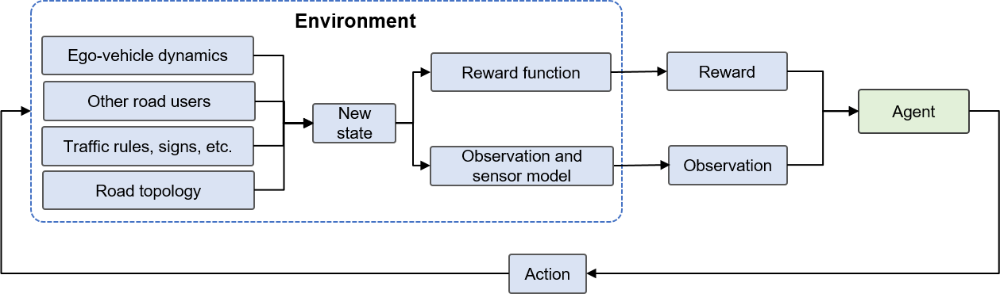

Overview of Robotic Systems
===========================

Robotics is an interdisciplinary subject that integrates computer
science, mechanical engineering, electrical engineering, biomedical
engineering, and mathematics. It covers the development of a wide range
of machines, including autonomous vehicles, mechanical arms, unmanned
aerial vehicles, and medical robots. Robots can perform one or more
tasks autonomously or assist humans in specified tasks. A robotic system
is generally composed of subsystems of perception, decision-making
(planning), and control.

Based on the number of robots involved in a given system, robotic
systems can be categorized into single-robot learning systems and
multi-robot learning systems. An area worthy of research in terms of
robotic systems is security and privacy issues, especially in scenarios
where multiple robots collaborate and communicate with each other. Robot
learning systems have recently been fully applied and developed in
industry scenarios such as indoor navigation , autonomous driving in
traffic scenarios , and mechanical arm operations. There are also a
number of projects related to building robot learning infrastructure
currently underway. One example is RoboBrain, a large-scale computing
system that learns from publicly available Internet resources, computer
simulations, and real-life robot trials. In autonomous driving, the
impact of connected and autonomous vehicles (CAVs) on the traditional
transportation industry has drawn wide attention to vehicle computing
and stimulated research on how to perform complex computing tasks on
computing platforms with limited computing power and surrounding CAVs.
Simulators for autonomous driving systems, such as CARLA, MetaDrive ,
CarSim, and TruckSim, have been used to train and evaluate various
autonomous driving algorithms. In addition, platforms for developing
autonomous driving systems, such as ERDOS, Dynamic Deadline-Driven (D3),
and Pylot, keep emerging to interconnect with model training and
deployment systems.

Figure :numref:`ch17/ch17-learning_decision_module` depicts a typical
framework of an autonomous driving system that adopts a modular design
for perception, planning, and control. Green arrows represent the
modular process of the autonomous driving system, the orange dashed
arrow indicates that the planning and control systems are
non-differentiable, and the blue dashed arrow indicates that the
decision strategy can be trained through re-parameterization. We will
introduce the perception, planning, and control systems in the following
subsections.

.. _ch17/ch17-learning_decision_module:

.. figure:: ../img/ch17/idm.png

   Automatic driving framework based on imitation learning

Perception System
-----------------

**1. Object detection and semantic segmentation**

Realizing autonomous movement and navigation of the robot, which depends
on the perception system . As well as visual perception, a perception
system also includes audio and tactile perception. In an unknown
environment, a robot must know where it is (by means of camera
re-location ) and what is around (by means of 3D object detection  or
semantic segmentation) to forecast the trajectory of a camera in space .

An example of a commonly used perception technology is image semantic
segmentation, which has undergone several iterations over the years. The
traditional 2D semantic segmentation is reaching maturity with little
prospect of advancing much further. Because it uses 2D images, it has
limitations in directly locating the spatial position of an object and
its layout in space. This is why 3D information is essential. In order
to make robots obtain 3D coordinates, semantics, and boundary
information of objects in space based on only 2D images, cross-view
semantic segmentation  has become a hot research topic.

**2. Simultaneous localization and mapping**

A simultaneous localization and mapping (SLAM) system enables a robot to
localize itself and know its surroundings in an unknown environment.

Figure :numref:\ ``ch17/ch17-orbslam3`` shows the major system
components of ORB-SLAM3 — the latest version of ORB-SLAM. In this SLAM
system, processes include landmark extraction, data association, state
estimation and update, and landmark update. It localizes the positions
and orientations of a robot with map features (such as corners and
columns) that are repeatedly observed while the robot is moving, and
maps the environment according to incremental positions. In this way,
both localization and mapping are achieved at the same time. DROID-SLAM
is a deep visual SLAM system for monocular, stereo, and RGB-D cameras.
With recurrent iterative updates of camera pose and pixel depth through
a Bundle Adjustment (BA) layer, DROID-SLAM is highly robust and
substantially less likely to experience catastrophic failures. Despite
training on monocular video, it can leverage stereo or RGB-D video to
achieve improved performance at test time. BA describes a sum of errors
between pixel coordinates and reprojection coordinates — these
coordinates are usually computed by 3D coordinate points and camera
parameters. Due to the heavy and time-consuming workloads involved in BA
computing, the University of Edinburgh proposed using a distributed
multi-GPU system  to accelerate BA computing. Along with the advancement
of machine learning, extensive research has been carried out with the
combination of BA and machine learning.

Visual odometry (VO) is a crucial part in SLAM. It is a process of
estimating the relative motion of a robot at two timeslots. Recently, as
machine learning continues to gain popularity, learning-based VO
frameworks have been proposed. TartanVO, which outperforms traditional
geometry-based methods, is the first learning-based VO model that can be
generalized to multiple datasets and real-world scenarios.

.. _ch17/ch17-orbslam3:

.. figure:: ../img/ch17/orbslam3.png

   Main system components ofORB-SLAM3

Planning System
---------------

Robotic planning includes motion and task planning . Motion planning,
one of the core issues in robotics, aims to find a path for a robot
between two given points under certain constraints with a guarantee of
integrated and optimal probability, such as a collision-free path, the
shortest path, or a path with minimum mechanical work. Although motion
planning has wide applications, such as navigation and mechanical arm
operation in complex environments, challenges still exist when it is
used to deal with real-world robotic issues (in high-dimensional
spaces). Researchers are developing new algorithms to overcome such
challenges, for example, by optimizing computation and memory loads,
improving planning representation, and better handling the curse of
dimensionality.

At the same time, advances in machine learning have opened up a new
perspective for robotics experts to study motion planning issues — a
data-driven method — in order to address the bottlenecks of classical
motion planners. Deep learning–based planners can use visual or semantic
inputs for planning. ML4KP, a C++ library for kinodynamic motion
planning, makes it easy to integrate machine learning methods into the
planning process.

Reinforcement learning (RL) also has vital applications in planning
systems . Some recent work has performed multi-agent RL and driving
behavior analysis  based on the MetaDrive simulator . To better
illustrate how RL is applied to autonomous driving, especially as a
planning module for autonomous driving,
Figure :numref:\ ``ch17/ch17-rl_ad`` shows the Partially Observable
Markov Decision Process (POMDP) model for autonomous driving based on
deep RL, covering important components such as the environment, reward,
and agent.

.. _ch17/ch17-rl_ad:

   POMDP model for deep RL–based autonomousdriving 

Control System
--------------

Although control theory is firmly rooted in the model-based design
philosophy, massive data and machine learning methods has brought new
opportunities to use the theory. The intersection of control theory and
machine learning has a wide range of research directions as well as
their applications in various real-world systems.

**1. Linear-quadratic control**

Theoretically, linear-quadratic control is a classical control method.
The linear-quadratic problem is one in which a set of linear
differential equations can be used to represent a dynamical system and a
quadratic function can be used to describe the constraint. The solution
to such a problem is provided by the linear-quadratic regulator (LQR).
Recent research on graph neural networks in distributed linear-quadratic
control has transformed such problems into self-supervised learning
problems, found the optimal distributed controllers based on graph
neural networks, and derived sufficient conditions for the stability of
the closed-loop systems.

**2. Model predictive control**

Model predictive control (MPC) is an advanced method for controlling a
process while satisfying a set of constraints. The main advantage of MPC
is allowing the current timeslot to be optimized while taking future
timeslots in account — such an approach differs from an LQR. MPC can
also forecast future events and take control actions accordingly. Some
recent studies integrate optimal control and machine learning, and apply
them to visual navigation tasks in unknown environments. For example, a
learning-based perception module generates a series of waypoints for
guiding a robot along a collision-free path to a target. Using these
waypoints, a model-based planner generates a smooth and dynamically
feasible trajectory that is then executed on the physical system by
feedback control. Experiments show that the MPC system can reach the
target position more reliably and efficiently than systems based on
geometric mapping or end-to-end learning.

**3. Stability analysis of control systems**

Because safety is critical in robot applications, some RL methods learn
the uncertainty of dynamics in order to improve safety. Safe and robust
methods that can formally authenticate the learned control strategies
are encouraged. Figure :numref:\ ``ch17/ch17-safe_learning_control``
shows the framework of a safe learning control system. Lyapunov
functions can effectively evaluate the stability of nonlinear dynamical
systems. Recently, neural Lyapunov has been proposed to take safety into
account.

.. _ch17/ch17-safe_learning_control:

   Safe learning control system where data is used to update
   controlstrategies or safetyfilters

Robot Safety
------------

Robotics and machine learning are cutting-edge research hotspots with a
promising future. Using them together will open up even more fascinating
opportunities and create far greater benefits than the incremental gains
made in both fields independently. When we apply machine learning to
robot projects, we often get too excited about using it to do many
things that we once thought impossible. However, applying machine
learning to robotics is not the same as using it directly. One important
difference is that general machine learning systems have more of a
direct impact in the virtual world, whereas machine learning systems for
robots can easily have a direct influence on the physical world through
robots. Consequently, in robot projects that integrate machine learning,
we must always be cognizant of system safety and ensure that human
safety (e.g., for developers and users) is reliably guaranteed
throughout product development and after product launch. Safety is
important in not only commercial projects but also personal projects —
no one wants to cause injury or loss of life through negligence.

There are very real risks involved. Imagine the following situation in a
commercial project: You are developing a mobile robot that will be used
in a logistics warehouse for your company. It will operate alongside
human workers and help them transfer goods for dispatch as needed. The
robot has a vision-based human detection system to detect humans in the
vicinity. If it encounters an obstacle while moving forward, the system
helps determine the robot’s behavior: the robot will take a wider turn
to avoid human obstacles or a narrower turn if the obstacle is not a
human. Now assume that a worker is on a ladder sorting goods. If the
system fails to detect that the obstacle ahead is a human, it will take
a narrower turn to avoid the obstacle. In this case, the approaching
robot might startle the worker, causing the worker to fall off the
ladder in front of the robot. Any collision between the robot and the
worker could be devastating, especially because the weight of the robot
and the carried loads is hundreds of kilograms. If a collision did
occur, the company as well as its owners would be held accountable (even
legally accountable), and the potential commercial value of the robot
could be ruined. More importantly, the injury to the worker and your
guilt could seriously impact both parties.

In terms of personal projects, suppose you are developing a small
mechanical arm to help you with simple desktop tasks, such as moving a
cup or turning a switch on and off. The mechanical arm also relies on an
object detection system to identify mission targets. On one occasion,
while moving a cup, the mechanical arm fails to recognize a power strip
in the planned path. The water in the cup splashes onto the power strip
causing a short circuit. In the best case, you may only need to replace
a power strip. But equally, a fire or electric shock may occur. Such
accidents are not desirable.

Therefore, we must always pay attention to system safety when applying
machine learning to any robot project.

**1. Safety measures: Risk assessment and independent safety system**

**1) Risk assessment**

To ensure the safety of robots and machine learning systems, we first
need to identify the potential risks through risk assessment. There are
many references online discussing how to conduct risk assessment. As
such, we will not delve too deeply into this topic. The main point is
that we should try to provide risk mitigation solutions for identified
risks. More importantly, we should implement such solutions, as
otherwise our efforts would be in vain.

**2) Independent safety system**

Once we have identified and understood what potential risks are
involved, we can design an independent safety system to avoid those
related to the robotic system. Specifically, the safety system works
independently of the machine learning system, serves as the foundation
of the robot framework, and operates with high or top priority. The
safety system should cover not only the machine learning system but also
all aspects of the robot. In other words, an independent and high-level
safety system is necessary throughout the process of robot development
rather than just for safeguarding the machine learning system. Take the
mobile robot in the logistics warehouse we discussed earlier as an
example. Assume that the robot’s wheels have an independent safety
circuit with automatic brakes upon power-off. Also assume that the robot
has a strictly standard laser radar to detect obstacles and likewise
this radar has a safety circuit connected to that of the wheels. As
such, if the laser radar detects any object (e.g., a person directly in
front of the robot or suddenly intruding on the path), the independent
safety circuit powers off and applies the brakes to prevent collision.
Such a safety system is completely free from any control logic or
higher-level systems, freeing developers from worrying about unexpected
consequences of adopting groundbreaking technologies.

**2. Ethical issues of machine learning systems**

In addition to the most fundamental issue of safety discussed in the
previous sections, the ethics of machine learning systems can also
affect the use of robots.

Ethnicity imbalance in training datasets is a classical issue. Let’s use
the previous example again here. If our training dataset includes images
of only Asian people but we want to explore markets outside Asia, users
are likely to find that our robots cannot recognize their workers
effectively. Although the independent safety system can avoid accidents,
performing emergency stops in front of workers would result in a bad
user experience. In addition, sales of our robots would be impeded in
markets outside Asia.

The ethical issue of machine learning systems is currently a hotly
debated topic. As industry stakeholders, we need to be aware of the
latest progress in this direction. While we take these issues into
account at the initial stage of system design, we also hope that our
products are beneficial to more people rather than being a hinderance.
